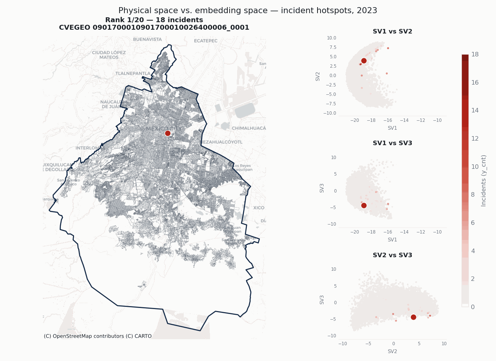

# Earth Embeddings: An Overview and Applications to Crime Analytics

Using **Google DeepMind's AlphaEarth** satellite embeddings to characterize and score **street-level crime risk in Mexico City (CDMX)**. The repository is a self-contained data-analysis exercise: a documented online book, reproducible Python / Google Earth Engine pipelines, and two interactive Streamlit apps.

📖 **Online book:** <https://edgar-daniel-codes.github.io/earth-embeddings-workshop-in-crime/>


🚀 **Repository:** <https://github.com/edgar-daniel-codes/earth-embeddings-workshop-in-crime>

> Developed as part of the ITAM MCD (Maestría en Ciencia de Datos) 
> internship (estancia).





---

## About this repo

Crime is a hard phenomenon to model: it is under-reported, spatially heterogeneous and driven by structural factors no single dataset captures. This project asks a narrower, tractable question — *does the structural/environmental signal encoded in Earth embeddings help characterize which streets are prone to crime?* — and builds tooling to answer it end to end:

- **Embeddings as features.** AlphaEarth emits a 64-dimensional vector per 10 m pixel per year; these are aggregated onto street segments (and other geometries) and used as model inputs.
- **Supervised modelling.** Count regression (`y_cnt`) and event classification (`y_ind`) with Logistic Regression, XGBoost and PyTorch NN heads, benchmarked across feature sets (embeddings only / covariates only / both).
- **Unsupervised modelling.** Dimensionality reduction (PCA, SVD), manifold learning (t-SNE, UMAP, LLE, MDS) and spherical K-means clustering to reveal structure and derive risk tiers.
- **Risk scoring & products.** Street-level risk tiers surfaced through two Streamlit apps (an EDA dashboard and an interactive risk/clustering showcase).

The emphasis is on **understanding and risk tiering**, not literal prediction of where crime will occur.

## Table of contents

- [Earth Embeddings: An Overview and Applications to Crime Analytics](#earth-embeddings-an-overview-and-applications-to-crime-analytics)
  - [About this repo](#about-this-repo)
  - [Table of contents](#table-of-contents)
  - [Features](#features)
  - [Repository structure](#repository-structure)
  - [Installation](#installation)
  - [Data](#data)
  - [Usage](#usage)
    - [Interactive apps](#interactive-apps)
    - [End-to-end pipeline](#end-to-end-pipeline)
    - [Building the book](#building-the-book)
  - [Configuration](#configuration)
  - [Documentation](#documentation)
  - [FAQs](#faqs)
  - [References](#references)
  - [License](#license)
  - [Citation](#citation)
  - [Disclaimer](#disclaimer)
  - [Use of AI Disclaimer](#use-of-ai-disclaimer)

## Features

- Reproducible ETL from **Google Earth Engine** (JS snippets + Python API) to a tabular, Hive-partitioned embeddings dataset.
- Raster-to-vector **pixel-coverage aggregation** of embeddings onto streets, blocks (MZA) and AGEBs, with unit-sphere re-normalization.
- **Group-aware cross-validation** (by year and municipality) and Optuna hyperparameter tuning.
- A shared **visual identity** (`src/utils/style.py`) so every figure reads as one system.
- A **Quarto book** deployable to GitHub Pages via GitHub Actions.

## Repository structure

```
earth_embeddings_app/
├── config/                     # YAML configs for apps, ETL and models
├── data/                       # Local data (not versioned; see Data)
│   ├── raw/                    # AlphaEarth GeoTIFFs, raw crime CSVs
│   ├── clean/  proc/  sample/  # cleaned, processed and app-sample data
│   └── spatial/                # INEGI shapefiles (political division, streets)
├── docs/
│   ├── 0X_*.qmd, 99_appendix_* # source chapters (the report/book content)
│   ├── figures/  resources/    # figures, GIFs and generated plots
├── notebooks/                  # exploratory notebooks (similarity, aggregation)
├── src/
│   ├── earth_engine_basics/    # Google Earth Engine JS starters
│   ├── etl/                    # embeddings processing, geometry assignment, training sets
│   ├── eda/                    # EDA core + data-quality + Streamlit dashboard (app.py)
│   ├── supervised/             # models (logreg/xgb/nn), CV, tuning, metrics, runners
│   ├── unsupervised/           # dim_reduction, manifold_learning, clustering_kmeans
│   ├── showcase/               # interactive risk/clustering app (app.py) + sample prep
│   ├── visuals/                # figure/animation builders and utilities
│   └── utils/                  # palette/theme, geometry, similarity, logging
├── .github/workflows/          # CI: render & publish the Quarto book
├── requirements.txt
└── README.md
```

## Installation

Requires **Python 3.12**.

```bash
git clone https://github.com/edgar-daniel-codes/earth-embeddings-workshop-in-crime.git
cd earth-embeddings-app-to-crime

python -m venv .venv && source .venv/bin/activate   # or conda
pip install -r requirements.txt
```

Key libraries: numpy, pandas, pyarrow, scikit-learn, geopandas / shapely / pyproj / rasterio / h3 / contextily, matplotlib / seaborn / plotly, streamlit, xgboost, torch, optuna, umap-learn (full pinned list in `requirements.txt`).

For data acquisition you also need a **Google Earth Engine** account; the Python API reads the project id from a `.env` file (`EE_PROJECT_NAME`).

## Data

The datasets themselves are **not versioned** in this repository. They come from public, reliable sources and are reproduced via the provided scripts:

- **AlphaEarth Satellite Embedding V1 (Annual)** — Google Earth Engine catalog (`GOOGLE/SATELLITE_EMBEDDING/V1/ANNUAL`, CC-BY 4.0).
- **Crime incidents** — *Carpetas de Investigación* (FGJ) from the CDMX open-data portal (Sistema Ajolote).
- **Geometries** — INEGI's *Marco Geoestadístico* (political division, streets).
- **Socio-economic data** — INEGI.

Downloaded/processed files are expected under `data/` following the paths in the `config/` YAML files.

## Usage

Modules follow a consistent contract and can be run as packages:

```bash
python -m src.<subpackage>.<module>
```

### Interactive apps

```bash
# Crime EDA dashboard (config-driven; optional YAML argument)
streamlit run src/eda/app.py -- eda_fgr_conf.yml

# Street risk & embedding-clusters showcase (reads a small precomputed sample)
streamlit run src/showcase/app.py
```

### End-to-end pipeline

Suggested execution order (see the book's *Data Processing and aggregation* section for the full DAG):

| Stage | Script |
|---|---|
| Validation (EDA / coverage) | `src/eda/app.py`, `src/eda/dq.py` |
| Extract — socio-economic data | `src/etl/get_socioecon_data.py` |
| Transform — process embeddings | `src/etl/process_embeddings.py` |
| Transform — clean crime data | `src/eda/core.py` |
| Transform — split streets at corners | `src/utils/geom.py` |
| Transform — assign points to geometry | `src/etl/assign_point_to_geometry.py` |
| Load — build training sets | `src/etl/get_training_sets.py` |
| Train — supervised | `src/supervised/run_classification.py`, `src/supervised/run_regression.py`, `src/supervised/run_tuning.py` |
| Train — unsupervised | `src/unsupervised/dim_reduction.py`, `src/unsupervised/manifold_learning.py`, `src/unsupervised/clustering_kmeans.py` |

Utility: convert every GIF under `docs/` into a per-frame PNG grid with `python -m src.visuals.gif_frame_grid`.

### Building the book

```bash
quarto preview docs/book     # live local preview
quarto render  docs/book     # build to docs/book/_book
```

Pushing to `main` triggers `.github/workflows/publish-book.yml`, which renders the book and publishes it to the `gh-pages` branch (served by GitHub Pages).

## Configuration

Behavior is driven by YAML files in `config/`:

- `eda_fgr_conf.yml`, `eda_c5_conf.yml` — EDA dashboard (inputs, shapefiles,
  filters, DBSCAN settings, labels).
- `etl_embedding_alpha_earth.yml`, `data.yaml` — ETL and dataset paths.
- `clf_logreg.yaml`, `clf_xgb.yaml`, `clf_nn.yaml`, `reg_xgb.yaml`,
  `reg_nn.yaml` — supervised model hyperparameters.
- `kmeans_conf.yml` — spherical K-means sweep and clustering settings.

## Documentation

The full write-up is the online book (chapters mirrored from `docs/*.md`):

1. **Earth Embeddings** — what an embedding is; open Earth-embedding families.
2. **Working with Embeddings** — retrieving from GEE, similarity, aggregation.
3. **Crime in Mexico** — CDMX crime context, data sources and EDA.
4. **Embeddings Applications to Crime** — modelling, supervised & unsupervised.
5. **Conclusions** — learnings and future work.
- **Appendices** — models/metrics, geospatial operations, technical notes.

## FAQs

**Why aren't the databases or a productive end-to-end runner included?** 
Beyond volume, public crime endpoints are unstable over time; INEGI and Google Earth are reliable, but this particular set of geometries and raster assets needs a one-off manual interaction. The provided scripts remain reliable for reproducing the data.

**Downloads fail with a certificate error.**
The official CDMX portal certificate is occasionally expired; the documented `wget` commands add `--no-check-certificate` for that reason.

**Does the showcase app run the models?**
No. It reads a small precomputed sample (`data/sample/…`) so it stays fast and low-data; no inference happens at run time.

**Can I reuse this for another city / hazard?**
Yes — swap the geometries and target, keep the embedding-aggregation and modelling patterns (the same archetype extends to floods, land-use change, etc.).

## References

Full, APA-formatted references (academic papers, datasets, software and media credits) are compiled in the book's introduction, under *Resources (all at once)*. Core sources include AlphaEarth Foundations (Brown et al., 2025), the Google Earth Engine catalog, and INEGI (ENVIPE / ENSU / Marco Geoestadístico).

## License

This repository uses a split license:

- **Code** (`src/`, `scripts/`, notebooks) — [MIT](LICENSE). Copy, modify and
  redistribute freely; retain the copyright notice.
- **Documentation, figures and derived data** (`docs/`, `data/derived/`) —
  [CC BY 4.0](LICENSE-DOCS). Reuse freely **with visible credit**.
- **Raw input data** (`data/raw/`) — governed by the original providers'
  terms. See [DATA_SOURCES.md](DATA_SOURCES.md).

## Citation

If this work informs a paper, report, dashboard or model, please cite it. GitHub's **"Cite this repository"** button (sidebar) exports BibTeX and APA from [`CITATION.cff`](CITATION.cff). Manually:

```bibtex
@software{<KEY>_2026_<REPO>,
  author  = {Nava, Edgar Daniel},
  title   = {Earth Embeddings: An Overview and Applications to Crime Analytics},
  year    = {2026},
  url     = {https://github.com/edgar-daniel-codes/earth-embeddings-workshop-in-crime},
  license = {MIT},
  version = {1.0.0}
}
```

Reuse of the figures or the written analysis additionally requires attribution under CC BY 4.0:

> "Earth Embeddings: An Overview and Applications to Crime Analytics" by Edgar Daniel Nava, licensed under CC BY 4.0.
> https://github.com/edgar-daniel-codes/earth-embeddings-workshop-in-crime

Please also cite the upstream data providers listed in [DATA_SOURCES.md](DATA_SOURCES.md) — citing this repository alone misattributes the underlying observations.

## Disclaimer

The risk levels produced here are **statistical estimates from historical reported data**, not measurements of danger and not a basis for operational, commercial or policy decisions affecting individuals or neighbourhoods. "High risk" labels are assigned *relative to the other clusters in the same year* and are not comparable across years as absolute levels. Reported-incident data reflects reporting behaviour as much as underlying incidence.

---

## Use of AI Disclaimer 

The use of Artificial Intelligence (AI) in this work was restricted to code debugging, code testing and technical translation consulting for ambiguous terms used in the field. The methods and ideas, as well as the proposed approach taken for the present problem, are full responsibility and original product of the author.

---


*By Edgar Daniel Nava — ITAM MCD internship.*
