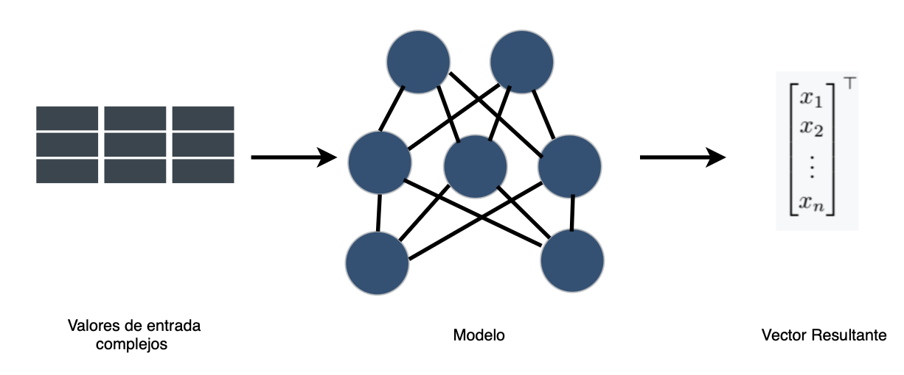
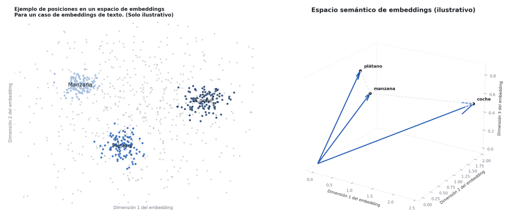

## ¿Qué es exactamente un embedding? {#what-is-an-embedding}

No es difícil definir qué son los embeddings; lo difícil es entender cómo crear un embedding y cómo evaluar (benchmark) cuáles son realmente útiles o informativos para las entidades o campos que pretenden representar.

***Def (Embedding)***: En el contexto de las matemáticas y el machine learning, definimos un embedding $x_i \in X$ del objeto $i \subset A$, como una representación vectorial del objeto $i$ donde $X \subset \mathbb{R}^n$, definida vía una relación $f$ tal que: $f:A \rightarrow X$.

La convención es que $x_i$ es un *vector embedding* que representa al objeto $i$ del conjunto (finito o infinito) $A$, mientras que $X$ es la *base (espacio) de embeddings* que representa al propio conjunto $A$. En la literatura, y particularmente en este contenido, *embedding* se usará para ambos según el contexto, especificando solo si se requiere desambiguar.

Algunas expectativas implícitas sobre los embeddings —implícitas ya que es el objetivo que un embedding las satisfaga, aunque en el proceso de generar embeddings no necesariamente se cumplan— son las siguientes:
- La base de embeddings ($X$) debe derivarse exclusivamente del universo de datos $A$.
- Para cada elemento $a_i$ corresponde un único vector $x_i$.
- El espacio vectorial de expansión mínima para $X$ debe mantener el significado de $A$ *embebido* en la geometría de dicho espacio vectorial.

### Representaciones vectoriales

La necesidad de embeddings surge naturalmente en la práctica del machine learning y el modelado estadístico. Al trabajar con conjuntos de datos tabulares, hay instancias en las que, para entender y modelar fenómenos, usamos ingeniería de características, creando una serie de métricas derivadas. Otras veces el objeto que estudiamos es realmente difícil de manejar, por ejemplo texto, imágenes u objetos físicos, esto debido a sus cantidades y combinaciones de objetos finitas pero casi inmanejables, o por su comportamiento continuo y complejo; entonces crear modelos de la realidad que representan esos objetos es difícil. Para esos casos existe la opción de crear embeddings, es decir, tomar algún conjunto y, vía un proceso $f$, algunos de los cuales se comentarán más abajo, representarlo en forma vectorial, un objeto matemático muy bien conocido, computable y estudiado.

La siguiente figura describe el proceso general para la generación de bases de embeddings, donde el modelo puede ir desde reglas de asignación simples, funciones hash o ingeniería de características, hasta salidas de redes neuronales complejas o pesos entre capas.

Para una explicación más visual de lo que esperamos de un (buen) embedding, veamos la siguiente figura. A la izquierda tenemos la existencia de dimensiones de embedding, en las que esperamos ver que las palabras se agrupen entre sí con base en su significado semántico. Eso se traduce en un sentido geométrico, en el que objetos similares (en este ejemplo, texto) mantienen un sentido de similitud geométrica: objetos similares se envían a embeddings similares.

### El caso del texto

Siguiendo la lógica ya esbozada, el texto es quizás el objeto canónico que se resiste al modelado ingenuo. Un corpus es un conjunto discreto cuyos átomos —palabras, subpalabras, oraciones— tienen un inventario finito, pero se combinan en un espacio de posibilidades efectivamente ilimitado; y, peor aún, el significado que nos importa no vive en los símbolos mismos sino en la compañía que mantienen. Esta es la vieja intuición distribucional, aislada por Harris y formulada de manera memorable por Firth: una palabra se caracteriza por las palabras que la rodean [Harris 1954; Firth 1957]. Un embedding de texto es entonces un mapeo

$$f : V \to \mathbb{R}^{d} $$

sobre el vocabulario de tokens $V$ (o $f:\Sigma^{*} \to \mathbb{R}^{d}$ sobre spans) que convierte estos objetos puramente relacionales y combinatorios en vectores sobre los cuales la geometría se vuelve semántica —la proximidad coseno aproximando el grado de relación y, célebremente, las traslaciones vectoriales aproximando analogías—. La primera generación aprendía un único vector estático por palabra a partir de estadísticas de co-ocurrencia: word2vec optimiza un objetivo autosupervisado —predecir el contexto a partir de la palabra central, o al revés— cuyo óptimo coloca cerca a las palabras con distribuciones similares [Mikolov et al. 2013], mientras que GloVe alcanza una geometría comparable factorizando una matriz global de co-ocurrencia [Pennington et al. 2014]. Sin embargo, dicha $f$ estática no puede separar los dos sentidos de *bank* (banco/orilla). La segunda generación, por lo tanto, hizo contextual el embedding, dejando que $f$ dependa de la oración completa, de modo que un mismo token recibe vectores distintos en contextos distintos —el movimiento industrializado por BERT [Devlin et al. 2019] y extendido a pasajes completos, para recuperación y clustering, por codificadores a nivel de oración como Sentence-BERT [Reimers & Gurevych 2019]. La ganancia es exactamente la prometida en el caso general: un objeto relacional intratable se reemplaza por puntos en un espacio bien conocido, computable y exhaustivamente estudiado.

### VAE y Transformers

Los ejemplos anteriores toman el embedding como el producto final; el autoencoder variacional vale la pena estudiarlo porque invierte el énfasis y trata el embedding como una causa latente. Supongamos que postulamos que cada dato observado $x$ se genera a partir de un código no observado $z$, extraído de un prior simple $p(z)$ —convencionalmente una Gaussiana estándar— y transformado a través de un decodificador $p_{\theta}(x \mid z)$. Embeber $x$ ahora consiste en inferir su posterior $p(z \mid x)$, la distribución sobre códigos que podrían haberlo producido; pero este posterior es intratable para cualquier decodificador interesante. La resolución de Kingma y Welling es aproximarlo con un codificador $q_{\phi}(z \mid x)$ y entrenar codificador y decodificador conjuntamente maximizando la cota inferior de la evidencia (ELBO) [Kingma & Welling 2014; Rezende et al. 2014]:

$$ \log p_{\theta}(x) \ge \mathcal{L}(\theta,\phi;x) = \underbrace{\mathbb{E}_{q_{\phi}(z\mid x)}\!\left[\log p_{\theta}(x\mid z)\right]}_{\text{reconstrucción}} - \underbrace{\mathrm{KL}\!\left(q_{\phi}(z\mid x)\,\Vert\,p(z)\right)}_{\text{regularización}}. $$

Los dos términos se leen como una instrucción y una disciplina: reconstruir $x$ fielmente, pero mantener la distribución del código cerca del prior, de modo que el espacio latente permanezca suave y muestreable en lugar de degenerar en una tabla de búsqueda. El único obstáculo técnico —que debemos retropropagar a través de un paso de muestreo— se elimina con el truco de reparametrización, escribiendo $z = \mu_{\phi}(x) + \sigma_{\phi}(x)\odot\varepsilon$ con $\varepsilon \sim \mathcal{N}(0, I)$, lo que empuja la aleatoriedad hacia una variable independiente de la entrada y restaura un camino diferenciable. Lo que obtenemos, entonces, no es meramente un vector por objeto, sino un espacio de embeddings dotado de una gramática probabilística: una variedad continua y de baja dimensión a lo largo de la cual podemos interpolar y de la cual podemos muestrear —el mismo objetivo vectorial bien comportado de antes, ahora equipado con una explicación generativa de cómo surgieron los objetos.

### Transformers

Si el VAE aporta una razón probabilística para querer buenos embeddings, el Transformer aporta el mecanismo que calcula los mejores que tenemos actualmente. Su punto de partida es, una vez más, una limitación de las herramientas anteriores: los codificadores recurrentes y convolucionales construyen el contexto de forma local y secuencial, de modo que las dependencias entre elementos distantes se median a través de cadenas largas y, por consiguiente, resultan costosas de aprender. El Transformer descarta la recurrencia y permite que cada elemento atienda directamente a todos los demás mediante self-attention [Vaswani et al. 2017]. Concretamente, a partir de una matriz de entrada $X$ se forman queries, keys y values mediante mapeos lineales, $Q = X W_{Q}$, $K = X W_{K}$, $V = X W_{V}$, y se mezclan mediante
$$ \mathrm{Attention}(Q,K,V)\;=\;\mathrm{softmax}\!\left(\frac{Q K^{\top}}{\sqrt{d_{k}}}\right) V , $$
de modo que cada vector de salida es un promedio ponderado, dependiente de los datos, de todos los demás —una recuperación direccionada por contenido en la que los pesos son similitudes aprendidas y el factor $\sqrt{d_{k}}$ simplemente mantiene los logits en una escala adecuada. Varios de estos mapeos corren en paralelo (atención multi-cabeza) para capturar distintos patrones relacionales a la vez; y dado que la operación es equivariante a permutaciones, el orden debe reinyectarse mediante codificaciones posicionales. El resultado es precisamente una máquina para el embedding contextual: consume un conjunto (o secuencia) de vectores y devuelve un conjunto de la misma forma en el que cada uno ha sido reescrito en términos de sus vecinos relevantes. Por esto la arquitectura sustenta los embeddings de texto contextuales anteriores; por esto —con las imágenes cortadas en parches y tratadas como tokens— da lugar al Vision Transformer [Dosovitskiy et al. 2021]; y por esto, combinada con un objetivo de reconstrucción enmascarada al estilo del autoencoder enmascarado [He et al. 2022], se ha convertido en el motor por defecto para aprender representaciones de casi cualquier objeto que podamos serializar en tokens.

### De los libros a los mapas

Lo cual nos lleva al objeto más difícil de la lista. La superficie de la Tierra no es ni un vocabulario finito ni una imagen ordenada; es un campo continuo y tetradimensional, observado solo indirectamente, a través de una flota heterogénea de instrumentos. A veces la vemos en bandas ópticas y térmicas (Sentinel-2, Landsat); otras veces mediante radar que penetra las nubes (Sentinel-1 SAR), altimetría láser de la estructura de la vegetación (GEDI, LiDAR), variables climáticas de reanálisis (ERA5-Land), o incluso el campo gravitacional del planeta (GRACE) —cada una con su propia resolución, cadencia y régimen de ruido, y cada una plagada de vacíos dejados por nubes, órbita y tiempo de revisita—. La dificultad de modelado es entonces de un tipo distinto al del texto: no la combinatoria de un conjunto discreto, sino la fusión de muchas vistas parciales, continuas y mal registradas de un sistema en evolución —agravada por la escasez que domina el campo, a saber, petabytes de píxeles contra muy pocas etiquetas, porque un solo dato de verdad-de-campo (*ground truth*) significa que alguien visitó físicamente un lugar en un momento dado [Jakubik et al. 2023; Brown et al. 2025]. La respuesta natural ha sido importar en bloque la maquinaria recién descrita: tratar pilas de imágenes satelitales como cubos de tokens espacio-temporales, preentrenar un codificador Vision-Transformer mediante reconstrucción enmascarada, y así aprender una representación general de la superficie sin etiquetas —la estrategia de los modelos fundacionales geoespaciales como Prithvi, preentrenado de forma autosupervisada en el archivo armonizado Landsat–Sentinel y luego ajustado para mapeo de inundaciones, segmentación de cultivos y similares [Jakubik et al. 2023; Szwarcman et al. 2024]. El objeto es monstruoso, pero la receta es la conocida: encontrar un mapeo $f$ hacia un espacio vectorial computable.

La culminación es llevar la idea del embedding a su extremo literal y vectorizar el planeta mismo: asignar a cada lugar, y a cada año, un código compacto que resuma todo lo que los instrumentos, en conjunto, dicen sobre él. Han surgido dos lecturas complementarias de "embedding de la Tierra". En la primera, se embebe la ubicación: SatCLIP aprende un codificador de ubicación alineando de forma contrastiva coordenadas geográficas —elevadas a la esfera mediante características posicionales de armónicos esféricos— con la imaginería satelital observada en ese lugar, produciendo un $f : (\mathrm{lat}, \mathrm{lon}) \to \mathbb{R}^{d}$ ligero cuyos vectores ya predicen temperatura, densidad poblacional o presencia de especies en un punto [Klemmer et al. 2025]. En la segunda lectura, más abarcadora, se embebe directamente el campo de la superficie: AlphaEarth Foundations, de Google DeepMind, asimila fuentes ópticas, de radar, LiDAR, climáticas, gravimétricas e incluso textuales en un único modelo de campo de embeddings continuo en el tiempo, y emite, para cada píxel de 10 metros y cada año, un vector de 64 dimensiones —cuantizado a 8 bits— que destila un año completo de observación multisensor en un único código listo para análisis [Brown et al. 2025]. La arquitectura es una síntesis de todo lo anterior: un codificador espacio-temporal construido sobre atención, entrenado como un autoencoder multimodal con decodificadores implícitos que reconstruyen modalidades y fechas faltantes, regularizado hacia una geometría latente suave y muestreable —la disciplina del VAE, la mezcla del Transformer, y la intuición distribucional de los embeddings de texto, todo apuntado hacia el planeta—. Publicadas como capas anuales, globales y listas para análisis en Google Earth Engine desde 2017 en adelante [Brown et al. 2025; Google 2025], estos embeddings permiten a un practicante reemplazar un pipeline a medida y hambriento de etiquetas por una búsqueda de vecinos más cercanos o un clasificador ligero sobre vectores —lo cual es, una vez más y ahora a escala planetaria, exactamente la promesa con la que comenzamos: tomar un conjunto casi imposible de modelar directamente y, vía un proceso $f$, representarlo como un objeto matemático bien conocido, computable y exhaustivamente estudiado.

## Embeddings de Datos Abiertos y Familias de Embeddings {#open-data-embeddings}

Con la explosión de aplicaciones como ChatGPT y con el creciente interés en la creación de embeddings como una práctica estándar en ML y Deep Learning para fines de investigación y comerciales, particularmente para embeddings de palabras, es importante definir algunos conceptos importantes:

***Def (Modelos Fundacionales)***: los modelos fundacionales son un concepto que incluye modelos de machine learning o estadísticos, pesos, o inferencia obtenidos al entrenar un algoritmo a gran escala que, dado su objetivo de optimización general y su entrenamiento multipropósito, puede usarse como punto de partida para usarse como entrada o resultado preprocesado para una tarea más delimitada.

***Def (Transfer Learning)***: Se refiere a cualquier acción y método a partir del cual algún modelo o algoritmo preentrenado, ajustado u optimizado se usa como punto de partida para un entrenamiento posterior con el fin de mejorar el desempeño del propio modelo para la tarea original o para cualquier otra donde el entrenamiento sea relevante.

Dado el creciente uso de modelos y pesos preentrenados para mejorar los modelos existentes, no solo por la confianza en las entidades que publican los modelos, sino también por el creciente costo de mantener y entrenar la infraestructura necesaria requerida para entrenar dichos modelos, dichas entidades también proveen modelos para generar embeddings o, con el fin de proteger la propiedad intelectual, abren los datos de las bases de embeddings resultantes de los modelos para que investigadores y practicantes las usen.

Ese es el caso de ChatGPT, Meta y Google, que son pioneros en abrir dichos conjuntos de datos para capas de texto, imagen o satélite terrestre.

En particular, para los embeddings de la Tierra hay tres familias principales de embeddings con bases de datos abiertas.

### Clay

Clay es un modelo fundacional de la Tierra impulsado por la comunidad y completamente de código abierto, desarrollado con Development Seed y patrocinado fiscalmente por la organización sin fines de lucro Radiant Earth. Es un Vision Transformer entrenado mediante aprendizaje autosupervisado con un Masked Autoencoder, que produce embeddings semánticos para cualquier ubicación y momento. El modelo v1 es una red de 632 millones de parámetros dividida en un codificador MAE de 311M, un decodificador de 15M y un "profesor" DINOv2 congelado de 304M, y emite embeddings de 768 dimensiones; el entrenamiento combina una pérdida de reconstrucción del 95% (MSE sobre parches enmascarados) con una pérdida de representación del 5% destilada del profesor DINOv2, de modo que optimiza simultáneamente la reconstrucción de píxeles y la estructura semántica. Su énfasis de diseño es la flexibilidad: ingiere un cubo de datos de valores de píxel más metadatos (tiempo, latitud/longitud, distancia de muestreo en tierra y longitudes de onda centrales), preentrenado a través de muchos sensores —Sentinel-1/2, NAIP, MODIS, Landsat-8 y otros—, de modo que funciona en múltiples plataformas y resoluciones, desde drones hasta satélites. El código y los pesos son Apache-2.0, la documentación es CC-BY, y los embeddings publicados son ODC-BY en Source Cooperative —el más permisivo y completamente abierto de los tres.

### Prithvi de IBM

Construido conjuntamente por IBM Research y la NASA, es el modelo fundacional geoespacial de referencia con pesos abiertos. Usa una arquitectura base de Vision Transformer temporal con embeddings de parches 3D —las entradas son cubos de imágenes multitemporales y multiespectrales divididos en "tubelets" espaciotemporales— y codificación posicional 3D sobre alto, ancho y tiempo, entrenado como un Masked Autoencoder. El primer lanzamiento, Prithvi-EO-1.0 (100M de parámetros), se preentrenó en el archivo armonizado Landsat–Sentinel-2 de la NASA; Prithvi-EO-2.0 escala a 300M/600M de parámetros con cobertura global y añade embeddings temporales-de-ubicación, preentrenado en 4.2 millones de muestras de series temporales de HLS a 30 metros de resolución. El entrenamiento enmascara aproximadamente el 75% de los parches de entrada y los reconstruye bajo una pérdida MSE. Los pesos se publican abiertamente en Hugging Face (ibm-nasa-geospatial) y se ajustan (fine-tune) para mapeo de inundaciones, segmentación de cicatrices de incendios forestales y cultivos, e imputación de vacíos de nubes [Jakubik et al. 2023, arXiv:2310.18660; Szwarcman et al. 2024, arXiv:2412.02732].

### AlphaEarth de Google DeepMind

AlphaEarth, de Google DeepMind, es el más agresivamente diseñado de los tres y adopta un enfoque distinto —un modelo de campo de embeddings en lugar de un codificador de recortes de imagen. Su codificador de Precisión Espacio-Temporal combina atención espacial y temporal con convoluciones, y se entrena como un autoencoder multimodal con decodificadores implícitos que reconstruyen observaciones faltantes a través del tiempo y de las modalidades, regularizado mediante consistencia profesor-alumno y alineación contrastiva. Asimila un conjunto de fuentes inusualmente amplio —imaginería óptica y térmica de Sentinel-2 y Landsat, radar que penetra nubes, mediciones 3D de superficie derivadas de LiDAR, elevación, clima, campos gravitacionales e incluso texto descriptivo. La salida es un embedding de 64 dimensiones para cada píxel de 10 metros, que empaqueta un año de datos multifuente en cada vector, y los embeddings de 32 bits se cuantizan a 8 bits para una reducción de almacenamiento de 4× con una pérdida de desempeño insignificante. Estos se distribuyen como capas anuales, globales y listas para análisis (desde 2017 en adelante, versión del conjunto de datos 1.1 a partir de noviembre de 2025) en el catálogo de Google Earth Engine bajo CC-BY 4.0 [Brown et al. 2025, arXiv:2507.22291] —datos abiertos, aunque los pesos del modelo en sí no son públicos.

## Recursos

Harris, Z. S. (1954). Distributional Structure. Word, 10(2–3), 146–162. https://doi.org/10.1080/00437956.1954.11659520

Firth, J. R. (1957). A Synopsis of Linguistic Theory, 1930–1955. In Studies in Linguistic Analysis (pp. 1–32). Oxford: Blackwell.

Mikolov, T., Sutskever, I., Chen, K., Corrado, G., & Dean, J. (2013). Distributed Representations of Words and Phrases and their Compositionality. NIPS 26, 3111–3119. arXiv:1310.4546. https://arxiv.org/abs/1310.4546

Pennington, J., Socher, R., & Manning, C. D. (2014). GloVe: Global Vectors for Word Representation. Proceedings of EMNLP 2014, 1532–1543. https://doi.org/10.3115/v1/D14-1162

Devlin, J., Chang, M.-W., Lee, K., & Toutanova, K. (2019). BERT: Pre-training of Deep Bidirectional Transformers for Language Understanding. NAACL-HLT 2019, 4171–4186. arXiv:1810.04805. https://arxiv.org/abs/1810.04805

Reimers, N., & Gurevych, I. (2019). Sentence-BERT: Sentence Embeddings using Siamese BERT-Networks. EMNLP-IJCNLP 2019, 3982–3992. arXiv:1908.10084. https://arxiv.org/abs/1908.10084

Kingma, D. P., & Welling, M. (2014). Auto-Encoding Variational Bayes. ICLR 2014, Banff. arXiv:1312.6114. https://arxiv.org/abs/1312.6114

Rezende, D. J., Mohamed, S., & Wierstra, D. (2014). Stochastic Backpropagation and Approximate Inference in Deep Generative Models. ICML 2014, 1278–1286. arXiv:1401.4082. https://arxiv.org/abs/1401.4082

Vaswani, A., Shazeer, N., Parmar, N., Uszkoreit, J., Jones, L., Gomez, A. N., Kaiser, Ł., & Polosukhin, I. (2017). Attention Is All You Need. NeurIPS 30, 5998–6008. arXiv:1706.03762. https://arxiv.org/abs/1706.03762
Dosovitskiy, A., Beyer, L., Kolesnikov, A., Weissenborn, D., Zhai, X., Unterthiner, T., Dehghani, M., Minderer, M., Heigold, G., Gelly, S., Uszkoreit, J., & Houlsby, N. (2021). An Image is Worth 16×16 Words: Transformers for Image Recognition at Scale. ICLR 2021. arXiv:2010.11929. https://arxiv.org/abs/2010.11929

He, K., Chen, X., Xie, S., Li, Y., Dollár, P., & Girshick, R. (2022). Masked Autoencoders Are Scalable Vision Learners. CVPR 2022, 16000–16009. arXiv:2111.06377. https://arxiv.org/abs/2111.06377

Jakubik, J., Roy, S., Phillips, C. E., Fraccaro, P., Godwin, D., Zadrozny, B., Szwarcman, D., et al. (2023). Foundation Models for Generalist Geospatial Artificial Intelligence. arXiv:2310.18660. https://arxiv.org/abs/2310.18660
Brown, C. F., Kazmierski, M. R., Pasquarella, V. J., Rucklidge, W. J., Samsikova, M., Zhang, C., Shelhamer, E., et al. (2025). AlphaEarth Foundations: An Embedding Field Model for Accurate and Efficient Global Mapping from Sparse Label Data. Google DeepMind. arXiv:2507.22291. https://arxiv.org/abs/2507.22291

Szwarcman, D., Roy, S., Fraccaro, P., Gíslason, Þ. E., Blumenstiel, B., Ghosal, R., et al. (2024). Prithvi-EO-2.0: A Versatile Multi-Temporal Foundation Model for Earth Observation Applications. arXiv:2412.02732. https://arxiv.org/abs/2412.02732

Klemmer, K., Rolf, E., Robinson, C., Mackey, L., & Rußwurm, M. (2025). SatCLIP: Global, General-Purpose Location Embeddings with Satellite Imagery. AAAI 39(4), 4347–4355. arXiv:2311.17179. https://doi.org/10.1609/aaai.v39i4.32457

Google & Google DeepMind (2025). Satellite Embedding V1 (Annual) — AlphaEarth Foundations Satellite Embedding dataset. Earth Engine Data Catalog, GOOGLE/SATELLITE_EMBEDDING/V1/ANNUAL. CC-BY 4.0. https://developers.google.com/earth-engine/datasets/catalog/GOOGLE_SATELLITE_EMBEDDING_V1_ANNUAL
