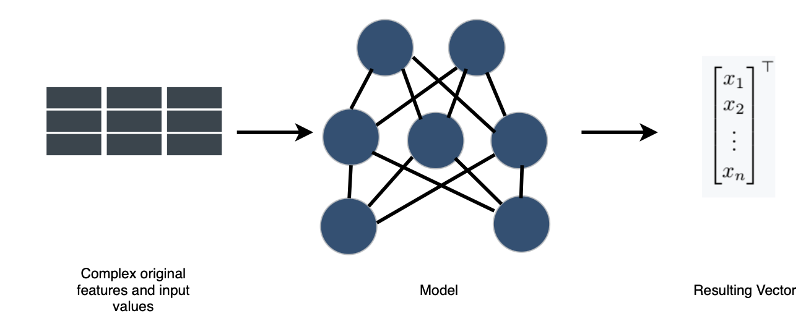
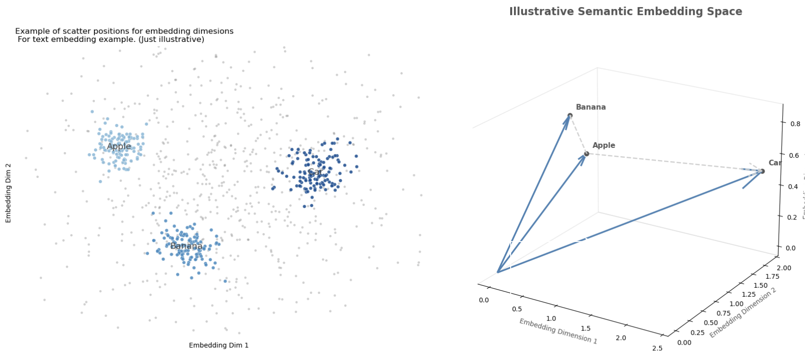
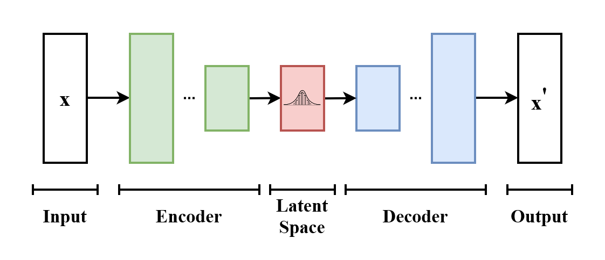
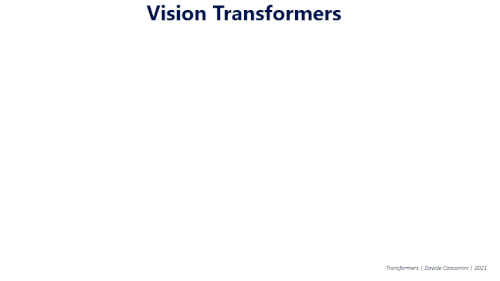

## What exactly is an embedding? {#what-is-an-embedding}

It is not hard to define what embeddings are; the hard part is understanding how to create an embedding and how to benchmark which ones are actually useful or informative for the entities or fields they intend to represent.

***Def (Embedding)***: In the context of mathematics and machine learning, we define an embedding $x_i \in X$ of the object $i \subset A$ as a vector representation of the object $i$ where $X \subset \mathbb{R}^n$, defined via a relation $f$ such that: $f:A \rightarrow X$.

The convention is that $x_i$ is an *embedding vector* representing the object $i$ of the (finite or infinite) set $A$, while $X$ is the *embedding base (space)* representing the set $A$ itself. In the literature, and particularly in this content, *embedding* will be used for both depending on context, specifying only when disambiguation is required.

Some implicit expectations about embeddings —implicit since it is the goal for an embedding to satisfy them, even though they are not necessarily met in the process of generating embeddings— are the following:

- The embedding base ($X$) must be derived exclusively from the data universe $A$.
- To each element $a_i$ there corresponds a unique vector $x_i$.
- The minimal spanning vector space for $X$ must keep the meaning of $A$ *embedded* in the geometry of that vector space.

### Vector representations

The need for embeddings arises naturally in the practice of machine learning and statistical modeling. When working with tabular datasets, there are instances in which, in order to understand and model phenomena, we use feature engineering, creating a series of derived metrics. Other times the object we study is really hard to handle —for example text, images or physical objects— due to their finite but almost unmanageable quantities and combinations of objects, or because of their continuous and complex behavior; then creating models of the reality those objects represent is difficult. For those cases there is the option of creating embeddings, that is, taking some set and, via a process $f$ (some of which are discussed below), representing it in vector form, a very well known, computable and studied mathematical object.

The following figure describes the general process for the generation of embedding bases, where the model can range from simple assignment rules, hash functions or feature engineering, to outputs of complex neural networks or weights between layers.

For a more visual explanation of what we expect from a (good) embedding, let us look at the following figure. On the left we have the existence of embedding dimensions, in which we expect to see words group together based on their semantic meaning. That translates into a geometric sense, in which similar objects (in this example, text) keep a sense of geometric similarity: similar objects are sent to similar embeddings.

### The case of text

Following the logic already outlined, text is perhaps the canonical object that resists naive modeling. A corpus is a discrete set whose atoms —words, subwords, sentences— have a finite inventory, but they combine into an effectively unlimited space of possibilities; and, worse still, the meaning we care about does not live in the symbols themselves but in the company they keep. This is the old distributional intuition, isolated by Harris and memorably formulated by Firth: a word is characterized by the words that surround it [Harris 1954; Firth 1957]. A text embedding is then a mapping

$$f : V \to \mathbb{R}^{d} $$

over the token vocabulary $V$ (or $f:\Sigma^{*} \to \mathbb{R}^{d}$ over spans) that turns these purely relational and combinatorial objects into vectors over which geometry becomes semantics —cosine proximity approximating the degree of relatedness and, famously, vector translations approximating analogies. The first generation learned a single static vector per word from co-occurrence statistics: word2vec optimizes a self-supervised objective —predict the context from the center word, or the other way around— whose optimum places words with similar distributions close together [Mikolov et al. 2013], while GloVe reaches a comparable geometry by factorizing a global co-occurrence matrix [Pennington et al. 2014]. However, such a static $f$ cannot separate the two senses of *bank*. The second generation therefore made the embedding contextual, letting $f$ depend on the full sentence, so that the same token receives different vectors in different contexts —the move industrialized by BERT [Devlin et al. 2019] and extended to complete passages, for retrieval and clustering, by sentence-level encoders such as Sentence-BERT [Reimers & Gurevych 2019]. The gain is exactly the one promised in the general case: an intractable relational object is replaced by points in a well known, computable and exhaustively studied space.

### VAE and Transformers

The previous examples take the embedding as the final product; the variational autoencoder is worth studying because it inverts the emphasis and treats the embedding as a latent cause. Suppose we posit that each observed datum $x$ is generated from an unobserved code $z$, drawn from a simple prior $p(z)$ —conventionally a standard Gaussian— and transformed through a decoder $p_{\theta}(x \mid z)$. Embedding $x$ now consists of inferring its posterior $p(z \mid x)$, the distribution over codes that could have produced it; but this posterior is intractable for any interesting decoder. Kingma and Welling's resolution is to approximate it with an encoder $q_{\phi}(z \mid x)$ and to train encoder and decoder jointly by maximizing the evidence lower bound (ELBO) [Kingma & Welling 2014; Rezende et al. 2014]:

$$ \log p_{\theta}(x) \ge \mathcal{L}(\theta,\phi;x) = \underbrace{\mathbb{E}_{q_{\phi}(z\mid x)}\!\left[\log p_{\theta}(x\mid z)\right]}_{\text{reconstruction}} - \underbrace{\mathrm{KL}\!\left(q_{\phi}(z\mid x)\,\Vert\,p(z)\right)}_{\text{regularization}}. $$

The two terms read as an instruction and a discipline: reconstruct $x$ faithfully, but keep the code distribution close to the prior, so that the latent space remains smooth and samplable instead of degenerating into a lookup table. The only technical obstacle —that we must backpropagate through a sampling step— is removed with the reparameterization trick, writing $z = \mu_{\phi}(x) + \sigma_{\phi}(x)\odot\varepsilon$ with $\varepsilon \sim \mathcal{N}(0, I)$, which pushes the randomness into a variable independent of the input and restores a differentiable path. What we obtain, then, is not merely a vector per object, but an embedding space endowed with a probabilistic grammar: a continuous, low-dimensional manifold along which we can interpolate and from which we can sample —the same well-behaved vector goal as before, now equipped with a generative explanation of how the objects arose.

### Transformers

If the VAE provides a probabilistic reason to want good embeddings, the Transformer provides the mechanism that computes the best ones we currently have. Its starting point is, once again, a limitation of previous tools: recurrent and convolutional encoders build context locally and sequentially, so that dependencies between distant elements are mediated through long chains and are consequently expensive to learn. The Transformer discards recurrence and lets each element attend directly to all the others through self-attention [Vaswani et al. 2017]. Concretely, from an input matrix $X$ queries, keys and values are formed via linear mappings, $Q = X W_{Q}$, $K = X W_{K}$, $V = X W_{V}$, and are mixed through

$$ \mathrm{Attention}(Q,K,V)\;=\;\mathrm{softmax}\!\left(\frac{Q K^{\top}}{\sqrt{d_{k}}}\right) V , $$

so that each output vector is a data-dependent weighted average of all the others —a content-addressed retrieval in which the weights are learned similarities and the factor $\sqrt{d_{k}}$ simply keeps the logits on a suitable scale. Several of these mappings run in parallel (multi-head attention) to capture different relational patterns at once; and since the operation is permutation-equivariant, order must be reinjected through positional encodings. The result is precisely a machine for contextual embedding: it consumes a set (or sequence) of vectors and returns a set of the same shape in which each one has been rewritten in terms of its relevant neighbors. This is why the architecture underpins the contextual text embeddings above; this is why —with images cut into patches and treated as tokens— it gives rise to the Vision Transformer [Dosovitskiy et al. 2021]; and this is why, combined with a masked reconstruction objective in the style of the masked autoencoder [He et al. 2022], it has become the default engine for learning representations of almost any object we can serialize into tokens.

### From books to maps

Which brings us to the hardest object on the list. The Earth's surface is neither a finite vocabulary nor a tidy image; it is a continuous, four-dimensional field, observed only indirectly, through a heterogeneous fleet of instruments. Sometimes we see it in optical and thermal bands (Sentinel-2, Landsat); other times through cloud-penetrating radar (Sentinel-1 SAR), laser altimetry of vegetation structure (GEDI, LiDAR), reanalysis climate variables (ERA5-Land), or even the planet's gravitational field (GRACE) —each with its own resolution, cadence and noise regime, and each riddled with gaps left by clouds, orbit and revisit time. The modeling difficulty is then of a different kind than that of text: not the combinatorics of a discrete set, but the fusion of many partial, continuous and poorly registered views of an evolving system —compounded by the scarcity that dominates the field, namely petabytes of pixels against very few labels, because a single ground-truth datum means that someone physically visited a place at a given time [Jakubik et al. 2023; Brown et al. 2025]. The natural answer has been to import the machinery just described wholesale: treat stacks of satellite imagery as cubes of spatiotemporal tokens, pre-train a Vision-Transformer encoder through masked reconstruction, and thereby learn a general representation of the surface without labels —the strategy of geospatial foundation models such as Prithvi, pre-trained self-supervised on the harmonized Landsat–Sentinel archive and then fine-tuned for flood mapping, crop segmentation and the like [Jakubik et al. 2023; Szwarcman et al. 2024]. The object is monstrous, but the recipe is the familiar one: find a mapping $f$ into a computable vector space.

The culmination is to take the embedding idea to its literal extreme and vectorize the planet itself: assign to each place, and to each year, a compact code that summarizes everything the instruments, taken together, say about it. Two complementary readings of "Earth embedding" have emerged. In the first, the location is embedded: SatCLIP learns a location encoder by contrastively aligning geographic coordinates —lifted to the sphere through spherical-harmonic positional features— with the satellite imagery observed at that place, producing a lightweight $f : (\mathrm{lat}, \mathrm{lon}) \to \mathbb{R}^{d}$ whose vectors already predict temperature, population density or species presence at a point [Klemmer et al. 2025]. In the second, more encompassing reading, the surface field itself is embedded directly: AlphaEarth Foundations, from Google DeepMind, assimilates optical, radar, LiDAR, climate, gravimetric and even textual sources into a single time-continuous embedding field model, and emits, for each 10-meter pixel and each year, a 64-dimensional vector —quantized to 8 bits— that distills a full year of multisensor observation into a single analysis-ready code [Brown et al. 2025]. The architecture is a synthesis of everything above: a spatiotemporal encoder built on attention, trained as a multimodal autoencoder with implicit decoders that reconstruct missing modalities and dates, regularized toward a smooth and samplable latent geometry —the discipline of the VAE, the mixing of the Transformer, and the distributional intuition of text embeddings, all aimed at the planet. Published as annual, global, analysis-ready layers in Google Earth Engine from 2017 onward [Brown et al. 2025; Google 2025], these embeddings allow a practitioner to replace a bespoke, label-hungry pipeline with a nearest-neighbor search or a lightweight classifier over vectors —which is, once again and now at planetary scale, exactly the promise we started with: take a set that is almost impossible to model directly and, via a process $f$, represent it as a well known, computable and exhaustively studied mathematical object.

## Open Data Embeddings and Embedding Families {#open-data-embeddings}

With the explosion of applications such as ChatGPT and with the growing interest in the creation of embeddings as a standard practice in ML and Deep Learning for research and commercial purposes, particularly for word embeddings, it is important to define some important concepts:

***Def (Foundation Models)***: foundation models are a concept that includes machine learning or statistical models, weights, or inference obtained by training an algorithm at large scale that, given its general optimization objective and its multipurpose training, can be used as a starting point to serve as input or preprocessed result for a more delimited task.

***Def (Transfer Learning)***: It refers to any action and method by which some pre-trained, fine-tuned or optimized model or algorithm is used as a starting point for subsequent training in order to improve the performance of the model itself for the original task or for any other where the training is relevant.

Given the growing use of pre-trained models and weights to improve existing models, not only because of the trust in the entities that publish the models, but also because of the growing cost of maintaining and training the necessary infrastructure required to train such models, those entities also provide models to generate embeddings or, in order to protect intellectual property, open the data of the resulting embedding bases for researchers and practitioners to use.

That is the case of ChatGPT, Meta and Google, which are pioneers in opening such datasets for text, image or Earth satellite layers.

In particular, for Earth embeddings there are three main families of embeddings with open databases.

### Clay

Clay is a community-driven, fully open-source Earth foundation model, developed with Development Seed and fiscally sponsored by the non-profit Radiant Earth. It is a Vision Transformer trained through self-supervised learning with a Masked Autoencoder, which produces semantic embeddings for any location and moment. The v1 model is a 632-million-parameter network split into a 311M MAE encoder, a 15M decoder and a frozen 304M DINOv2 "teacher", and emits 768-dimensional embeddings; training combines a 95% reconstruction loss (MSE over masked patches) with a 5% representation loss distilled from the DINOv2 teacher, so that it simultaneously optimizes pixel reconstruction and semantic structure. Its design emphasis is flexibility: it ingests a data cube of pixel values plus metadata (time, latitude/longitude, ground sampling distance and central wavelengths), pre-trained across many sensors —Sentinel-1/2, NAIP, MODIS, Landsat-8 and others— so that it works across multiple platforms and resolutions, from drones to satellites. Code and weights are Apache-2.0, documentation is CC-BY, and the published embeddings are ODC-BY on Source Cooperative —the most permissive and fully open of the three.

### IBM's Prithvi

Built jointly by IBM Research and NASA, it is the reference geospatial foundation model with open weights. It uses a temporal Vision Transformer base architecture with 3D patch embeddings —inputs are cubes of multitemporal, multispectral images split into spatiotemporal "tubelets"— and 3D positional encoding over height, width and time, trained as a Masked Autoencoder. The first release, Prithvi-EO-1.0 (100M parameters), was pre-trained on NASA's harmonized Landsat–Sentinel-2 archive; Prithvi-EO-2.0 scales to 300M/600M parameters with global coverage and adds temporal-location embeddings, pre-trained on 4.2 million HLS time-series samples at 30-meter resolution. Training masks approximately 75% of the input patches and reconstructs them under an MSE loss. The weights are openly published on Hugging Face (ibm-nasa-geospatial) and are fine-tuned for flood mapping, wildfire scar and crop segmentation, and cloud-gap imputation [Jakubik et al. 2023, arXiv:2310.18660; Szwarcman et al. 2024, arXiv:2412.02732].

### Google DeepMind's AlphaEarth

AlphaEarth, from Google DeepMind, is the most aggressively engineered of the three and takes a different approach —an embedding field model rather than an image-crop encoder. Its Space-Time Precision encoder combines spatial and temporal attention with convolutions, and is trained as a multimodal autoencoder with implicit decoders that reconstruct missing observations across time and modalities, regularized through teacher-student consistency and contrastive alignment. It assimilates an unusually broad set of sources —optical and thermal imagery from Sentinel-2 and Landsat, cloud-penetrating radar, LiDAR-derived 3D surface measurements, elevation, climate, gravitational fields and even descriptive text. The output is a 64-dimensional embedding for each 10-meter pixel, packing a year of multi-source data into each vector, and the 32-bit embeddings are quantized to 8 bits for a 4× storage reduction with negligible performance loss. These are distributed as annual, global, analysis-ready layers (from 2017 onward, dataset version 1.1 as of November 2025) in the Google Earth Engine catalog under CC-BY 4.0 [Brown et al. 2025, arXiv:2507.22291] —open data, although the model weights themselves are not public.

## Resources

Harris, Z. S. (1954). Distributional Structure. Word, 10(2–3), 146–162. https://doi.org/10.1080/00437956.1954.11659520

Firth, J. R. (1957). A Synopsis of Linguistic Theory, 1930–1955. In Studies in Linguistic Analysis (pp. 1–32). Oxford: Blackwell.

Mikolov, T., Sutskever, I., Chen, K., Corrado, G., & Dean, J. (2013). Distributed Representations of Words and Phrases and their Compositionality. NIPS 26, 3111–3119. arXiv:1310.4546. https://arxiv.org/abs/1310.4546

Pennington, J., Socher, R., & Manning, C. D. (2014). GloVe: Global Vectors for Word Representation. Proceedings of EMNLP 2014, 1532–1543. https://doi.org/10.3115/v1/D14-1162

Devlin, J., Chang, M.-W., Lee, K., & Toutanova, K. (2019). BERT: Pre-training of Deep Bidirectional Transformers for Language Understanding. NAACL-HLT 2019, 4171–4186. arXiv:1810.04805. https://arxiv.org/abs/1810.04805

Reimers, N., & Gurevych, I. (2019). Sentence-BERT: Sentence Embeddings using Siamese BERT-Networks. EMNLP-IJCNLP 2019, 3982–3992. arXiv:1908.10084. https://arxiv.org/abs/1908.10084

Kingma, D. P., & Welling, M. (2014). Auto-Encoding Variational Bayes. ICLR 2014, Banff. arXiv:1312.6114. https://arxiv.org/abs/1312.6114

Rezende, D. J., Mohamed, S., & Wierstra, D. (2014). Stochastic Backpropagation and Approximate Inference in Deep Generative Models. ICML 2014, 1278–1286. arXiv:1401.4082. https://arxiv.org/abs/1401.4082

Vaswani, A., Shazeer, N., Parmar, N., Uszkoreit, J., Jones, L., Gomez, A. N., Kaiser, Ł., & Polosukhin, I. (2017). Attention Is All You Need. NeurIPS 30, 5998–6008. arXiv:1706.03762. https://arxiv.org/abs/1706.03762

Dosovitskiy, A., Beyer, L., Kolesnikov, A., Weissenborn, D., Zhai, X., Unterthiner, T., Dehghani, M., Minderer, M., Heigold, G., Gelly, S., Uszkoreit, J., & Houlsby, N. (2021). An Image is Worth 16×16 Words: Transformers for Image Recognition at Scale. ICLR 2021. arXiv:2010.11929. https://arxiv.org/abs/2010.11929

He, K., Chen, X., Xie, S., Li, Y., Dollár, P., & Girshick, R. (2022). Masked Autoencoders Are Scalable Vision Learners. CVPR 2022, 16000–16009. arXiv:2111.06377. https://arxiv.org/abs/2111.06377

Jakubik, J., Roy, S., Phillips, C. E., Fraccaro, P., Godwin, D., Zadrozny, B., Szwarcman, D., et al. (2023). Foundation Models for Generalist Geospatial Artificial Intelligence. arXiv:2310.18660. https://arxiv.org/abs/2310.18660

Brown, C. F., Kazmierski, M. R., Pasquarella, V. J., Rucklidge, W. J., Samsikova, M., Zhang, C., Shelhamer, E., et al. (2025). AlphaEarth Foundations: An Embedding Field Model for Accurate and Efficient Global Mapping from Sparse Label Data. Google DeepMind. arXiv:2507.22291. https://arxiv.org/abs/2507.22291

Szwarcman, D., Roy, S., Fraccaro, P., Gíslason, Þ. E., Blumenstiel, B., Ghosal, R., et al. (2024). Prithvi-EO-2.0: A Versatile Multi-Temporal Foundation Model for Earth Observation Applications. arXiv:2412.02732. https://arxiv.org/abs/2412.02732

Klemmer, K., Rolf, E., Robinson, C., Mackey, L., & Rußwurm, M. (2025). SatCLIP: Global, General-Purpose Location Embeddings with Satellite Imagery. AAAI 39(4), 4347–4355. arXiv:2311.17179. https://doi.org/10.1609/aaai.v39i4.32457

Google & Google DeepMind (2025). Satellite Embedding V1 (Annual) — AlphaEarth Foundations Satellite Embedding dataset. Earth Engine Data Catalog, GOOGLE/SATELLITE_EMBEDDING/V1/ANNUAL. CC-BY 4.0. https://developers.google.com/earth-engine/datasets/catalog/GOOGLE_SATELLITE_EMBEDDING_V1_ANNUAL
