La presente página cubre lo básico para extraer, transformar y manipular embeddings como bases de datos y estructuras de datos. También cubre las advertencias más importantes y comunes al trabajar con este tipo de datos.

## ¿Cómo empezar a usar los Embeddings de Google Earth? {#getting-started}

En las siguientes secciones exploramos cómo obtener la información de los repositorios y plataformas públicas para conseguir bases de datos punto/ráster para análisis geoespacial.

### Google Earth Engine y Embeddings

Google Earth Engine es la plataforma oficial de Google para trabajar con múltiples capas de geodatos, públicas y de pago, provistas por Google y compatibles con la plataforma Google Earth.

Google Earth Engine trabaja con una variedad de herramientas y entornos; para nuestra tarea principal, el consumo de datos, hay dos alternativas principales:

- Ejecutar consultas vía la interfaz web usando código JS y visualizando los resultados.
- Llamada a la API (ya sea en JS o Python), ideal para consultas por lotes (batch) y pipelines a gran escala.


#### Interfaz Web

El sitio permite calcular, consultar y visualizar capas de datos relevantes a nivel histórico y ejecutar consultas en vivo.

El siguiente es el diagrama oficial de la taxonomía del sitio (fuente: [Google Earth Engine — Guía del Editor de Código](https://developers.google.com/earth-engine/guides/playground)):


Podemos pensar en esto como un IDE de interfaz web para Google Earth Engine, donde podemos controlar carpetas, scripts, permisos, modificar código, ejecutarlo tanto a nivel de terminal como a nivel de mapeo, viendo al mismo tiempo los resultados del código reflejados en las salidas de la terminal y en las visualizaciones del mapa.

**Conociendo la Plataforma**


La primera sección es la *Sección de Archivos*, donde podemos encontrar scripts y assets relacionados con el proyecto actual, así como documentación.


Después tenemos el *Editor de texto*, que contiene un editor de texto simple para modificar, guardar y ejecutar fragmentos de código en el proyecto.


La *Sección de Consola* contiene una salida de consola donde podemos previsualizar las salidas de consola de las ejecuciones de código, gestionar las tareas de cómputo y también inspeccionar capas de datos particulares mostradas en el mapa.


Finalmente, una de las funciones más útiles de la Interfaz Web, la *Sección de Mapa*, muestra una visualización actualizada tipo Google Maps con todas las capas usadas y consultadas, ayudando al usuario a validar y entender los datos consultados.


Google Earth Engine corre sobre scripts JS y es capaz de ejecutar funciones y operaciones complejas sobre las capas de imágenes a escala usando operaciones MapReduce. Para entender la sintaxis básica de JS y las clases y métodos integrados básicos de Google Earth Engine, el código contenido en la [Carpeta de Fundamentos de Earth Engine](../src/earth_engine_basics/) puede ser un buen punto de partida. Basado en las lecciones oficiales del [canal de YouTube de Google Earth](https://www.youtube.com/@googleearth/videos).

Por ejemplo, para consultar y exportar los datos oficiales del Modelo de Earth Embeddings V1 para una fecha dada (actualización anual) y un punto o región dados, podemos ejecutar en la plataforma de Earth Engine:

``` javascript
/*

Get Google Earth embeddings for a series of point of interest defined as
coordinates.

*/


// Load collection.
var dataset = ee.ImageCollection('GOOGLE/SATELLITE_EMBEDDING/V1/ANNUAL');


// Points of interest.

// Condesa, CDMX
var point_condesa = ee.Geometry.Point(-99.17419288097291, 19.414731832420593);

// Col. del Valle, CDMX
var point_valle = ee.Geometry.Point(-99.16704184941831, 19.38310242644066);

// Lomas , CDMX
var point_loans = ee.Geometry.Point(-99.24850645938683, 19.40141416099446);

// Colon, Toluca
var point_colon = ee.Geometry.Point(-99.66243639933285, 19.279955716027864);

// Ciudad Neza
var point_neza = ee.Geometry.Point(-99.0496455008092,19.406336457788832);

// Chimalhuacan
var point_chimal = ee.Geometry.Point(-98.94521221369688,19.43969544524912);

// Santo Domingo
var point_san_dom = ee.Geometry.Point(-99.16633130557423,19.32572954373539);

// Seminario 4ta Sec.
var point_semi = ee.Geometry.Point(-99.6804373147858, 19.269166421663304);

// Mosaic all tiles for 2025
var embedding = dataset
  .filter(ee.Filter.calendarRange(2025, 2025, 'year'))
  .mosaic();

print('Embedding bands:', embedding.bandNames());

// Bundle all POIs as a FeatureCollection with labels
var pois = ee.FeatureCollection([
  ee.Feature(point_condesa, {label: 'Condesa'}),
  ee.Feature(point_valle,   {label: 'Col_del_Valle'}),
  ee.Feature(point_loans,   {label: 'Lomas'}),
  ee.Feature(point_colon,   {label: 'Colon_Toluca'}),
  ee.Feature(point_neza,    {label: 'Ciudad_Neza'}),
  ee.Feature(point_chimal,  {label: 'Chimalhuacan'}),
  ee.Feature(point_san_dom, {label: 'Santo_Domingo'}),
  ee.Feature(point_semi,    {label: 'Seminario_4ta'}),
]);

// Sample all 64 embedding dimensions at each POI (scale=10m native res)
var embeddings = embedding.reduceRegions({
  collection: pois,
  reducer: ee.Reducer.first(),
  scale: 10,
  tileScale: 4,
});

print('Embeddings sample:', embeddings.first());

// Export full 64-feature embeddings to Drive as CSV
Export.table.toDrive({
  collection: embeddings,
  description: 'POI_Embeddings_CDMX',
  folder: 'GEE_exports',
  fileNamePrefix: 'poi_embeddings_cdmx',
  fileFormat: 'CSV',
  selectors: ['label',
    'A00','A01','A02','A03','A04','A05','A06','A07',
    'A08','A09','A10','A11','A12','A13','A14','A15',
    'A16','A17','A18','A19','A20','A21','A22','A23',
    'A24','A25','A26','A27','A28','A29','A30','A31',
    'A32','A33','A34','A35','A36','A37','A38','A39',
    'A40','A41','A42','A43','A44','A45','A46','A47',
    'A48','A49','A50','A51','A52','A53','A54','A55',
    'A56','A57','A58','A59','A60','A61','A62','A63',
  ],
});
```

Después de ejecutar este código, el archivo con los valores más recientes de los embeddings para los puntos seleccionados se guardará como un .csv en la cuenta de Drive desde la cual se está ejecutando Google Earth Engine.


#### Consultas vía llamada a la API

Además, para un conjunto de datos más grande o un procesamiento por lotes de grandes volúmenes de datos, será útil usar la API de Python, como se muestra en el siguiente código:

``` python

### Needed libraries

# Officila Google Earth SDK
import ee

# Import environmental variables
from dotenv import load_dotenv
import os

# Load environment variables from .env file
try:
  load_dotenv()
except Exception as e:
  print(f"Error loading environment variables. {e}")


### Main

# One time only authentication
try:
  ee.Authenticate()
except Exception as e:
  print(f"Error loading authenticating. {e}")


# Open up the existing proyect
try:
  ee.Initialize(project=os.getenv('EE_PROJECT_NAME'))
except Exception as e:
  print(f"Error intializing project. {e}")


# Auxiliar Function
def get_embedding(lat: float, lon: float, year: int) -> dict | None:
    point = ee.Geometry.Point(lon, lat)
    image = (ee.ImageCollection('GOOGLE/SATELLITE_EMBEDDING/V1/ANNUAL')
               .filter(ee.Filter.calendarRange(year, year, 'year'))
               .mosaic())

    result = image.reduceRegion(
        reducer  = ee.Reducer.first(),
        geometry = point,
        scale    = 10
    )

    values = result.getInfo()
    return values if any(v is not None for v in values.values()) else None

if __name__=="__main__":

  # Example
  try:
    emb = get_embedding(lat=19.4147, lon=-99.1742, year=2023)
    print(emb)
  except Exception as e:
    print(f"Error getting embeddings for selected point. {e}")


```

A pesar de ser un fragmento de código funcional, para trabajar/descargar códigos más robustos y específicos, algunos de ellos se pueden encontrar en el directorio: `./src/earth_engine_basics/`.

## Trabajando con Embeddings Vectoriales {#working-with-vector-embeddings}

Independientemente del modelo usado para los embeddings, hay algunas propiedades que nos gustaría ver en esta característica, algunas de las cuales se describen a continuación.

### Similitud entre entidades {#entity-similarity}

La noción de similitud sobre embeddings podría malinterpretarse si no recordamos qué son, es decir, una colección de vectores de un espacio latente, y así, la similitud de las representaciones puede evaluarse en términos de la similitud vectorial.

En general, una de las métricas de similitud más relevantes es la *Similitud Coseno*, definida a continuación.

**Def.** La **similitud coseno** entre dos vectores $\mathbf{u}, \mathbf{v} \in \mathbb{R}^n \setminus \{\mathbf{0}\}$ se define como:

$$ S_c(\mathbf{u}, \mathbf{v}) = \cos(\theta) = \frac{\mathbf{u} \cdot \mathbf{v}}{\|\mathbf{u}\|_2 \, \|\mathbf{v}\|_2} = \frac{\displaystyle\sum_{i=1}^{n} u_i v_i}{\sqrt{\displaystyle\sum_{i=1}^{n} u_i^2} \cdot \sqrt{\displaystyle\sum_{i=1}^{n} v_i^2}}$$

donde $\theta \in [0, \pi]$ es el ángulo subtendido por $\mathbf{u}$ y $\mathbf{v}$ en el espacio con producto interno, y $\|\cdot\|_2$ denota la norma Euclidiana ($L^2$). Esto es una consecuencia directa de la desigualdad de Cauchy-Schwarz, que garantiza $\cos(\theta) \in [-1, 1]$.

De forma más general, en cualquier espacio real con producto interno $(\mathcal{H}, \langle \cdot, \cdot \rangle)$:

$$ \cos(\theta) = \frac{\langle \mathbf{u}, \mathbf{v} \rangle}{\|\mathbf{u}\| \, \|\mathbf{v}\|}$$

Es importante notar que la similitud coseno no es propiamente una métrica en el sentido de las métricas inducidas en espacios métricos o de Hilbert; sin embargo, su uso en distintos métodos de aprendizaje estadístico y su significado como "proximidad" entre vectores la convierten en un valor adecuado para evaluar la similitud entre representaciones vectoriales de entidades (embeddings).

Considerando esto, podemos definir la *distancia coseno* para vectores unitarios como:

$$
D_c(\mathbf{u},\mathbf{v}) = \operatorname{dist}(\mathbf{u}, \mathbf{v}) = \sqrt{(\mathbf{u}- \mathbf{v}) \cdot (\mathbf{u}- \mathbf{v})} = \sqrt{2(1-S_c(\mathbf{u},\mathbf{v}))}
$$

y a veces también conocida o definida como:

$$
D_c(\mathbf{u},\mathbf{v}) = 1 - S_c(\mathbf{u},\mathbf{v})
$$

Al final, la intención de la Similitud Coseno es que lugares similares en el mismo momento (coordenadas puntuales en un tiempo dado) con base en sus características deberían tener valores similares que los representen como entidades, es decir, a pesar de la distancia espacial, las divisiones políticas y las separaciones geográficas, lugares similares deberían ser similares en el espacio de características definido por el embedding.

Para esta tarea realizamos un pequeño experimento usando el espacio de características de 64 dimensiones creado por Google Earth Embedding V1 para analizar la similitud entre 8 zonas residenciales distintas del Área Metropolitana de la Ciudad de México mostradas en la siguiente figura:


Veamos el siguiente ejemplo; el código completo se puede revisar en el [Notebook de Prueba de Similitud](Revisar repositorio).

Primero, calculamos la *similitud coseno* punto a punto entre los puntos seleccionados:

| | Condesa | Col_del_Valle | Lomas | Colon_Toluca | Ciudad_Neza | Chimalhuacan | Santo_Domingo | Seminario_4ta |
|---|---|---|---|---|---|---|---|---|
| **Condesa** | 1.0000 | 0.8172 | 0.8849 | 0.7854 | 0.9103 | 0.8580 | 0.9446 | 0.8622 |
| **Col_del_Valle** | 0.8172 | 1.0000 | 0.6855 | 0.9493 | 0.7264 | 0.8178 | 0.8110 | 0.8815 |
| **Lomas** | 0.8849 | 0.6855 | 1.0000 | 0.7358 | 0.8248 | 0.7797 | 0.8853 | 0.7654 |
| **Colon_Toluca** | 0.7854 | 0.9493 | 0.7358 | 1.0000 | 0.7724 | 0.8820 | 0.8283 | 0.9174 |
| **Ciudad_Neza** | 0.9103 | 0.7264 | 0.8248 | 0.7724 | 1.0000 | 0.9406 | 0.9356 | 0.8989 |
| **Chimalhuacan** | 0.8580 | 0.8178 | 0.7797 | 0.8820 | 0.9406 | 1.0000 | 0.9087 | 0.9465 |
| **Santo_Domingo** | 0.9446 | 0.8110 | 0.8853 | 0.8283 | 0.9356 | 0.9087 | 1.0000 | 0.9037 |
| **Seminario_4ta** | 0.8622 | 0.8815 | 0.7654 | 0.9174 | 0.8989 | 0.9465 | 0.9037 | 1.0000 |


Podemos ver las similitudes en el siguiente mapa de calor:

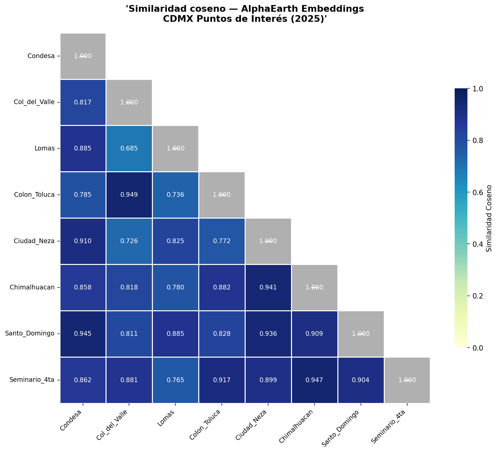


A pesar de observar diferencias notables entre puntos con distintas características socio-demográficas, la métrica no diferencia completamente las características estructurales, y dado que todos los puntos son de una región similar en general, la similitud coseno se mantiene cercana a uno en la mayoría de los casos.

Por lo tanto, podemos aplicar un análisis PCA para usar la varianza entre puntos como forma de diferenciar la naturaleza de los puntos seleccionados.

Después de reproyectar cada vector de punto en los 2 componentes de la descomposición PCA(k=2), exploramos su posición en el nuevo plano PC1-PC2.

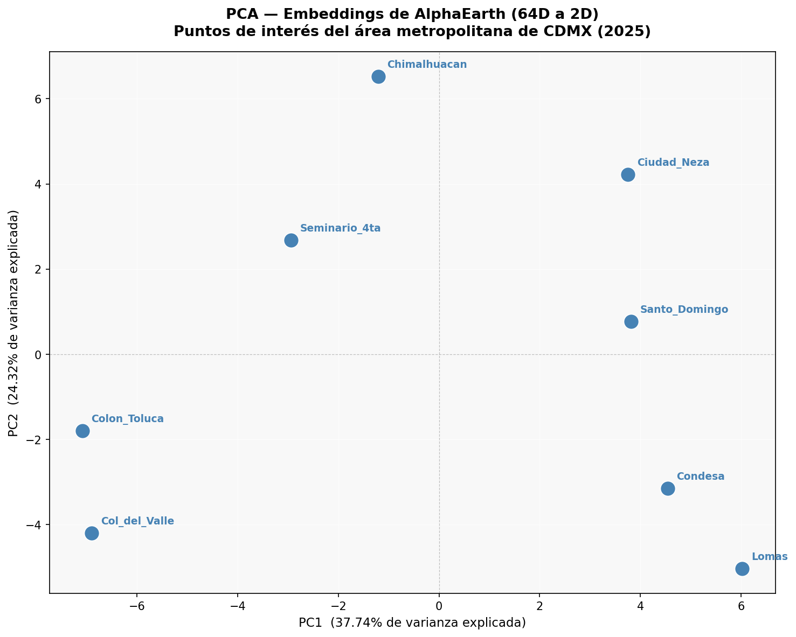

Ahora, en la descomposición, podemos ver que lugares similares, como 'Condesa' y 'Lomas' o 'Ciudad Neza' y 'Santo Domingo', quedan más cercanos entre sí, y también podemos observar una separación de los puntos en secciones; entonces podemos interpretar el significado de los valores del índice usando conocimiento socio-demográfico y empírico. Tomemos por ejemplo lo siguiente:

- **PC1**: Representa zonas de bajos ingresos; entre más bajo el índice, mayor el ingreso esperado.
- **PC2**: Podría asociarse con 'Puramente Residencial': entre más bajo el índice, mayor la probabilidad de estar en un suelo de uso mixto (comercial, industrial y residencial).

A pesar de ser una interpretación básica, y de requerir muchos más puntos de datos para mejorar los índices derivados de los componentes, este pequeño ejercicio nos muestra el potencial de estos vectores de embedding para entender, describir e identificar características latentes de puntos geográficos a través de características puramente numéricas, y traducirlo en información accionable.

El código y la lógica paso a paso del material cubierto en la siguiente sección se pueden consultar en el *Notebook de Varianza de Similitud Local* (revisar el repositorio).

Por ejemplo, tomemos una región (área) de interés (AoI) de la cual extraer embeddings; en este caso, seleccionamos la Delegación (Alcaldía) Coyoacán dentro de la Ciudad de México. La división política oficial y los archivos SHP se pueden encontrar en la [Página Web Oficial de INEGI México](https://www.inegi.org.mx/app/biblioteca/ficha.html?upc=794551163061).


El área seleccionada que se muestra abajo (Coyoacán, Ciudad de México) es útil para este análisis porque tiene las siguientes propiedades que hacen homogéneo el análisis (área cubierta relativamente 'cuadrada', diversidad de patrones urbanos, coexistencia de múltiples niveles socioeconómicos, y POIs contenidos como parques o estadios).

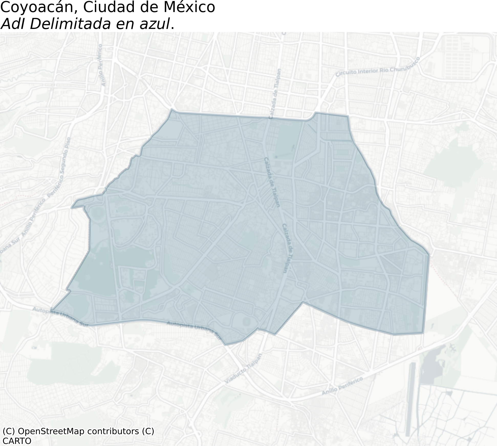

### Límites de la Similitud Coseno

La similitud coseno, o su correspondiente función de métrica propia, *distancia coseno* o *distancia angular*, es una de las funciones más fuertes en Ciencia de Datos para entender la similitud en altas dimensiones, y particularmente al trabajar con embeddings. Debido a que el supuesto implícito para los embeddings es que ya son características procesadas del objeto de interés, la similitud coseno resulta ser una herramienta crítica para encontrar patrones entre pares de puntos.

Para este ejercicio, tomamos un punto ($(-99.17095, 19.35364)$) en medio de *Viveros de Coyoacán*, un conocido parque de conservación en la Ciudad de México, y lo emparejamos con las características correspondientes de la celda de $10m$ como vector de referencia. Luego se graficaron todos los puntos correspondientes donde la similitud coseno está por encima de un umbral en $[0.80, 0.95]$.

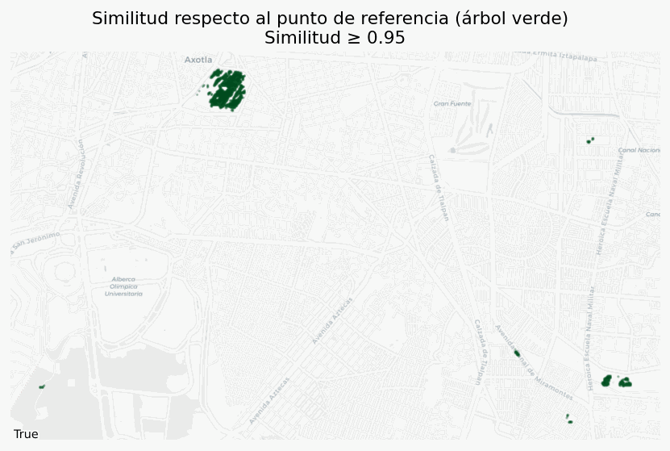

Como podemos ver, con solo tomar un embedding de un píxel bien conocido que representa el objeto de interés, en este caso un árbol, podemos recuperar una gran cantidad de masa verde (otros árboles o vegetación), simplemente relajando el umbral de similitud lo suficiente para reconocer, pero no tan bajo como para contaminar con falsos positivos.

Esto dice mucho sobre la gran cantidad de abstracción y los detalles particulares embebidos de los objetos capturados vía los embeddings vectoriales.

El mismo ejercicio se puede repetir con cuerpos de agua, obteniendo resultados incluso mejores.

### Características latentes de los Embeddings

Uno de los supuestos —más aún, más que un supuesto, es en realidad parte de la naturaleza de los embeddings por diseño de entrenamiento— es que buscamos *embeber* características latentes del proceso generador del cual provienen los datos, y eso vive en objetos geométricos multidimensionales. Así, al trabajar con embeddings o bases vectoriales, un buen primer instinto es usar técnicas de reducción de dimensionalidad para entender o visualizar la naturaleza de los datos que tenemos en mano.

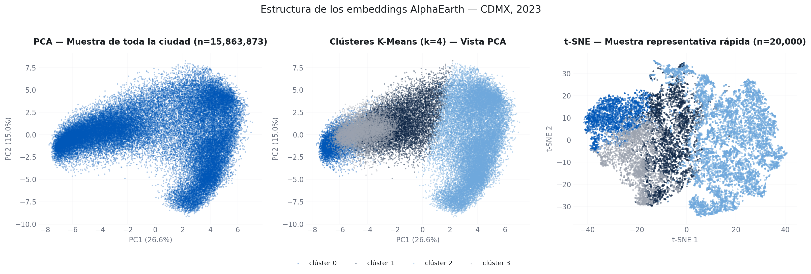

Métodos como PCA nos permiten evaluar las características de las features en formas de baja dimensionalidad manteniendo la mayor cantidad de datos posible (cantidad de varianza del total), y en combinación con métodos de clustering como K-means nos permiten visualizar los patrones de agrupamiento de características multidimensionales.

El algoritmo t-SNE aplica una reducción de dimensionalidad no lineal para identificar las características distribucionalmente similares de los puntos.

## Aplicaciones de los embeddings {#embedding-applications}

La naturaleza de los embeddings es tan rica en términos de información contenida porque estas características provienen de grandes volúmenes de datos procesados en un algoritmo supervisado para múltiples tareas, lo que permite a los modelos capturar múltiples características específicas de dominio y significado *embebido* a lo largo de las características en el espacio latente definido. Sin embargo, esta fortaleza es también su debilidad a la hora de aplicar y modelar usando embeddings, y aún más difícil cuando estas aplicaciones van más allá de un espacio teórico y entran en una aplicación entre dominios; debido a la generalidad y dispersión (sparsity) de los embeddings, es importante definir correctamente el alcance y la arquitectura del modelo, así como las métricas de éxito más allá de las métricas de desempeño para el modelo o algoritmo elegido.

Además, la mayoría de las veces en un entorno local (a nivel ciudad o distrito), incluso las regiones más distintas pueden ser realmente similares en términos de **similitud coseno** o cualquier otra métrica de similitud. (Ver la sección *Baja varianza en entornos locales* más abajo).

A pesar de estos inconvenientes, hay muchas técnicas que pueden ayudarnos a explotar el valor de los embeddings en múltiples aplicaciones; aquí algunas técnicas y modelos.

### Patrones de modelo plug-and-play para embeddings {#plug-and-play-patterns}

Las siguientes son algunas técnicas usadas al trabajar con embeddings; estos ejemplos están lejos de ser exhaustivos, y el campo está actualmente creciendo y definiendo nuevos marcos de modelos y técnicas; considera también que la lista pretende cubrir las aplicaciones y objetivos generales en machine learning, tales como predecir, estimar, clasificar o revelar patrones en los datos. Casos de uso más complejos o de propósito particular podrían usar herramientas y modelos más sofisticados, o incluso desarrollo de frontera.

**Basado en Similitud Coseno**

Podría ser repetitivo, pero el uso de la similitud coseno sobre vectores numéricos es una herramienta poderosa para identificar grupos y dar un significado semántico a un tema, incluso más al trabajar con datos esféricos (como los Embeddings de AlphaEarth).

Algunas aplicaciones directas son:

  - **Look-a-Likes**: Dado un objetivo identificado, buscar todas las entidades *similares* con respecto al objeto de interés.

  - **Aplicaciones de networking**: Con base en la similitud, definir entidades como nodos y conectarlas según umbrales de similitud. Habilitando todos los modelos de grafos planares, al menos.

  - **Clustering directo**: Base para todos los algoritmos de clustering que la usan como función de distancia (usando la definición de métrica de distancia adecuada).

Esta técnica es básica porque es la base de la mayoría de los modelos y métricas, y también por su uso directo dada una base vectorial.


**Reducción de Dimensionalidad**

Para algunos casos como los Earth Embeddings, la cantidad de features disponibles a veces puede agregar ruido en lugar de una señal clara; ahí es cuando la Reducción de Dimensionalidad, al igual que la similitud coseno, aparece tanto como un paso de preprocesamiento como un método para entender las propiedades globales de los embeddings en menos dimensiones, para su visualización y para obtener características más interpretables, como PCA o t-SNE. (Ver múltiples aplicaciones a lo largo de todas las páginas de este trabajo).


**Regresión *Ingenua***

Un primer intento de usar las características de embedding en aprendizaje supervisado es tomar un enfoque directo e intentar ajustar o modelar una relación lineal (o incluso, Modelos Lineales Generalizados) sobre una variable objetivo $y$ en términos de las características de embedding:

$$ y \sim E^t\beta + \epsilon$$

Donde $E$ es el vector de embedding, y $\epsilon$ una variable aleatoria.

Llamamos a este enfoque *ingenuo* no porque sea inherentemente incorrecto o erróneo (de hecho se usa en este trabajo), sino porque dado que los embeddings contienen una gran cantidad de datos, esto puede inducir varianza en el modelo, lo que dificulta su estudio con métodos tradicionales y rara vez deriva en un resultado interpretable y estadísticamente significativo al mismo tiempo.

**Covariables de Regresión**

Otra forma de usar embeddings como característica en una regresión lineal es usarlos, particularmente una proyección de baja dimensionalidad, no solo como las únicas variables sino como un enriquecimiento de datos a un conjunto actual de variables regresoras, particularmente si este no es de naturaleza geográfica.

Usando la siguiente estructura:

$$ y \sim X^t\beta_x + E_d^t\beta_e + \epsilon$$

Donde $E_d$ es un vector de embedding proyectado en un espacio de $d$ dimensiones, $X$ son las características relacionadas, y $\epsilon$ una variable aleatoria.

Como hemos mencionado antes, la cantidad de datos de los embeddings puede agregar varianza adicional, particularmente en un modelo lineal, así que el uso de una proyección de baja dimensionalidad es el punto medio para extraer la mayor cantidad posible de datos importantes sin agregar una gran cantidad de varianza al modelo.

**Clasificación**

Siguiendo la misma lógica que la regresión, cuando el objetivo $y$ es categórico, en nuestro caso un indicador binario de si un evento ocurrió o no, podemos ajustar un clasificador sobre las características de embedding, solas o combinadas con otras variables regresoras:

$$ P(y=1 \mid E, X) = \sigma\left(X^t\beta_x + E_d^t\beta_e\right)$$

Donde $\sigma$ es la función de enlace sigmoide. Las mismas advertencias sobre la varianza agregada por los embeddings aplican aquí, y también el beneficio de usarlos ya sea como el único predictor o como una capa de enriquecimiento sobre las covariables estructurales, particularmente útil dado que los objetivos basados en eventos tienden a estar altamente desbalanceados.

**Cabezas de Red Neuronal (NN Heads)**

Una extensión adicional sobre los modelos plug-in lineales (o lineales generalizados) anteriores es reemplazar la combinación lineal $\beta$, tanto para regresión como para clasificación, por una pequeña red neuronal —una *cabeza* (*head*)— entrenada sobre el vector de embedding (fijo). Es decir, en lugar de $E^t\beta$ aprendemos una función $g_\theta(E)$, típicamente un Perceptrón Multicapa poco profundo, que produce directamente el parámetro de interés (una media de conteo, un logit de clase).

Esto permite al modelo capturar interacciones no lineales entre las dimensiones del embedding que una regresión simple no puede, a costa de perder la interpretabilidad directa de cada coeficiente $\beta$, y exigiendo más datos y cuidado de regularización para evitar el sobreajuste, dado que los embeddings ya son un espacio de características denso y rico en información.

Y sobre cada uno de estos modelos podemos llegar a mejorarlos y hacerlos más complejos; piénsese, por ejemplo, en no solo usar y entrenar una capa de salida, sino en usar una técnica más sofisticada como un mecanismo de atención.

### Aplicaciones en el mundo real

**Predicción y mejora del clima**

Dado que los Earth Embeddings como AlphaEarth ya asimilan reanálisis climático y capas atmosféricas entre sus fuentes de entrenamiento, pueden servir como covariables compactas para el nowcasting meteorológico de corto plazo, o para corregir el sesgo de productos de reanálisis de baja resolución hasta una resolución hiperlocal, sin necesidad de levantar un modelo de simulación física completo.

**Puntuación de Riesgo de Desastres**

El mismo *arquetipo* explorado a lo largo de este trabajo, la puntuación de calles por riesgo de crimen, se extiende directamente a peligros naturales como inundaciones, deslizamientos de tierra o incendios forestales: usar los embeddings como proxy de las características del terreno, la vegetación y la infraestructura, y luego aplicar los mismos patrones supervisados o no supervisados descritos arriba para señalar áreas de alto riesgo, incluso donde el registro histórico del peligro está incompleto.

**Enriquecimiento de la valuación de bienes raíces**

Los modelos hedónicos de precios para bienes raíces tradicionalmente dependen de características estructurales de la propiedad (superficie, habitaciones, antigüedad), dejando de lado las características del vecindario y ambientales que son difíciles de codificar a mano. Los embeddings pueden enriquecer estos modelos como una variable regresora adicional, capturando información latente de amenidades, accesibilidad y uso de suelo de los alrededores de la propiedad, en el mismo espíritu que el enriquecimiento con datos socioeconómicos usado a lo largo de este trabajo.

**Agricultura y cambio climático**

La técnica de *choque sistémico* descrita arriba, comparando el embedding del mismo punto a través del tiempo vía similitud coseno, aplica directamente al cambio de uso de suelo relevante para la agricultura y el monitoreo climático, tales como deforestación, rotación de cultivos o estrés por sequía, sin necesidad de un modelo a la medida para cada fenómeno de interés.

## Advertencias al trabajar con embeddings {#caveats}

Como se puede ver en la sección anterior, los embeddings, cuando se descomponen (vía reducción de dimensionalidad) con métodos como PCA, pueden ser informativos sobre la naturaleza y similitud de diferentes puntos en una región similar en términos de infraestructura, nivel socioeconómico y diseño urbano, pero si prestamos atención al mapa de calor de similitudes, incluso los puntos más disímiles tienen una similitud alrededor de 0.7 (más similares que no). Por eso es importante entender la variabilidad local de los embeddings. Debido a que los embeddings se derivan de entrenar un ViT sobre modelos a nivel de la Tierra, la mayoría de los datos a nivel local se comparten (temperatura, vegetación, distancia al trópico, clima y tiempo, dentro de la misma división política); por eso queremos entender, a nivel local (bajo condiciones similares), cómo difieren los embeddings.


### Baja varianza en entornos locales {#low-local-variance}

Por ejemplo, si tomamos los 64 vectores de embedding para la región seleccionada. Para hacerlo, ejecutamos [Embeddings de EE desde un AoI](../src/earth_engine_basics/00_get_city_embeddings.js) y extraemos datos para un ráster a nivel de 10m, para entender qué tan diferentes son los vectores a escala de vecindario:


Como podemos ver, los patrones de cada banda son similares y las diferencias son difíciles de identificar en una primera inspección, y dado que, como mencionamos antes, los vectores de embedding llevan una enorme cantidad de características locales, debemos hacer una reducción de la dimensionalidad.

Para esta parte del ejercicio realizamos una descomposición PCA usando *k=7*, que da cuenta de hasta el 75% de la varianza, obteniendo los siguientes resultados:


En el primer componente $PC1$ podemos ver zonas borrosas pero agrupadas, que dan cuenta de lo que podemos interpretar como *'características regionales compartidas'*.

En $PC2$ y $PC6$ podemos ver claramente un patrón que define las carreteras y calles, lo que nos permite interpretar estos componentes como indicadores de edificios/infraestructura en comparación con carreteras y calles.

$PC3$ y $PC4$, por ejemplo, tienen valores más uniformemente distribuidos, siendo los componentes que llevan las características regionales.

En contraste, cuando observamos $PC5$, podemos ver claramente regiones definidas donde los valores varían con base en algunos patrones; dado el conocimiento existente, parece clasificar entre áreas verdes vs. infraestructura construida.

Tomando este último punto como una pieza de evidencia para defender la tesis de que los Earth Embeddings, a pesar de incluir datos a nivel mundial en dimensiones latentes, también incluyen información granular sobre POIs o infraestructura particulares.

Analizar embeddings a una granularidad de $10m$ y a nivel de distrito es casi intratable en términos de evaluación (benchmarking) y comparación de diferencias, dada la cantidad de combinaciones por pares a comparar ($\binom{N}{2}$ con $N > 500k$).

Además, si usamos las divisiones geográficas oficiales para evaluar la consistencia de los embeddings a través de las divisiones político-urbanas oficiales, trabajemos en una comparación a nivel de vecindario (colonia).

Para entender cómo se asignan los valores del vector a cada colonia, calle, o en general a los polígonos, ver la sección *Trabajando con Niveles de Agregación*.

**Cálculo de referencia (Benchmark)**

- Tomamos la cobertura de píxeles, es decir, el ráster de 10m, (ver imagen abajo) del polígono.
- Calculamos la similitud coseno por pares para cada vector de píxel (donde cada entrada es una banda para el píxel dado) para cada píxel de la cobertura, para cada nivel de colonia (MZA-CVEGEO para el presente caso, revisar el [Marco Geoestadístico de INEGI México](https://www.inegi.org.mx/app/biblioteca/ficha.html?upc=794551163061)).
- Calculamos el agregado (media/mediana) para las métricas calculadas en cada CVEGEO.


En el siguiente gráfico, vemos las distribuciones de similitud:

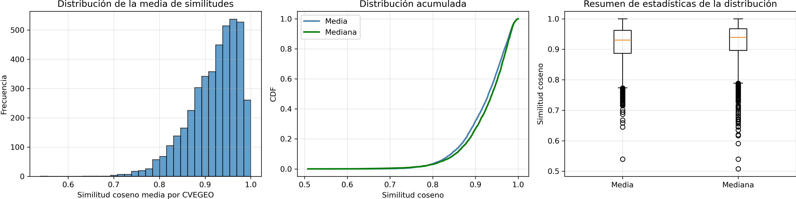

De esto, podemos tomar el supuesto de que la agregación por media/mediana de la cobertura de píxeles mantiene las representaciones de embedding a nivel local.

Además, es importante considerar que, aparentemente, la similitud interna (within) es uniforme a través del área de interés a nivel local.

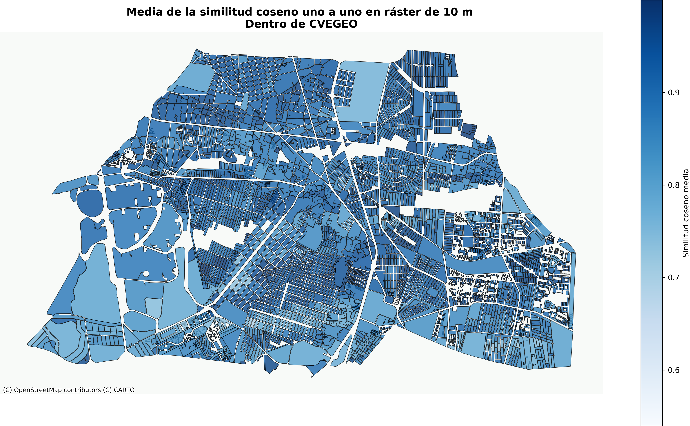


Cambiemos a un área administrativa incluso más grande, para ver qué tan bien se mantiene la similitud entre los embeddings internos por secciones.


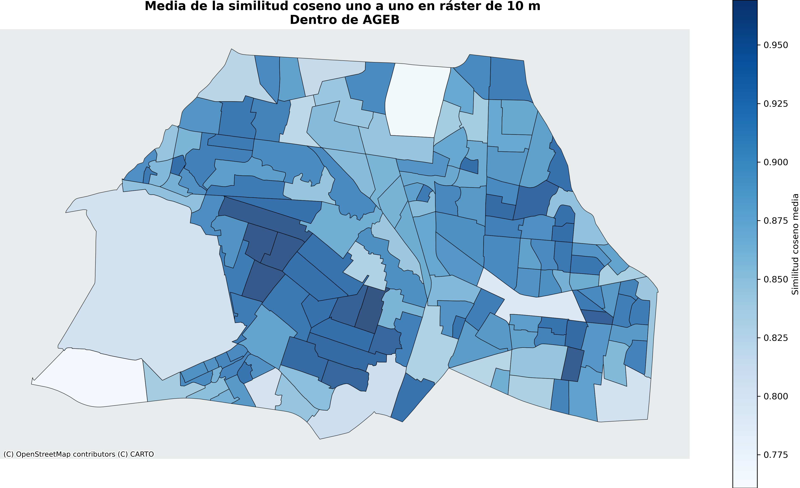

En la figura podemos ver que los *barrios* bien conocidos (vecindarios locales no oficiales) tienen una puntuación de similitud alta, y las áreas de baja similitud corresponden con áreas de uso mixto tales como la *Ciudad Universitaria de la UNAM*, que es el campus de la Universidad Nacional, el cual incluye edificios, parques, reservas forestales, laboratorios y diversos lugares naturales y de infraestructura.

Ahora, para el AGEB (grupo de MZAs), veamos la similitud muestreada:

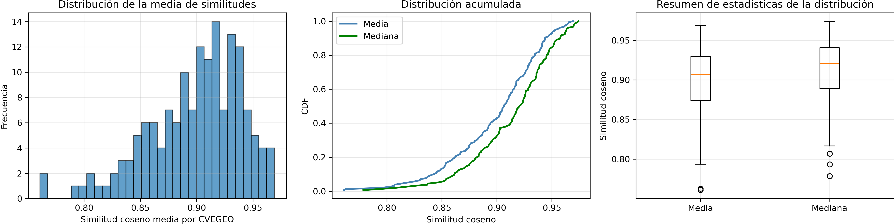

Aquí la media y la mediana parecen tener distribuciones distintas a través de las regiones, y por eso es importante pensar más a fondo en la selección de la métrica de agregación.

En general, lo que podemos ver es que los valores del vector son similares al nivel de CVEGEO tanto para los niveles de agregación de MZA como de AGEB, pero como es evidente en el mapa, las calles no están incluidas, particularmente para el caso de MZA, a pesar de que los embeddings las cubren por completo; entonces repitamos el ejercicio bajo la misma lógica pero tomando las calles correspondientes.

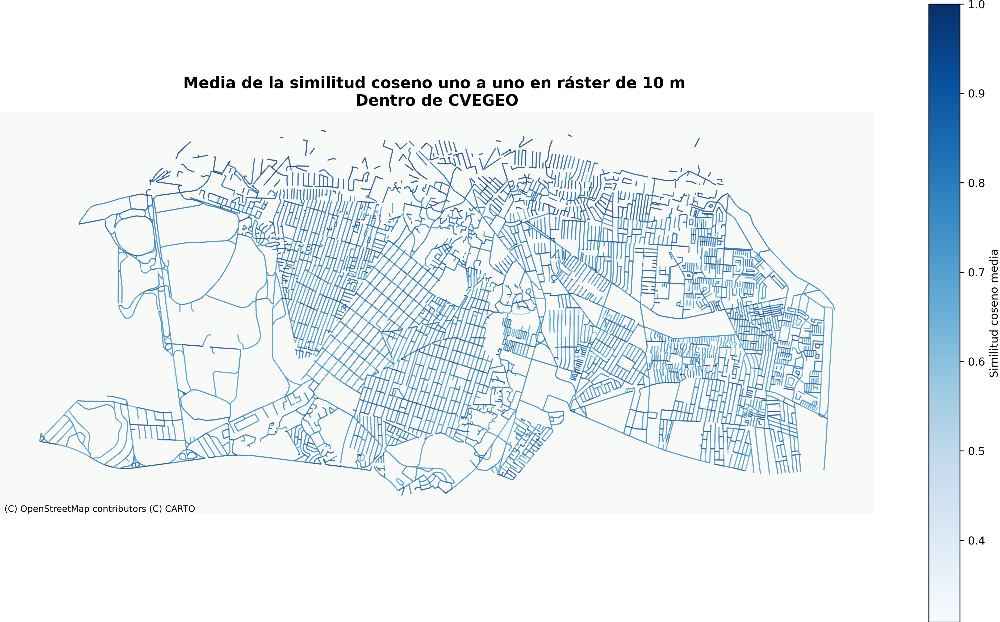

De aquí podemos ver que la mayoría de las calles son más similares que no en general, pero las geometrías reales pueden ser difíciles de interpretar; entonces es importante obtener la similitud muestreada sobre cada geometría a lo largo de la región.

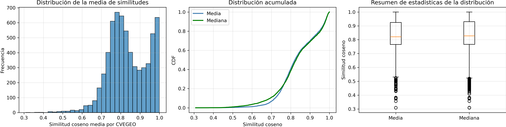

A pesar del comportamiento bimodal de la similitud, aún podemos concluir que la mayoría de las unidades mantienen un alto grado de similitud entre ellas.

### Choques sistémicos en la representación de embeddings

Otra característica de los embeddings vectoriales, particularmente con AlphaEarth, es que no solo ofrecen una cobertura completa de la superficie terrestre, sino que también realizan un entrenamiento de todo el modelo con una cadencia anual.

Entonces podemos estudiar los *choques sistémicos*, que en este contexto significa cambios radicales en los patrones de la superficie que se reflejan en las representaciones de embedding.

Para hacerlo, tomamos el enfoque de *Ceteris paribus*, es decir, dada una serie de embeddings sobre $(lat,lon,time)$, sobre un punto fijo en la Tierra, ¿cuál es la diferencia del embedding a lo largo de la dimensión temporal?, esto medido vía la similitud coseno.

Aquí la distribución para todas las similitudes coseno por pares de todos los embeddings dentro de nuestra AoI (Coyoacán):

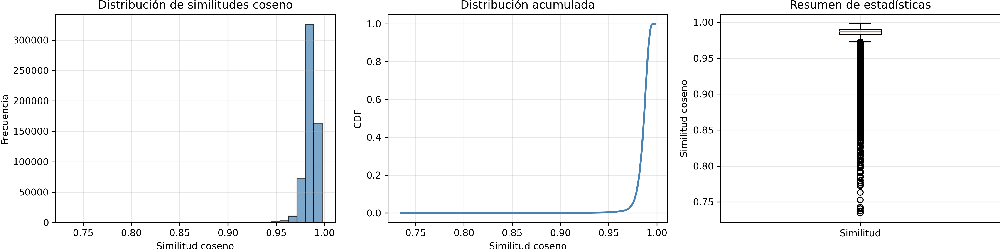

Y aquí los puntos de píxel en los cuales la similitud del vector de embedding correspondiente entre los años 2022 y 2023 es de a lo sumo $0.85$.


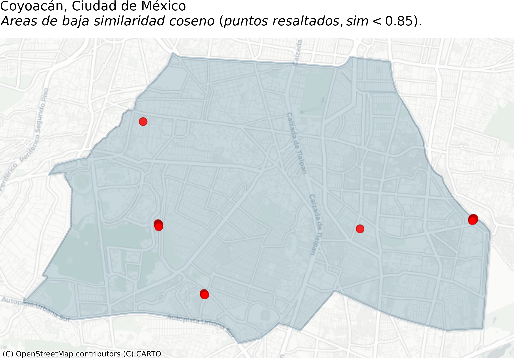


Profundizando en la naturaleza de los puntos donde identificamos cambios importantes, podemos ver el siguiente ejemplo

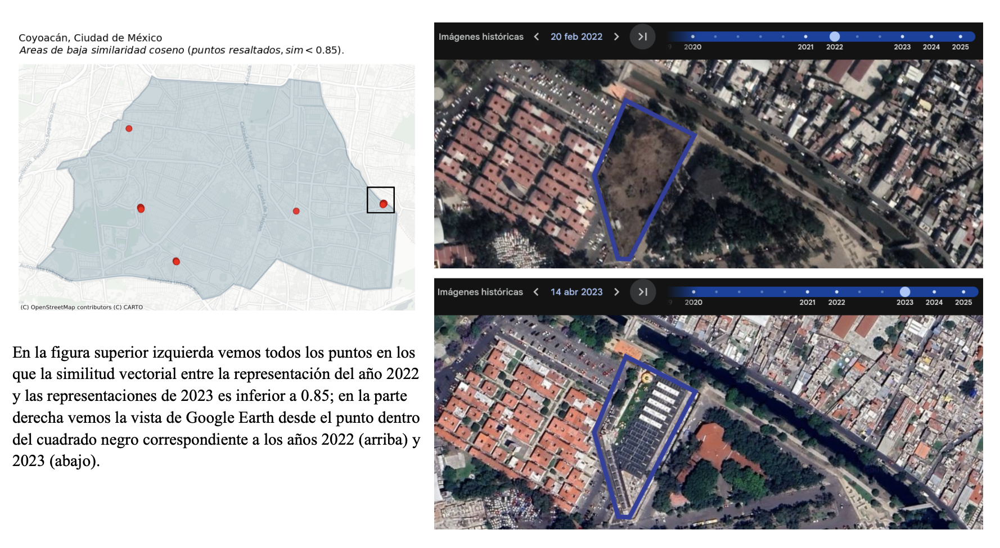

Como podemos ver en la figura, en los puntos donde los embeddings muestran baja similitud, identificamos que se construyó un edificio sobre un terreno vacío durante el año 2022. Esto muestra la metodología simple pero poderosa para identificar cambios geográficos importantes en el terreno, habilitada por el uso de embeddings.

### Trabajando con Niveles de Agregación {#aggregation-levels}

Como se mostró antes, cada modelo tiene su propia lógica y agregación, y podemos encontrar los siguientes 2 tipos de embeddings:

  - **Discretos**: Se encuentran principalmente en forma de rásteres (cuadrículas cuadradas que cubren un área de interés), o cualquier otro conjunto discreto (finito numerable) de división política, geográfica o geométrica (H3, celdas cuadradas). Dado esto, a pesar de las complejas diferencias y ventajas/desventajas entre ellos, para el propósito de esta sección se ven como lo mismo: una división discreta del espacio de interés, es decir, una partición finita disjunta del espacio en objetos poligonales.
  - **Continuos**: Representación continua del espacio, ya sea en un plano (Euclidiano 2D/3D) o cualquier proyección continua (esfera, cilíndrica) sobre geometrías no euclidianas. Además, por simplicidad, podemos ver esto como coordenadas (tupla de valores que representan una posición).

Más allá del tipo de geometría de la estructura de datos, lo que realmente define el tipo de agregación es la forma en que el evento se representa en general. Pensemos en la representación de la superficie terrestre: si usamos un sistema de coordenadas, es decir, una tupla (lat, lon), con un número infinito (en teoría) de puntos posibles entre cualquier par de puntos. En contraste, si usamos la partición H3 de Uber, dados dos celdas cualesquiera, o incluso dos puntos, hay un número finito de celdas H3 de resolución $r$ entre ellos.

Trabajemos con nuestros embeddings ráster de Alpha Earth para explicar la lógica de agregación:

**Asignación de Polígonos**

Supongamos que queremos asignar los valores del vector de nuestro ráster de $10m$, y que queremos asignar esos valores de ráster a un polígono dado cuyo alcance es mayor que una sola celda; la forma aceptada de hacerlo es vía la agregación de su cobertura de ráster, como se ve en la siguiente figura:


Es decir, dado un polígono, usamos la cobertura de ráster de ese polígono (cada celda que toca el área del polígono) y luego tomamos el valor medio del vector de todas esas celdas de ráster, y finalmente lo normalizamos, esto para ser consistentes con los Embeddings de AlphaEarth y la mayoría de las bases de embeddings, que están normalizadas, y particularmente con la base de AlphaEarth, manteniendo el resultado agregado en el espacio $S^{63}$ como se describe en la documentación oficial.

**Agregación de Linestrings**

Esta lógica se mantiene igual sin importar la geometría del objeto de interés; véase, por ejemplo, el siguiente ejemplo para un segmento de calle:

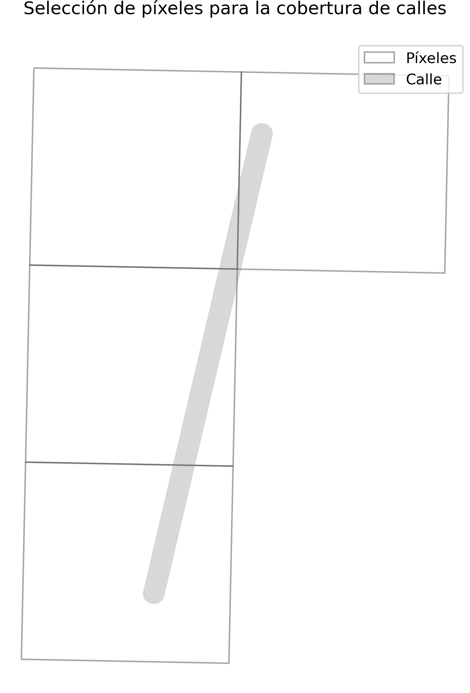

La mayoría de los problemas al trabajar con cualquiera de los dos tipos se deben a no usar una proyección estándar y unificada correcta y a no usar la agregación y las entidades geométricas correctas. Para más detalle sobre cómo trabajar con datos geográficos, ver el [Apéndice de Datos Geoespaciales](99_appendix_geo_data_structures_and_operations.qmd).

Como hemos visto, a pesar de no tener (en teoría) área, la lógica se mantiene: seleccionar todas las celdas tocadas por el objeto, y luego repetir el paso de normalización de la agregación.


## Recursos

[Google Earth Engine Official Web Site](https://earthengine.google.com/)
