This page covers the basics of extracting, transforming and manipulating embeddings as databases and data structures. It also covers the most important and common caveats when working with this type of data.

## How to start using Google Earth Embeddings? {#getting-started}

In the following sections we explore how to obtain the information from public repositories and platforms to get point/raster databases for geospatial analysis.

### Google Earth Engine and Embeddings

Google Earth Engine is Google's official platform for working with multiple geodata layers, public and paid, provided by Google and compatible with the Google Earth platform.

Google Earth Engine works with a variety of tools and environments; for our main task, data consumption, there are two main alternatives:

- Running queries via the web interface using JS code and visualizing the results.
- API call (either in JS or Python), ideal for batch queries and large-scale pipelines.

#### Web Interface

The site allows computing, querying and visualizing relevant data layers at a historical level and running live queries.

The following is the official diagram of the site taxonomy (source: [Google Earth Engine — Code Editor Guide](https://developers.google.com/earth-engine/guides/playground)):

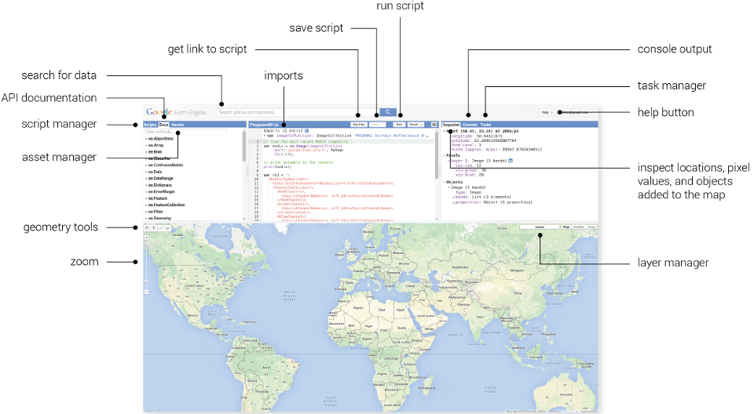

We can think of this as a web-interface IDE for Google Earth Engine, where we can control folders, scripts, permissions, modify code, run it both at the terminal level and at the mapping level, while seeing the results of the code reflected in the terminal outputs and in the map visualizations.

**Getting to know the Platform**

The first section is the *Files Section*, where we can find scripts and assets related to the current project, as well as documentation.

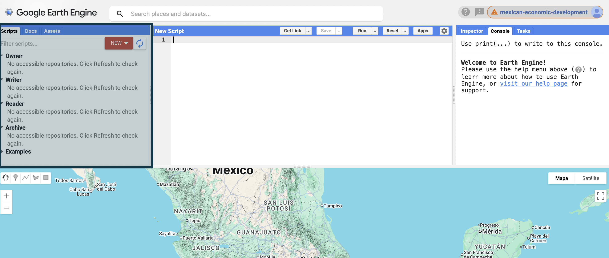

Then we have the *Text editor*, which contains a simple text editor to modify, save and run code snippets in the project.

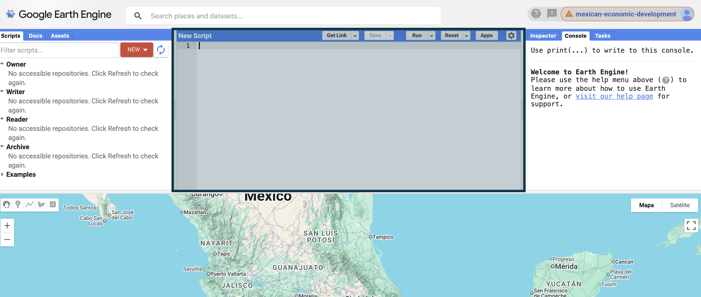

The *Console Section* contains a console output where we can preview the console outputs of the code runs, manage the compute tasks and also inspect particular data layers displayed on the map.

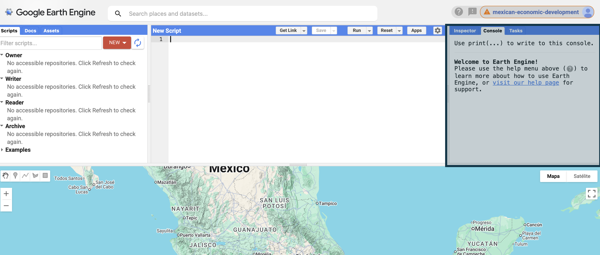

Finally, one of the most useful functions of the Web Interface, the *Map Section*, shows an updated Google Maps-like visualization with all the layers used and queried, helping the user validate and understand the queried data.

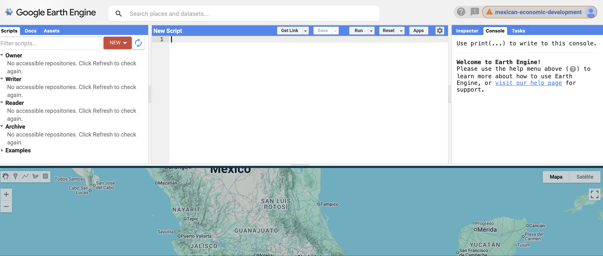

Google Earth Engine runs on JS scripts and is capable of executing complex functions and operations over image layers at scale using MapReduce operations. To understand the basic JS syntax and the basic built-in Google Earth Engine classes and methods, the code contained in the [Earth Engine Basics Folder](../src/earth_engine_basics/) can be a good starting point. Based on the official lessons from the [Google Earth YouTube channel](https://www.youtube.com/@googleearth/videos).

For example, to query and export the official Earth Embeddings Model V1 data for a given date (annual update) and a given point or region, we can run on the Earth Engine platform:

``` javascript
/*

Get Google Earth embeddings for a series of point of interest defined as
coordinates. 

*/


// Load collection.
var dataset = ee.ImageCollection('GOOGLE/SATELLITE_EMBEDDING/V1/ANNUAL');


// Points of interest.

// Condesa, CDMX 
var point_condesa = ee.Geometry.Point(-99.17419288097291, 19.414731832420593);

// Col. del Valle, CDMX
var point_valle = ee.Geometry.Point(-99.16704184941831, 19.38310242644066);

// Lomas , CDMX 
var point_loans = ee.Geometry.Point(-99.24850645938683, 19.40141416099446);

// Colon, Toluca
var point_colon = ee.Geometry.Point(-99.66243639933285, 19.279955716027864);

// Ciudad Neza 
var point_neza = ee.Geometry.Point(-99.0496455008092,19.406336457788832);

// Chimalhuacan 
var point_chimal = ee.Geometry.Point(-98.94521221369688,19.43969544524912);

// Santo Domingo 
var point_san_dom = ee.Geometry.Point(-99.16633130557423,19.32572954373539);

// Seminario 4ta Sec. 
var point_semi = ee.Geometry.Point(-99.6804373147858, 19.269166421663304);

// Mosaic all tiles for 2025
var embedding = dataset
  .filter(ee.Filter.calendarRange(2025, 2025, 'year'))
  .mosaic();                                              

print('Embedding bands:', embedding.bandNames());

// Bundle all POIs as a FeatureCollection with labels
var pois = ee.FeatureCollection([
  ee.Feature(point_condesa, {label: 'Condesa'}),
  ee.Feature(point_valle,   {label: 'Col_del_Valle'}),
  ee.Feature(point_loans,   {label: 'Lomas'}),
  ee.Feature(point_colon,   {label: 'Colon_Toluca'}),
  ee.Feature(point_neza,    {label: 'Ciudad_Neza'}),
  ee.Feature(point_chimal,  {label: 'Chimalhuacan'}),
  ee.Feature(point_san_dom, {label: 'Santo_Domingo'}),
  ee.Feature(point_semi,    {label: 'Seminario_4ta'}),
]);

// Sample all 64 embedding dimensions at each POI (scale=10m native res)
var embeddings = embedding.reduceRegions({
  collection: pois,
  reducer: ee.Reducer.first(),
  scale: 10,
  tileScale: 4,
});

print('Embeddings sample:', embeddings.first());

// Export full 64-feature embeddings to Drive as CSV
Export.table.toDrive({
  collection: embeddings,
  description: 'POI_Embeddings_CDMX',
  folder: 'GEE_exports',
  fileNamePrefix: 'poi_embeddings_cdmx',
  fileFormat: 'CSV',
  selectors: ['label',
    'A00','A01','A02','A03','A04','A05','A06','A07',
    'A08','A09','A10','A11','A12','A13','A14','A15',
    'A16','A17','A18','A19','A20','A21','A22','A23',
    'A24','A25','A26','A27','A28','A29','A30','A31',
    'A32','A33','A34','A35','A36','A37','A38','A39',
    'A40','A41','A42','A43','A44','A45','A46','A47',
    'A48','A49','A50','A51','A52','A53','A54','A55',
    'A56','A57','A58','A59','A60','A61','A62','A63',
  ],
});
```

After running this code, the file with the most recent embedding values for the selected points will be saved as a .csv in the Drive account from which Google Earth Engine is being run.

#### Queries via API call

In addition, for a larger dataset or batch processing of large data volumes, it will be useful to use the Python API, as shown in the following code:

``` python

### Needed libraries 

# Officila Google Earth SDK 
import ee

# Import environmental variables 
from dotenv import load_dotenv
import os

# Load environment variables from .env file
try:
  load_dotenv()  
except Exception as e:
  print(f"Error loading environment variables. {e}")


### Main 

# One time only authentication 
try:
  ee.Authenticate()
except Exception as e:
  print(f"Error loading authenticating. {e}")


# Open up the existing proyect
try:
  ee.Initialize(project=os.getenv('EE_PROJECT_NAME'))
except Exception as e:
  print(f"Error intializing project. {e}")


# Auxiliar Function 
def get_embedding(lat: float, lon: float, year: int) -> dict | None:
    point = ee.Geometry.Point(lon, lat)
    image = (ee.ImageCollection('GOOGLE/SATELLITE_EMBEDDING/V1/ANNUAL')
               .filter(ee.Filter.calendarRange(year, year, 'year'))
               .mosaic())

    result = image.reduceRegion(
        reducer  = ee.Reducer.first(),
        geometry = point,
        scale    = 10
    )

    values = result.getInfo()
    return values if any(v is not None for v in values.values()) else None

if __name__=="__main__":
  
  # Example 
  try:
    emb = get_embedding(lat=19.4147, lon=-99.1742, year=2023)
    print(emb)
  except Exception as e:
    print(f"Error getting embeddings for selected point. {e}")


```

Despite being a functional code snippet, for working with/downloading more robust and specific code, some of it can be found in the directory: `./src/earth_engine_basics/`.

## Working with Vector Embeddings {#working-with-vector-embeddings}

Regardless of the model used for the embeddings, there are some properties we would like to see in this feature, some of which are described below.

### Similarity between entities {#entity-similarity}

The notion of similarity over embeddings could be misunderstood if we do not remember what they are, that is, a collection of vectors from a latent space, and thus the similarity of the representations can be evaluated in terms of vector similarity.

In general, one of the most relevant similarity metrics is *Cosine Similarity*, defined below.

**Def.** The **cosine similarity** between two vectors $\mathbf{u}, \mathbf{v} \in \mathbb{R}^n \setminus \{\mathbf{0}\}$ is defined as:

$$ S_c(\mathbf{u}, \mathbf{v}) = \cos(\theta) = \frac{\mathbf{u} \cdot \mathbf{v}}{\|\mathbf{u}\|_2 \, \|\mathbf{v}\|_2} = \frac{\displaystyle\sum_{i=1}^{n} u_i v_i}{\sqrt{\displaystyle\sum_{i=1}^{n} u_i^2} \cdot \sqrt{\displaystyle\sum_{i=1}^{n} v_i^2}}$$

where $\theta \in [0, \pi]$ is the angle subtended by $\mathbf{u}$ and $\mathbf{v}$ in the inner-product space, and $\|\cdot\|_2$ denotes the Euclidean ($L^2$) norm. This is a direct consequence of the Cauchy-Schwarz inequality, which guarantees $\cos(\theta) \in [-1, 1]$.

More generally, in any real inner-product space $(\mathcal{H}, \langle \cdot, \cdot \rangle)$:

$$ \cos(\theta) = \frac{\langle \mathbf{u}, \mathbf{v} \rangle}{\|\mathbf{u}\| \, \|\mathbf{v}\|}$$

It is important to note that cosine similarity is not properly a metric in the sense of the metrics induced on metric or Hilbert spaces; however, its use in different statistical learning methods and its meaning as "proximity" between vectors make it a suitable value for evaluating the similarity between vector representations of entities (embeddings).

Considering this, we can define the *cosine distance* for unit vectors as:

$$
D_c(\mathbf{u},\mathbf{v}) = \operatorname{dist}(\mathbf{u}, \mathbf{v}) = \sqrt{(\mathbf{u}- \mathbf{v}) \cdot (\mathbf{u}- \mathbf{v})} = \sqrt{2(1-S_c(\mathbf{u},\mathbf{v}))}
$$

and sometimes also known or defined as:

$$
D_c(\mathbf{u},\mathbf{v}) = 1 - S_c(\mathbf{u},\mathbf{v})
$$

In the end, the intent of Cosine Similarity is that similar places at the same moment (point coordinates at a given time) based on their features should have similar values representing them as entities, that is, despite spatial distance, political divisions and geographic separations, similar places should be similar in the feature space defined by the embedding.

For this task we performed a small experiment using the 64-dimensional feature space created by Google Earth Embedding V1 to analyze the similarity between 8 different residential areas of the Mexico City Metropolitan Area shown in the following figure:

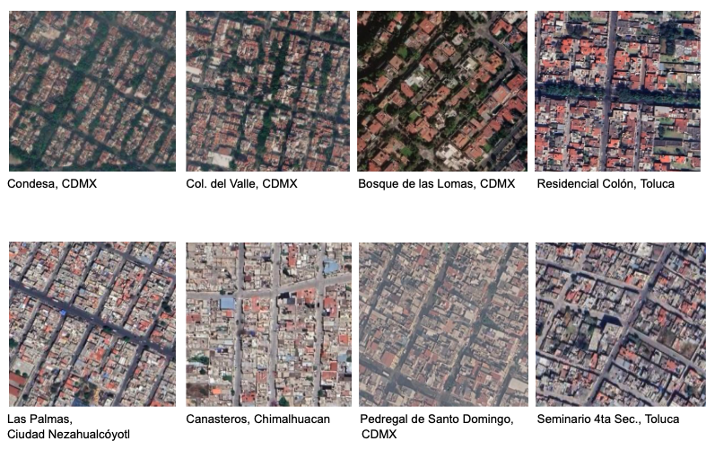

Let us look at the following example; the full code can be reviewed in the [Similarity Test Notebook](../notebooks/ee_sim_test.ipynb).

First, we compute the point-to-point *cosine similarity* between the selected points:

| | Condesa | Col_del_Valle | Lomas | Colon_Toluca | Ciudad_Neza | Chimalhuacan | Santo_Domingo | Seminario_4ta |
|---|---|---|---|---|---|---|---|---|
| **Condesa** | 1.0000 | 0.8172 | 0.8849 | 0.7854 | 0.9103 | 0.8580 | 0.9446 | 0.8622 |
| **Col_del_Valle** | 0.8172 | 1.0000 | 0.6855 | 0.9493 | 0.7264 | 0.8178 | 0.8110 | 0.8815 |
| **Lomas** | 0.8849 | 0.6855 | 1.0000 | 0.7358 | 0.8248 | 0.7797 | 0.8853 | 0.7654 |
| **Colon_Toluca** | 0.7854 | 0.9493 | 0.7358 | 1.0000 | 0.7724 | 0.8820 | 0.8283 | 0.9174 |
| **Ciudad_Neza** | 0.9103 | 0.7264 | 0.8248 | 0.7724 | 1.0000 | 0.9406 | 0.9356 | 0.8989 |
| **Chimalhuacan** | 0.8580 | 0.8178 | 0.7797 | 0.8820 | 0.9406 | 1.0000 | 0.9087 | 0.9465 |
| **Santo_Domingo** | 0.9446 | 0.8110 | 0.8853 | 0.8283 | 0.9356 | 0.9087 | 1.0000 | 0.9037 |
| **Seminario_4ta** | 0.8622 | 0.8815 | 0.7654 | 0.9174 | 0.8989 | 0.9465 | 0.9037 | 1.0000 |

We can see the similarities in the following heatmap:

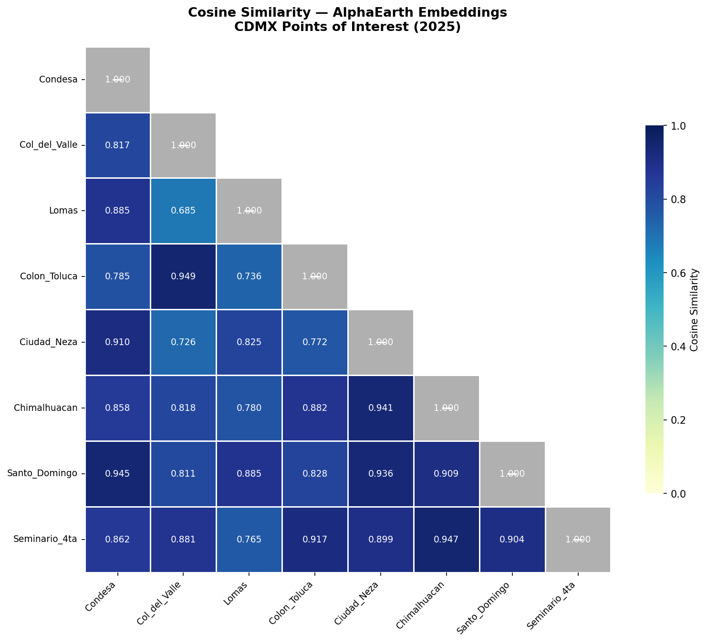

Despite observing notable differences between points with different socio-demographic characteristics, the metric does not fully differentiate the structural features, and given that all points are from a broadly similar region, the cosine similarity stays close to one in most cases.

Therefore, we can apply a PCA analysis to use the variance between points as a way of differentiating the nature of the selected points.

After reprojecting each point vector onto the 2 components of the PCA(k=2) decomposition, we explore their position on the new PC1-PC2 plane.

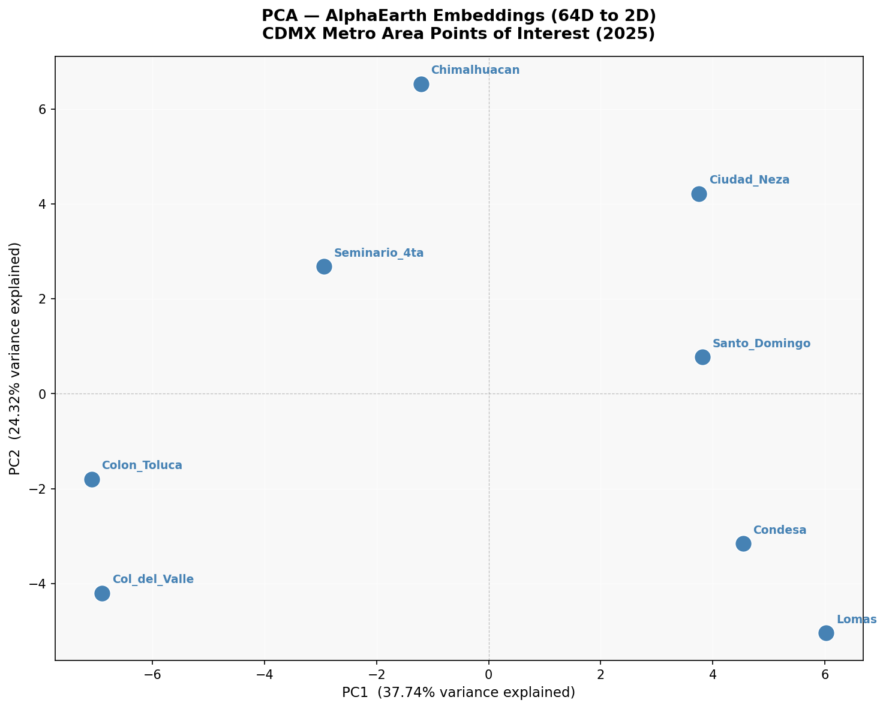

Now, in the decomposition, we can see that similar places, such as 'Condesa' and 'Lomas' or 'Ciudad Neza' and 'Santo Domingo', end up closer to each other, and we can also observe a separation of the points into sections; we can then interpret the meaning of the index values using socio-demographic and empirical knowledge. Take for example the following:

- **PC1**: Represents low-income areas; the lower the index, the higher the expected income.
- **PC2**: Could be associated with 'Purely Residential': the lower the index, the higher the probability of being on mixed-use land (commercial, industrial and residential).

Despite being a basic interpretation, and requiring many more data points to improve the indices derived from the components, this small exercise shows us the potential of these embedding vectors to understand, describe and identify latent features of geographic points through purely numerical features, and to translate it into actionable information.

The code and step-by-step logic of the material covered in the next section can be consulted in the [Local Similarity Variance Notebook](../notebooks/ee_sim_local_var.ipynb).

For example, let us take a region (area) of interest (AoI) from which to extract embeddings; in this case, we select the Coyoacán Borough (Alcaldía) within Mexico City. The official political division and the SHP files can be found at [Mexico's INEGI Official Web Page](https://www.inegi.org.mx/app/biblioteca/ficha.html?upc=794551163061).

The selected area shown below (Coyoacán, Mexico City) is useful for this analysis because it has the following properties that make the analysis homogeneous (relatively 'square' covered area, diversity of urban patterns, coexistence of multiple socioeconomic levels, and contained POIs such as parks or stadiums).

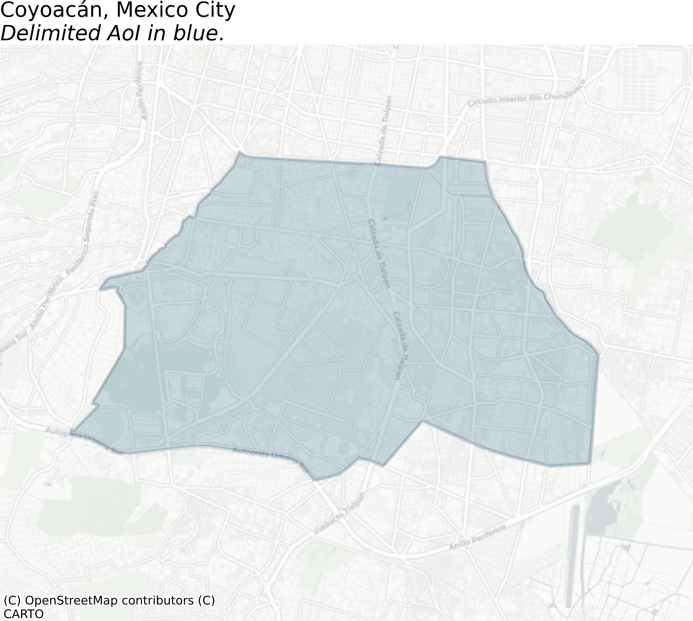

### Limits of Cosine Similarity

Cosine similarity, or its corresponding proper metric function, *cosine distance* or *angular distance*, is one of the strongest functions in Data Science for understanding similarity in high dimensions, and particularly when working with embeddings. Because the implicit assumption for embeddings is that they are already processed features of the object of interest, cosine similarity turns out to be a critical tool for finding patterns between pairs of points.

For this exercise, we take a point ($(-99.17095, 19.35364)$) in the middle of *Viveros de Coyoacán*, a well-known conservation park in Mexico City, and pair it with the corresponding features of the $10m$ cell as a reference vector. Then all the corresponding points where the cosine similarity is above a threshold in $[0.80, 0.95]$ were plotted.

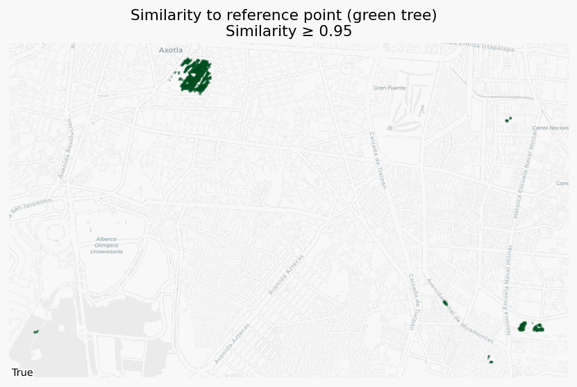

As we can see, by just taking an embedding of a well-known pixel representing the object of interest, in this case a tree, we can recover a large amount of green mass (other trees or vegetation), simply by relaxing the similarity threshold enough to recognize, but not so low as to contaminate with false positives.

This says a lot about the large amount of abstraction and the particular embedded details of the objects captured via the vector embeddings.

The same exercise can be repeated with water bodies, obtaining even better results.

### Latent features of Embeddings

One of the assumptions —moreover, more than an assumption, it is actually part of the nature of embeddings by training design— is that we seek to *embed* latent features of the generating process from which the data come, and that lives in multidimensional geometric objects. Thus, when working with embeddings or vector bases, a good first instinct is to use dimensionality reduction techniques to understand or visualize the nature of the data we have at hand.

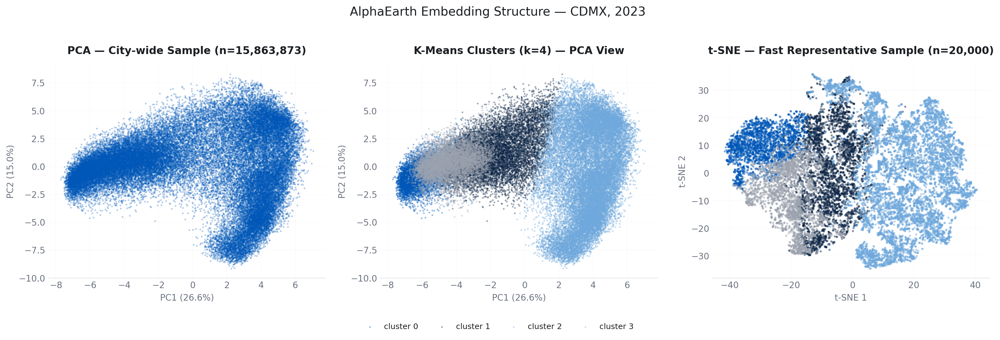

Methods such as PCA allow us to evaluate the characteristics of the features in low-dimensional forms while keeping as much of the data as possible (amount of variance of the total), and in combination with clustering methods such as K-means they allow us to visualize the grouping patterns of multidimensional features.

The t-SNE algorithm applies a non-linear dimensionality reduction to identify the distributionally similar features of the points.

## Applications of embeddings {#embedding-applications}

The nature of embeddings is so rich in terms of contained information because these features come from large volumes of data processed in a supervised algorithm for multiple tasks, which allows the models to capture multiple domain-specific features and meaning *embedded* throughout the features in the defined latent space. However, this strength is also its weakness when it comes to applying and modeling using embeddings, and it is even harder when these applications go beyond a theoretical space and enter a cross-domain application; because of the generality and sparsity of embeddings, it is important to correctly define the scope and architecture of the model, as well as the success metrics beyond the performance metrics for the chosen model or algorithm.

In addition, most of the time in a local setting (city or district level), even the most distinct regions can be really similar in terms of **cosine similarity** or any other similarity metric. (See the *Low variance in local settings* section below.)

Despite these drawbacks, there are many techniques that can help us exploit the value of embeddings in multiple applications; here are some techniques and models.

### Plug-and-play model patterns for embeddings {#plug-and-play-patterns}

The following are some techniques used when working with embeddings; these examples are far from exhaustive, and the field is currently growing and defining new model frameworks and techniques; consider also that the list intends to cover the general applications and objectives in machine learning, such as predicting, estimating, classifying or revealing patterns in the data. More complex or special-purpose use cases could use more sophisticated tools and models, or even frontier development.

**Based on Cosine Similarity**

It might be repetitive, but the use of cosine similarity over numerical vectors is a powerful tool for identifying groups and giving semantic meaning to a topic, even more so when working with spherical data (such as AlphaEarth Embeddings).

Some direct applications are:

- **Look-a-Likes**: Given an identified target, search all the *similar* entities with respect to the object of interest.

- **Networking applications**: Based on similarity, define entities as nodes and connect them according to similarity thresholds. Enabling all planar graph models, at least.

- **Direct clustering**: Basis for all clustering algorithms that use it as a distance function (using the appropriate distance metric definition).

This technique is basic because it is the basis of most models and metrics, and also because of its direct use given a vector base.

**Dimensionality Reduction**

For some cases such as Earth Embeddings, the amount of available features can sometimes add noise instead of a clear signal; that is when Dimensionality Reduction, just like cosine similarity, appears both as a preprocessing step and as a method to understand the global properties of the embeddings in fewer dimensions, for visualization and to obtain more interpretable features, such as PCA or t-SNE. (See multiple applications throughout all the pages of this work.)

***Naive* Regression**

A first attempt at using embedding features in supervised learning is to take a direct approach and try to fit or model a linear relationship (or even Generalized Linear Models) on a target variable $y$ in terms of the embedding features:

$$ y \sim E^t\beta + \epsilon$$ 

Where $E$ is the embedding vector, and $\epsilon$ a random variable.

We call this approach *naive* not because it is inherently incorrect or wrong (it is in fact used in this work), but because since embeddings contain a large amount of data, this can induce variance in the model, which makes it difficult to study with traditional methods and rarely leads to an interpretable and statistically significant result at the same time.

**Regression Covariates**

Another way to use embeddings as a feature in a linear regression is to use them, particularly a low-dimensional projection, not only as the sole variables but as a data enrichment to a current set of regressor variables, particularly if this one is not geographic in nature.

Using the following structure:

$$ y \sim X^t\beta_x + E_d^t\beta_e + \epsilon$$ 

Where $E_d$ is an embedding vector projected onto a $d$-dimensional space, $X$ are the related features, and $\epsilon$ a random variable.

As we have mentioned before, the amount of data in the embeddings can add additional variance, particularly in a linear model, so the use of a low-dimensional projection is the middle ground for extracting as much important data as possible without adding a large amount of variance to the model.

**Classification**

Following the same logic as regression, when the target $y$ is categorical, in our case a binary indicator of whether an event occurred or not, we can fit a classifier over the embedding features, alone or combined with other regressor variables:

$$ P(y=1 \mid E, X) = \sigma\left(X^t\beta_x + E_d^t\beta_e\right)$$

Where $\sigma$ is the sigmoid link function. The same caveats about the variance added by embeddings apply here, and so does the benefit of using them either as the sole predictor or as an enrichment layer over the structural covariates, particularly useful given that event-based targets tend to be highly imbalanced.

**Neural Network Heads (NN Heads)**

A further extension over the linear (or generalized linear) plug-in models above is to replace the linear combination $\beta$, both for regression and classification, with a small neural network —a *head*— trained over the (fixed) embedding vector. That is, instead of $E^t\beta$ we learn a function $g_\theta(E)$, typically a shallow Multilayer Perceptron, which directly produces the parameter of interest (a count mean, a class logit).

This allows the model to capture non-linear interactions between the embedding dimensions that a simple regression cannot, at the cost of losing the direct interpretability of each coefficient $\beta$, and demanding more data and regularization care to avoid overfitting, given that embeddings are already a dense, information-rich feature space.

And on top of each of these models we can go on to improve them and make them more complex; think, for example, of not only using and training an output layer, but of using a more sophisticated technique such as an attention mechanism.

### Real-world applications

**Weather prediction and improvement**

Since Earth Embeddings such as AlphaEarth already assimilate climate reanalysis and atmospheric layers among their training sources, they can serve as compact covariates for short-term meteorological nowcasting, or for correcting the bias of low-resolution reanalysis products down to a hyperlocal resolution, without needing to stand up a full physical simulation model.

**Disaster Risk Scoring**

The same *archetype* explored throughout this work, scoring streets by crime risk, extends directly to natural hazards such as floods, landslides or wildfires: use the embeddings as a proxy for terrain, vegetation and infrastructure features, and then apply the same supervised or unsupervised patterns described above to flag high-risk areas, even where the historical record of the hazard is incomplete.

**Real estate valuation enrichment**

Hedonic pricing models for real estate traditionally rely on structural property features (surface area, rooms, age), leaving aside the neighborhood and environmental features that are hard to hand-code. Embeddings can enrich these models as an additional regressor variable, capturing latent information about amenities, accessibility and land use around the property, in the same spirit as the socioeconomic data enrichment used throughout this work.

**Agriculture and climate change**

The *systemic shock* technique described above, comparing the embedding of the same point across time via cosine similarity, applies directly to land-use change relevant to agriculture and climate monitoring, such as deforestation, crop rotation or drought stress, without needing a bespoke model for each phenomenon of interest.

## Caveats when working with embeddings {#caveats}

As can be seen in the previous section, embeddings, when decomposed (via dimensionality reduction) with methods such as PCA, can be informative about the nature and similarity of different points in a similar region in terms of infrastructure, socioeconomic level and urban design, but if we pay attention to the similarity heatmap, even the most dissimilar points have a similarity around 0.7 (more similar than not). That is why it is important to understand the local variability of embeddings. Because embeddings are derived from training a ViT on Earth-level models, most of the data at the local level is shared (temperature, vegetation, distance to the tropics, climate and weather, within the same political division); this is why we want to understand, at the local level (under similar conditions), how the embeddings differ.

### Low variance in local settings {#low-local-variance}

For example, if we take the 64 embedding vectors for the selected region. To do so, we run [EE Embeddings from an AoI](../src/earth_engine_basics/00_get_city_embeddings.js) and extract data for a raster at the 10m level, to understand how different the vectors are at neighborhood scale:

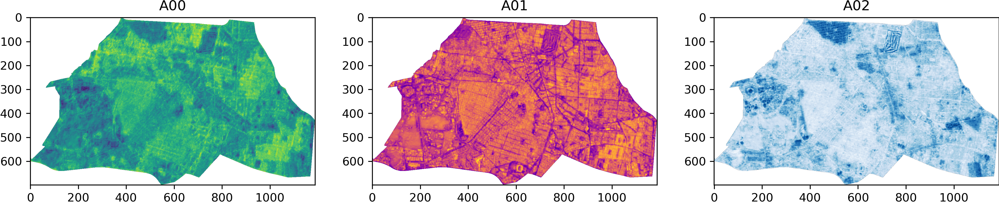

As we can see, the patterns of each band are similar and the differences are hard to identify at first inspection, and given that, as we mentioned before, the embedding vectors carry an enormous amount of local features, we must perform a dimensionality reduction.

For this part of the exercise we performed a PCA decomposition using *k=7*, which accounts for up to 75% of the variance, obtaining the following results:

.

In the first component $PC1$ we can see blurry but grouped areas, which account for what we can interpret as *'shared regional features'*.

In $PC2$ and $PC6$ we can clearly see a pattern that defines roads and streets, which allows us to interpret these components as indicators of buildings/infrastructure compared to roads and streets.

$PC3$ and $PC4$, for example, have more uniformly distributed values, being the components that carry the regional features.

In contrast, when we look at $PC5$, we can clearly see defined regions where the values vary based on some patterns; given the existing knowledge, it seems to classify between green areas vs. built infrastructure.

Taking this last point as a piece of evidence to defend the thesis that Earth Embeddings, despite including world-level data in latent dimensions, also include granular information about particular POIs or infrastructure.

Analyzing embeddings at a $10m$ granularity and at the district level is almost intractable in terms of benchmarking and comparing differences, given the number of pairwise combinations to compare ($\binom{N}{2}$ with $N > 500k$).

In addition, if we use the official geographic divisions to evaluate the consistency of the embeddings across the official political-urban divisions, let us work on a neighborhood-level (colonia) comparison.

To understand how the vector values are assigned to each neighborhood, street, or in general to polygons, see the *Working with Aggregation Levels* section.

**Benchmark computation**

- We take the pixel coverage, that is, the 10m raster, (see image below) of the polygon.
- We compute the pairwise cosine similarity for each pixel vector (where each entry is a band for the given pixel) for each pixel of the coverage, for each neighborhood level (MZA-CVEGEO for the present case, check [Mexico INEGI's Marco Geoestadístico](https://www.inegi.org.mx/app/biblioteca/ficha.html?upc=794551163061)).
- We compute the aggregate (mean/median) for the metrics computed in each CVEGEO.

In the following chart, we see the similarity distributions:

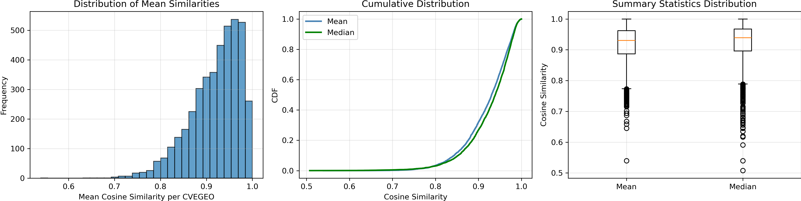

From this, we can take the assumption that the mean/median aggregation of the pixel coverage preserves the embedding representations at the local level.

In addition, it is important to consider that, apparently, the within similarity is uniform across the area of interest at the local level.

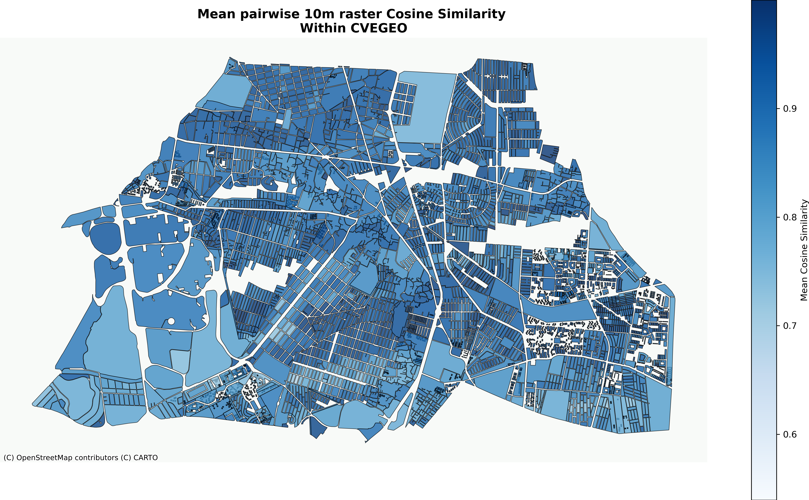

Let us switch to an even larger administrative area, to see how well the similarity between the within embeddings holds by sections.

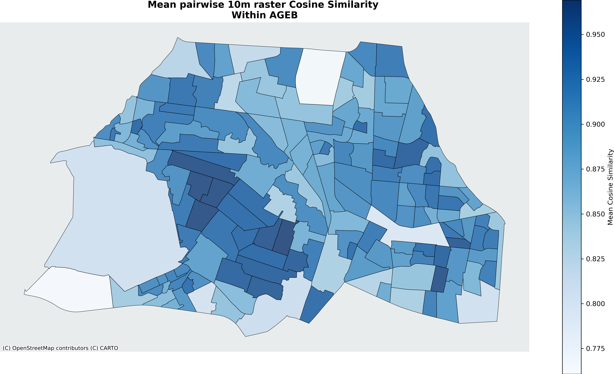

In the figure we can see that the well-known *barrios* (unofficial local neighborhoods) have a high similarity score, and the low-similarity areas correspond to mixed-use areas such as *UNAM's Ciudad Universitaria*, which is the National University campus, including buildings, parks, forest reserves, laboratories and various natural and infrastructure sites.

Now, for the AGEB (group of MZAs), let us look at the sampled similarity:

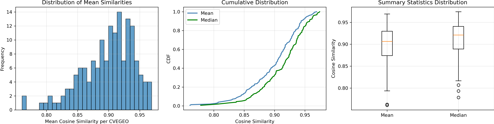

Here the mean and the median seem to have different distributions across the regions, and this is why it is important to think more deeply about the selection of the aggregation metric.

In general, what we can see is that the vector values are similar at the CVEGEO level for both the MZA and AGEB aggregation levels, but as is evident on the map, streets are not included, particularly for the MZA case, even though the embeddings cover them completely; so let us repeat the exercise under the same logic but taking the corresponding streets.

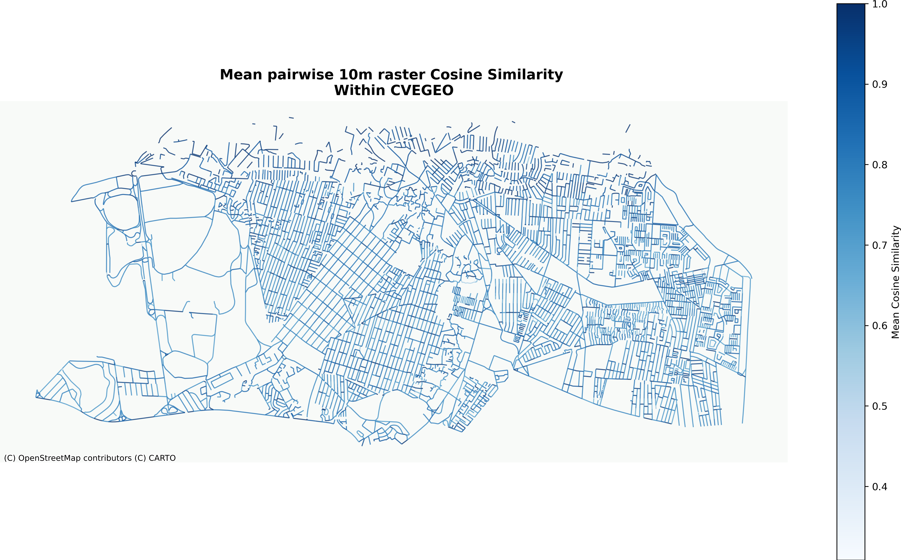

From here we can see that most streets are more similar than not in general, but the actual geometries can be hard to interpret; so it is important to obtain the sampled similarity over each geometry throughout the region.

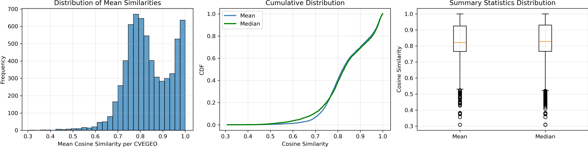

Despite the bimodal behavior of the similarity, we can still conclude that most units maintain a high degree of similarity among themselves.

### Systemic shocks in the embedding representation

Another feature of vector embeddings, particularly with AlphaEarth, is that they not only offer full coverage of the Earth's surface, but also perform a training of the whole model with an annual cadence.

We can then study *systemic shocks*, which in this context means radical changes in surface patterns that are reflected in the embedding representations.

To do so, we take the *Ceteris paribus* approach, that is, given a series of embeddings over $(lat,lon,time)$, over a fixed point on Earth, what is the difference of the embedding along the temporal dimension?, this measured via cosine similarity.

Here is the distribution for all pairwise cosine similarities of all embeddings within our AoI (Coyoacán):

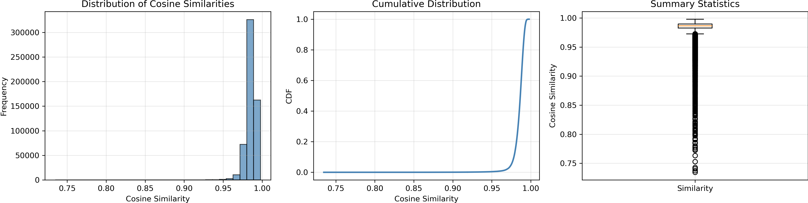

And here the pixel points at which the similarity of the corresponding embedding vector between the years 2022 and 2023 is at most $0.85$.

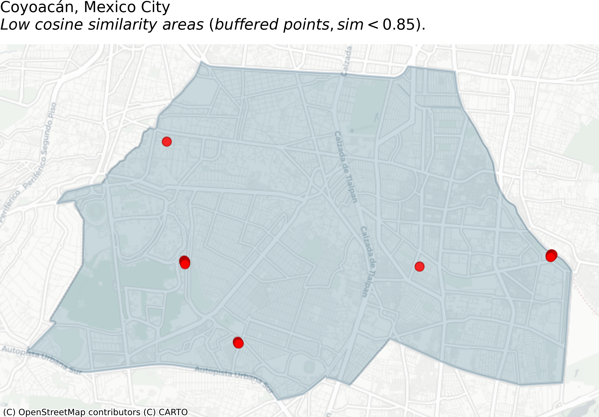

Digging deeper into the nature of the points where we identified important changes, we can see the following example

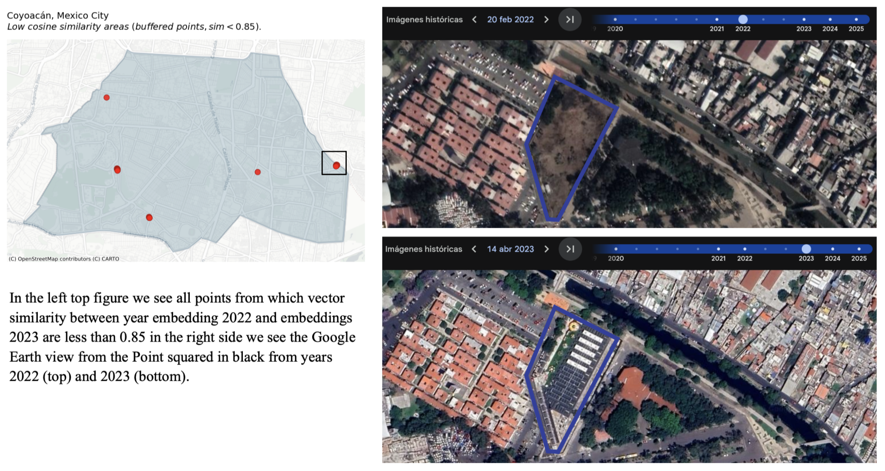

As we can see in the figure, at the points where the embeddings show low similarity, we identify that a building was constructed on an empty lot during the year 2022. This shows the simple but powerful methodology for identifying important geographic changes on the ground, enabled by the use of embeddings.

### Working with Aggregation Levels {#aggregation-levels}

As shown before, each model has its own logic and aggregation, and we can find the following 2 types of embeddings:

- **Discrete**: Found mainly in the form of rasters (square grids covering an area of interest), or any other discrete (countably finite) set of political, geographic or geometric division (H3, square cells). Given this, despite the complex differences and trade-offs between them, for the purpose of this section they are seen as the same thing: a discrete division of the space of interest, that is, a finite disjoint partition of the space into polygonal objects.
- **Continuous**: Continuous representation of space, either on a plane (2D/3D Euclidean) or any continuous projection (spherical, cylindrical) over non-Euclidean geometries. In addition, for simplicity, we can see this as coordinates (a tuple of values representing a position).

Beyond the geometry type of the data structure, what really defines the type of aggregation is the way the event is represented in general. Let us think about the representation of the Earth's surface: if we use a coordinate system, that is, a (lat, lon) tuple, with an infinite (in theory) number of possible points between any pair of points. In contrast, if we use Uber's H3 partition, given any two cells, or even two points, there is a finite number of resolution-$r$ H3 cells between them.

Let us work with our Alpha Earth raster embeddings to explain the aggregation logic:

**Polygon Assignment**

Suppose we want to assign the vector values from our $10m$ raster, and that we want to assign those raster values to a given polygon whose extent is larger than a single cell; the accepted way to do this is via the aggregation of its raster coverage, as seen in the following figure:

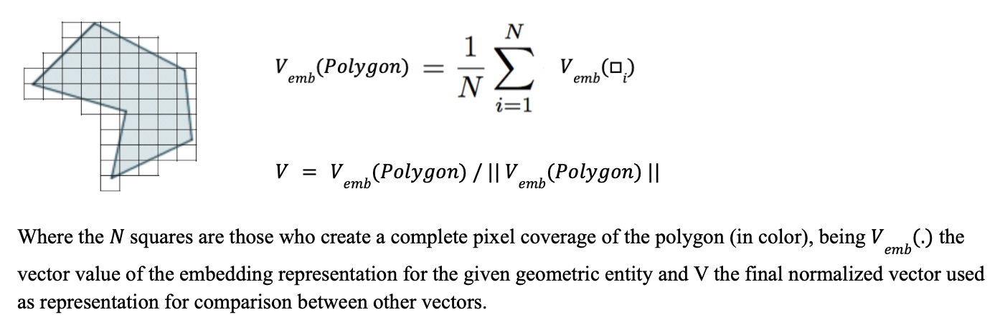

That is, given a polygon, we use the raster coverage of that polygon (each cell that touches the polygon's area) and then take the mean vector value of all those raster cells, and finally normalize it, this in order to be consistent with AlphaEarth Embeddings and most embedding bases, which are normalized, and particularly with the AlphaEarth base, keeping the aggregated result in the $S^{63}$ space as described in the official documentation.

**Linestring Aggregation**

This logic stays the same regardless of the geometry of the object of interest; see, for example, the following example for a street segment:

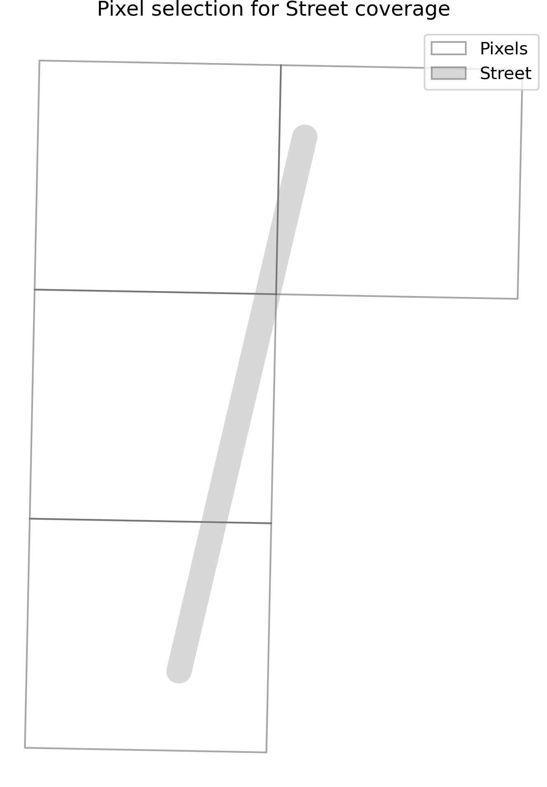

Most of the problems when working with either of the two types are due to not using a correct standard and unified projection and to not using the correct aggregation and geometric entities. For more detail on how to work with geographic data, see the [Geospatial Data Appendix](99_appendix_geo_data_structures_and_operations_eng.qmd).

As we have seen, despite not having (in theory) area, the logic holds: select all the cells touched by the object, and then repeat the normalization step of the aggregation.

## Resources

[Google Earth Engine Official Web Site](https://earthengine.google.com/)
