Uno de los problemas sociales y económicos más serios es el crimen. Desde el crimen organizado hasta el fraude financiero, México enfrenta en su historia moderna una serie de retos en materia de crimen y seguridad. Por otro lado, México y sus instituciones, como el INEGI, cuentan con datos e información abiertos de muy alta calidad, particularmente para la Ciudad de México. Entonces, es un buen candidato para realizar un ejercicio interesante de incidencia delictiva y earth embeddings.

## Contexto y fenómeno {#context-and-phenomenon}

El crimen y la inseguridad pública se ubican consistentemente entre las principales preocupaciones de la población mexicana. Según la *Encuesta Nacional de Victimización y Percepción sobre Seguridad Pública* (ENVIPE) del INEGI, se estima que 23.1 millones de personas de 18 años o más fueron víctimas de algún delito durante 2024 —una tasa de aproximadamente 24,135 víctimas por cada 100,000 habitantes—, y el costo económico del crimen y la inseguridad alcanzó cerca de 269.6 mil millones de pesos, cercano al 1.07% del PIB [INEGI, ENVIPE 2025].

Una característica estructural del fenómeno es el subregistro (*under-reporting*). ENVIPE estima que, de los aproximadamente 33.5 millones de delitos cometidos en 2024, solo una pequeña fracción fue denunciada y formalmente investigada, de modo que la *cifra negra* —la proporción de delitos ni denunciados ni investigados— se ubica alrededor del 93% [INEGI, ENVIPE 2025]. Esta brecha es central para cualquier análisis basado en datos: los registros administrativos como las *carpetas de investigación* usadas en este trabajo capturan solo la punta visible de la distribución, no el fenómeno en sí.

La percepción de inseguridad es igualmente alta y espacialmente heterogénea. En el tercer trimestre de 2025, cerca del 63% de la población adulta en las 91 áreas urbanas encuestadas por la *Encuesta Nacional de Seguridad Pública Urbana* (ENSU) del INEGI consideró inseguro vivir en su ciudad, con espacios públicos —cajeros automáticos, transporte público y la calle— percibidos como los menos seguros [INEGI, ENSU 2025]. La Ciudad de México concentra este contraste de forma marcada: alcaldías como Benito Juárez reportan algunas de las percepciones de inseguridad más bajas del país, mientras que otras se ubican muy por encima del promedio nacional, lo que subraya que la inseguridad en la capital es un fenómeno fundamentalmente *local*, a nivel sub-ciudad —precisamente la granularidad que este trabajo busca.


## Incidencia delictiva en la Ciudad de México (CDMX) - Datos disponibles {#available-data}

Uno de los problemas más relevantes en materia de crimen en México, tanto para medir el estado de la situación como para la creación de política pública, es la cantidad, calidad y confiabilidad de los datos delictivos a nivel nacional, lo que hace que la idea de tomar decisiones de estrategia contra el crimen basadas en datos sea un sueño lejano. Las principales preocupaciones son:

- Registros de datos censurados (no denunciados, corrompidos) debido al miedo de la población y a la corrupción.
- Barreras burocráticas y sistemas y procesos de gestión de datos heredados (legacy).
- Bajos incentivos para mejorar o incrementar los procesos de recolección de datos y transparencia.

Sin embargo, dada la relevancia global y la creciente presencia de ciudadanos globales e inversiones en la Ciudad de México, los portales de transparencia de datos como el [Sistema Ajolote de Datos Abiertos CDMX](https://www.datos.cdmx.gob.mx/) han estado proveyendo datos suficientemente buenos para generar análisis y reportes sobre la incidencia delictiva en toda la ciudad, a un nivel de granularidad que alcanza precisión de lat/lon (con excepción de los registros que constituyen un riesgo para las víctimas).

Esto da un buen punto de partida para comenzar una evaluación más precisa sobre la incidencia delictiva en la ciudad.

### Carpetas de Investigación de la FGJ

Uno de los conjuntos de datos más importantes es el de 'Carpetas de Investigación' —los expedientes abiertos por la *Fiscalía General de Justicia* (FGJ) de la Ciudad de México. Podemos descargar los datos directamente del portal con el siguiente código:

``` bash
# Direct download for Carpetas de Investigacion
# Up to 2025-01
 wget https://archivo.datos.cdmx.gob.mx/FGJ/carpetas/carpetasFGJ_acumulado_2025_01.csv -O ./data/raw/carpetasFGJ.csv --no-check-certificate
 ```

Considera que es importante agregar `--no-check-certificate`, porque, a pesar de ser el sitio oficial, el certificado de la página a veces está vencido.

#### Evaluación de Datos para Carpetas de Investigación

Una vez ejecutado un reporte de calidad de datos, observamos los siguientes resultados:

| Column | Null % | Verdict |
|---|---:|---|
| `alcaldia_catalogo` | **99.16%** | **Eliminar** — 1 valor distinto, efectivamente vacía |
| `competencia` | **50.70%** | Usar con precaución — solo 3 valores (`FUERO COMUN`, `HECHO NO DELICTIVO`, `INCOMPETENCIA`) |
| `colonia_catalogo` | 5.93% | Usable; `colonia_hecho` es la mejor gemela en texto libre |
| `colonia_hecho` | 4.87% | Usable |
| `latitud` / `longitud` | 4.82% | Usable; el análisis geográfico pierde ~101k filas |
| `fecha_inicio` | 2.74% | Usable |
| `hora_hecho` | 2.59% | Usable (ver advertencia del marcador de posición en §5) |
| `fecha_hecho` | 2.58% | Usable |
| `hora_inicio` | 2.55% | Usable |
| `alcaldia_hecho` | 1.19% | **Campo principal de alcaldía** |
| `unidad_investigacion` | 0.05% | Bien |
| `mes_hecho`, `anio_hecho` | 0.03% | Bien |
| `fiscalia` | ~0% | Bien |
| `delito`, `categoria_delito`, `mes_inicio`, `agencia`, `municipio_hecho`, `anio_inicio` | 0% | Completo |

**Totalmente pobladas (6):** `anio_inicio`, `mes_inicio`, `delito`,
`categoria_delito`, `agencia`, `municipio_hecho`.


**2. Campos de baja información / redundantes**

- **`municipio_hecho`** — valor único `CDMX` para las 2.1M filas. Sin valor analítico.
- **`alcaldia_catalogo`** — un único valor no nulo y 99.2% de valores faltantes. **Eliminar.**
- **`competencia`** — medio vacía; tratar la ausencia como "no especificado", no como una clase.
- **`colonia_catalogo` vs `colonia_hecho`** y **`alcaldia_catalogo` vs
  `alcaldia_hecho`** son gemelas catálogo/texto-libre; las variantes `_hecho` son mucho
  más completas y deberían ser los campos canónicos.

**3. Duplicados**

Fuente: `dq_duplicates.csv`.

- **Duplicados exactos (las 21 columnas idénticas):** 4,735 filas (0.226%).
- **Duplicados de clave de incidente** (mismo `fecha_hecho`, `hora_hecho`, `delito`,
  `latitud`, `longitud`, `colonia_hecho`, `alcaldia_hecho`): 11,432 filas (0.545%).

La brecha entre ambos significa que ~6,700 registros describen el *mismo* evento/lugar pero
difieren en metadatos administrativos (agencia, unidad). Deduplicar sobre la clave de incidente para
el conteo de crímenes; conservar todas las filas para el análisis de carga de trabajo de casos.

### Reportes ciudadanos C5

El "C5", que viene de su nombre completo "Centro de Comando, Control, Cómputo, Comunicaciones y Contacto Ciudadano de la Ciudad de México" (*Mexico City Command, Control, Computing, Communications, and Citizen Contact Center*, en inglés), es un sistema enorme que recolecta, vía miles de cámaras, botones de emergencia y centros de contacto, una gran cantidad de reportes ciudadanos, algunos de los cuales son falsos o meramente informativos; sin embargo, provee una fuente rica de reportes criminales y no criminales a lo largo de las calles de la ciudad. Para saber más al respecto, considera revisar el [Sitio Web Oficial del C5](https://www.c5.cdmx.gob.mx/).

Para acceder a la versión más actualizada de 3 años de la colección de reportes, ejecuta:

``` bash
 # C5 Direct download
wget https://archivo.datos.cdmx.gob.mx/C5/incidentes_viales/inViales_2022_2024.csv -O ./data/raw/c5_reports.csv --no-check-certificate
 ```

Además, considera que es importante agregar `--no-check-certificate`, porque, a pesar de ser el sitio oficial, el certificado de la página a veces está vencido.

En este trabajo nos inclinaremos por el primer conjunto de datos, pero animamos a los lectores a repetir el ejercicio con este segundo conjunto de datos, no con incidencias delictivas sino con llamadas de emergencia.


### EDA básico sobre los incidentes delictivos de la CDMX

Las siguientes estadísticas se obtuvieron de las 'Carpetas de Investigación' de 2016 hasta enero de 2025, usando solo los registros con datos completos en las columnas: `["delito", "categoria_delito", "mes_inicio", "agencia", "municipio_hecho", "anio_inicio", "mes_hecho", "anio_hecho", "fecha_inicio", "hora_hecho", "fecha_hecho", "latitud", "longitud"]`.

Podemos ver que, de los 15 delitos más cometidos en la CDMX, los más representados son "Violencia Familiar" y "Fraude", seguidos de múltiples tipos de "Robo", lo que sustenta la idea de que los delitos en la Ciudad de México tienen una fuerte motivación materialista y socioeconómica.


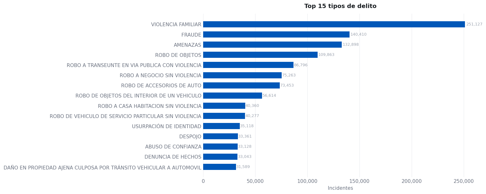


Cuando agrupamos los delitos en categorías, podemos ver que el robo a individuos y el robo de auto siguen siendo las principales ocurrencias.

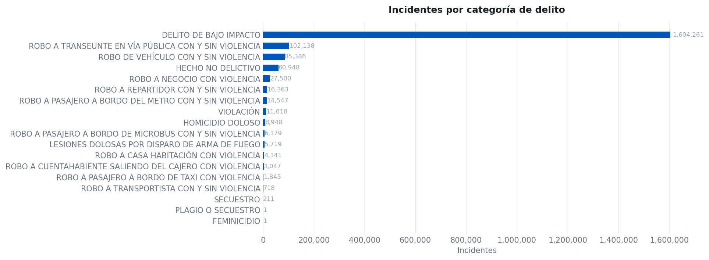

Podemos ver que la tendencia mensual de delitos, a pesar de haberse reducido en los últimos años, se mantiene en niveles constantes después de la pandemia de *COVID-19*.

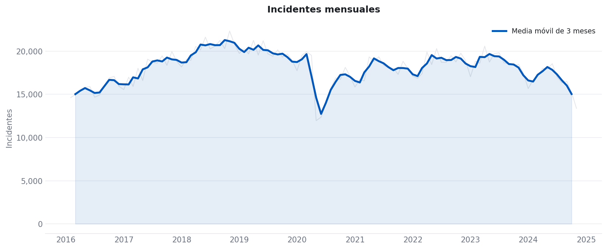

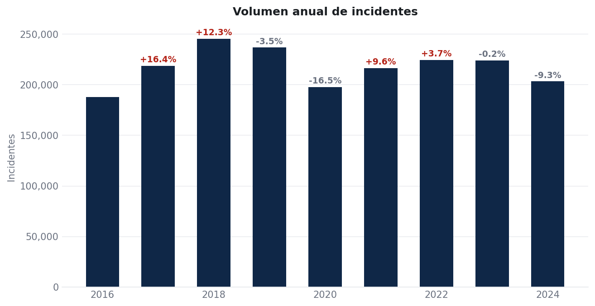

Al analizar los incidentes por hora y día, podemos observar, a partir de las siguientes figuras, que la mayoría de las ocurrencias suceden durante *horario laboral*. Esto podría ser una distribución natural, pero también, al enfocarse en el detalle horario, es claro que existe un *sesgo administrativo*, debido al procesamiento de las denuncias:

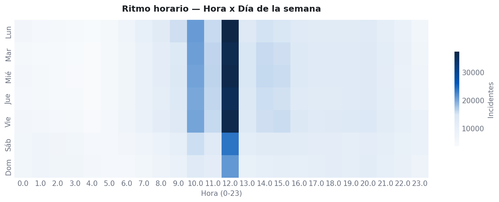

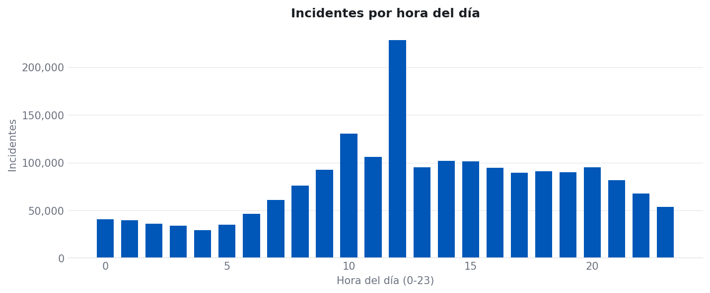


Sin embargo, al descomponer por el delito mismo podemos ver algunos patrones en la ocurrencia de delitos particulares a lo largo del día:

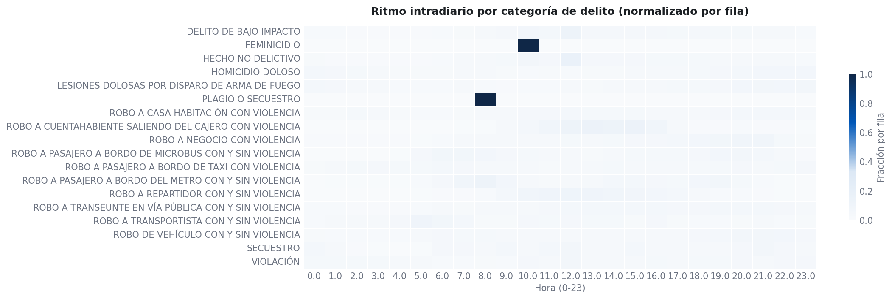

Particularmente, para el interés del presente reporte, es importante entender los patrones espaciales en los datos.

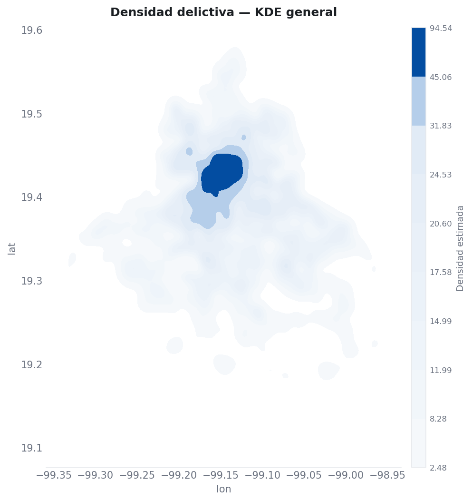

Como podemos ver, hay una concentración de delitos en el centro de la ciudad, lo cual puede explicarse por la población total presente en la región. Más adelante se presentarán analíticas per cápita más detalladas para clarificar la concentración de la incidencia en un sentido espacial.


### Un vistazo más cercano a algunos delitos

Consideremos algunas de las categorías de delitos más relevantes y usémoslas como ejemplo de un análisis espacial a través de múltiples tipos de geometría; en este caso estamos tomando un vistazo más cercano a: *homicidio, robo en vía pública y robo a casa habitación*.

Primero creamos una serie de bases de datos auxiliares:

``` python

## Import libraries
import pandas as pd
import geopandas as gpd

## Read full data set
df = pd.read_csv("./data/clean/carpetasFGJ.csv").query("year >= 2016")

## Save filtered data

# Murder
df.query(" crime_cat == 'HOMICIDIO DOLOSO' ").to_csv("./data/clean/carpetasFGJ_homicidios.csv", index = False)

# Street robbery
df.query(" crime_cat == 'ROBO A TRANSEUNTE EN VÍA PÚBLICA CON Y SIN VIOLENCIA' ").to_csv("./data/clean/carpetasFGJ_asaltos.csv", index = False)

# House robbery
df.query(" crime_cat == 'ROBO A CASA HABITACIÓN CON VIOLENCIA' ").to_csv("./data/clean/carpetasFGJ_robo.csv", index = False)

```


### Un vistazo profundo a los incidentes de asalto (*Asalto a transeúnte*)

Ahora, demos un vistazo profundo a un delito particular que no solo es uno de los más observados en la base de datos, sino que también, por su definición estructural, nos obligará a entender la naturaleza de su geometría: eso es el asalto (*Robo a Transeúnte con y sin violencia*, en su denominación en español).

La tendencia mensual del asalto tuvo un pico relevante en 2019, previo a la *pandemia de COVID-19*, y desde entonces ha mantenido una incidencia estable a través del tiempo, particularmente de 2022 a 2024, los años candidatos para un análisis más profundo.

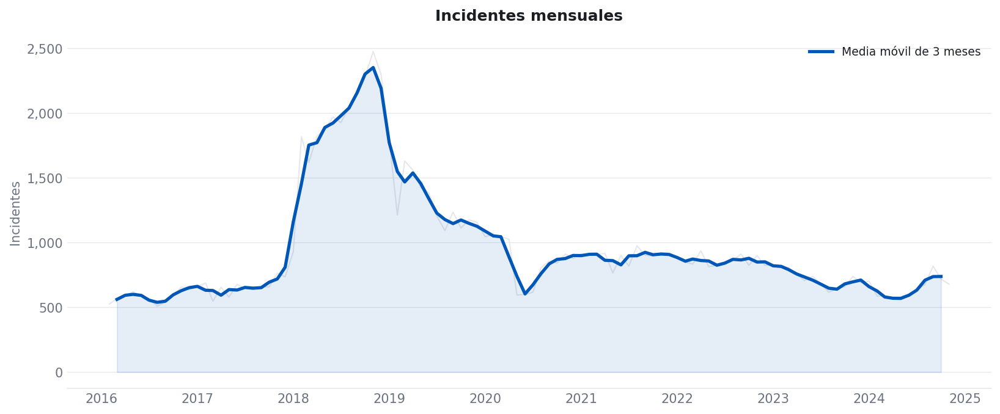


Considera los siguientes ritmos a nivel de día de la semana y mes, y también la cadencia horaria para el asalto reportado en la CDMX. Como podemos ver, es claro que los momentos más frecuentes son en días laborales y en horarios de cena y el típico fin de la jornada laboral, lo que indica que este delito es altamente oportunista, es decir, tiende a ocurrir dependiendo del flujo de tránsito.

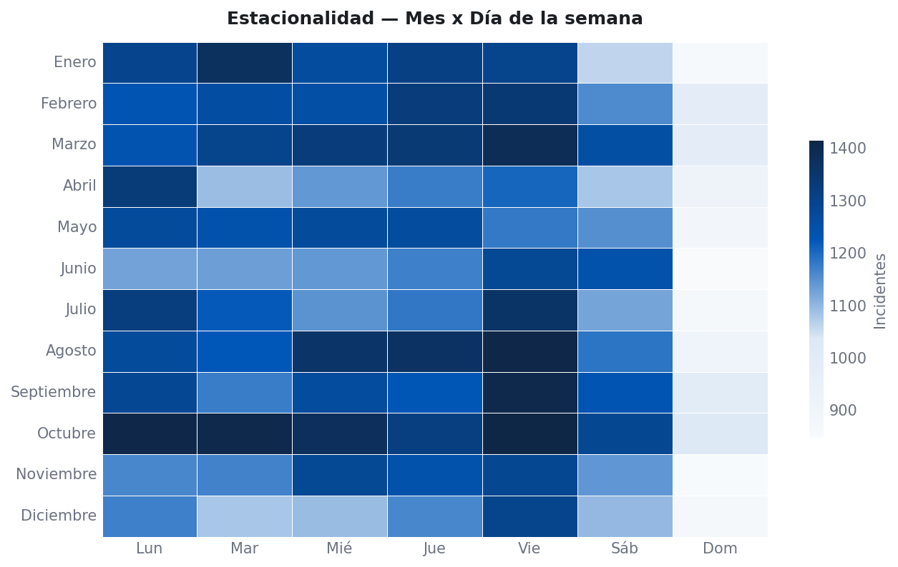

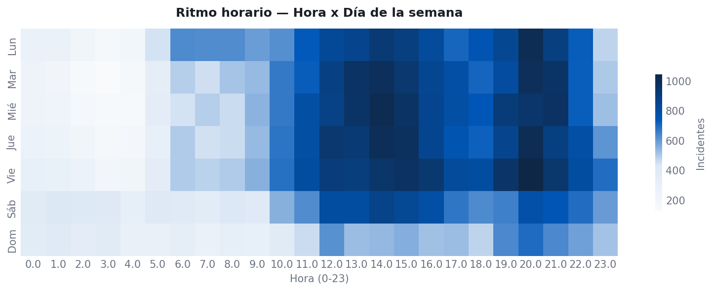


Un primer análisis espacial a entender es la ubicación directa en el espacio del evento delictivo. Como se observa en la figura de abajo, a pesar de estar distribuido a lo largo de toda el área poblada de la ciudad, hay patrones claros que se asemejan a alguna *acumulación* o agrupamiento de los puntos en *hotspots*.

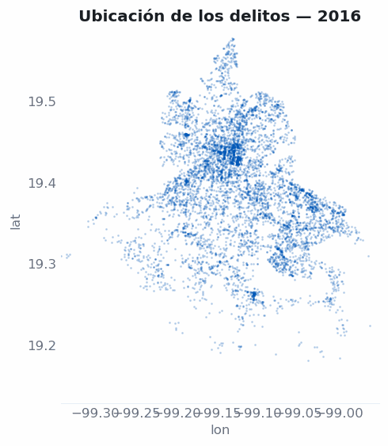


Con el fin de evaluar el aparente agrupamiento, aplicamos un DBSCAN, un algoritmo no supervisado diseñado para identificar el agrupamiento espacial de puntos, dado algún parámetro de proximidad y un tamaño mínimo de clúster, con base tanto en la cantidad de puntos como en su proximidad.

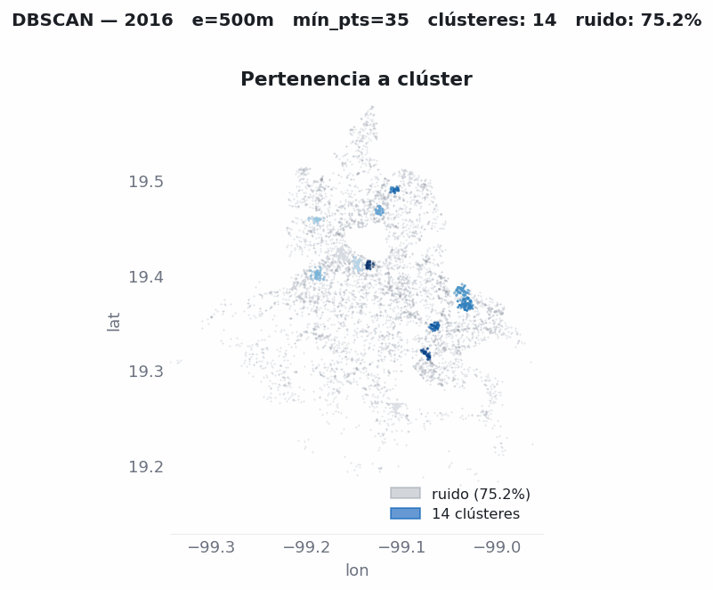

Como podemos ver, confirmamos que para cada año se forman clústeres en contraste con el ruido identificado. Esto respalda la tesis de que el crimen aparentemente tiende a agruparse a través del espacio para cada año.

A pesar de los resultados positivos, hay algunas críticas particulares a este enfoque, y es que, incluso en el supuesto del DBSCAN, se asume que la incidencia es continua a través del espacio, cuando en realidad el crimen está limitado por el espacio geográfico, el cual es discreto, no uniforme y diseñado por humanos, y cambiado dinámicamente por las sociedades; por eso, desde un análisis serio, es importante mantener la referenciación geográfica correcta.

Por ejemplo, para este delito particular que ocurre por definición en la calle, la referenciación y el nivel de agregación correctos deben ser a nivel de calle.

Ver la figura de abajo, donde los eventos delictivos se agregan a nivel de calle (esquina a esquina) por año.

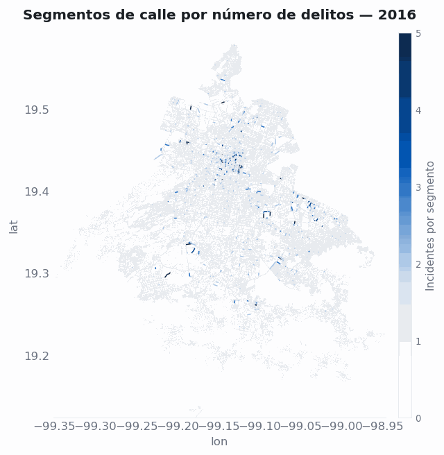

Ahora podemos ver que, incluso sin ser continuos, los patrones espaciales se mantienen, respaldando la tesis de que el crimen no es constante a través del espacio urbano.

## Recursos

[INEGI — Encuesta Nacional de Victimización y Percepción sobre Seguridad Pública (ENVIPE) 2025](https://www.inegi.org.mx/programas/envipe/2025/). Press release: [ENVIPE 2025 (PDF)](https://www.inegi.org.mx/contenidos/saladeprensa/boletines/2025/ENVIPE/ENVIPE_25.pdf).

[INEGI — Encuesta Nacional de Seguridad Pública Urbana (ENSU)](https://www.inegi.org.mx/programas/ensu/).

[Sistema Ajolote de Datos Abiertos CDMX](https://www.datos.cdmx.gob.mx/) — *Carpetas de Investigación* (FGJ) and C5 citizen-report datasets.

[C5 — Centro de Comando, Control, Cómputo, Comunicaciones y Contacto Ciudadano de la Ciudad de México](https://www.c5.cdmx.gob.mx/).

[Mexico INEGI's Marco Geoestadístico](https://www.inegi.org.mx/app/biblioteca/ficha.html?upc=794551163061).
