One of the most serious social and economic problems is crime. From organized crime to financial fraud, Mexico faces in its modern history a series of challenges in matters of crime and security. On the other hand, Mexico and its institutions, such as INEGI, have very high-quality open data and information, particularly for Mexico City. Thus, it is a good candidate for carrying out an interesting exercise on crime incidence and earth embeddings.

## Context and phenomenon {#context-and-phenomenon}

Crime and public insecurity consistently rank among the main concerns of the Mexican population. According to INEGI's *National Survey of Victimization and Perception of Public Security* (ENVIPE), an estimated 23.1 million people aged 18 or older were victims of some crime during 2024 —a rate of approximately 24,135 victims per 100,000 inhabitants— and the economic cost of crime and insecurity reached about 269.6 billion pesos, close to 1.07% of GDP [INEGI, ENVIPE 2025].

A structural feature of the phenomenon is under-reporting. ENVIPE estimates that, of the approximately 33.5 million crimes committed in 2024, only a small fraction was reported and formally investigated, so that the *cifra negra* —the proportion of crimes neither reported nor investigated— stands at around 93% [INEGI, ENVIPE 2025]. This gap is central to any data-based analysis: administrative records such as the *carpetas de investigación* used in this work capture only the visible tip of the distribution, not the phenomenon itself.

The perception of insecurity is equally high and spatially heterogeneous. In the third quarter of 2025, about 63% of the adult population in the 91 urban areas surveyed by INEGI's *National Urban Public Security Survey* (ENSU) considered it unsafe to live in their city, with public spaces —ATMs, public transport and the street— perceived as the least safe [INEGI, ENSU 2025]. Mexico City concentrates this contrast sharply: boroughs such as Benito Juárez report some of the lowest perceptions of insecurity in the country, while others rank well above the national average, which underscores that insecurity in the capital is a fundamentally *local*, sub-city-level phenomenon —precisely the granularity this work seeks.

## Crime incidence in Mexico City (CDMX) - Available data {#available-data}

One of the most relevant problems in matters of crime in Mexico, both for measuring the state of the situation and for public policy creation, is the quantity, quality and reliability of crime data at the national level, which makes the idea of making data-based anti-crime strategy decisions a distant dream. The main concerns are:

- Censored data records (unreported, corrupted) due to the population's fear and to corruption.
- Bureaucratic barriers and legacy data management systems and processes.
- Low incentives to improve or increase data collection and transparency processes.

However, given the global relevance and the growing presence of global citizens and investments in Mexico City, data transparency portals such as the [Sistema Ajolote de Datos Abiertos CDMX](https://www.datos.cdmx.gob.mx/) have been providing data that is good enough to generate analyses and reports on crime incidence throughout the city, at a granularity level that reaches lat/lon precision (with the exception of records that constitute a risk for the victims).

This gives a good starting point to begin a more precise assessment of crime incidence in the city.

### FGJ's Carpetas de Investigación

One of the most important datasets is 'Carpetas de Investigación' —the case files opened by Mexico City's *Fiscalía General de Justicia* (FGJ). We can download the data directly from the portal with the following code:

``` bash
# Direct download for Carpetas de Investigacion
# Up to 2025-01
 wget https://archivo.datos.cdmx.gob.mx/FGJ/carpetas/carpetasFGJ_acumulado_2025_01.csv -O ./data/raw/carpetasFGJ.csv --no-check-certificate
 ``` 

Consider that it is important to add `--no-check-certificate`, because, despite being the official site, the page's certificate is sometimes expired.

#### Data Assessment for Carpetas de Investigación

Once a data quality report has been run, we observe the following results:

| Column | Null % | Verdict |
|---|---:|---|
| `alcaldia_catalogo` | **99.16%** | **Drop** — 1 distinct value, effectively empty |
| `competencia` | **50.70%** | Use with caution — only 3 values (`FUERO COMUN`, `HECHO NO DELICTIVO`, `INCOMPETENCIA`) |
| `colonia_catalogo` | 5.93% | Usable; `colonia_hecho` is the better free-text twin |
| `colonia_hecho` | 4.87% | Usable |
| `latitud` / `longitud` | 4.82% | Usable; geographic analysis loses ~101k rows |
| `fecha_inicio` | 2.74% | Usable |
| `hora_hecho` | 2.59% | Usable (see the placeholder caveat in §5) |
| `fecha_hecho` | 2.58% | Usable |
| `hora_inicio` | 2.55% | Usable |
| `alcaldia_hecho` | 1.19% | **Main borough field** |
| `unidad_investigacion` | 0.05% | Fine |
| `mes_hecho`, `anio_hecho` | 0.03% | Fine |
| `fiscalia` | ~0% | Fine |
| `delito`, `categoria_delito`, `mes_inicio`, `agencia`, `municipio_hecho`, `anio_inicio` | 0% | Complete |

**Fully populated (6):** `anio_inicio`, `mes_inicio`, `delito`,
`categoria_delito`, `agencia`, `municipio_hecho`.

**2. Low-information / redundant fields**

- **`municipio_hecho`** — single value `CDMX` for all 2.1M rows. No analytical value.
- **`alcaldia_catalogo`** — a single non-null value and 99.2% missing values. **Drop.**
- **`competencia`** — half empty; treat absence as "unspecified", not as a class.
- **`colonia_catalogo` vs `colonia_hecho`** and **`alcaldia_catalogo` vs
  `alcaldia_hecho`** are catalog/free-text twins; the `_hecho` variants are far
  more complete and should be the canonical fields.

**3. Duplicates**

Source: `dq_duplicates.csv`.

- **Exact duplicates (all 21 columns identical):** 4,735 rows (0.226%).
- **Incident-key duplicates** (same `fecha_hecho`, `hora_hecho`, `delito`,
  `latitud`, `longitud`, `colonia_hecho`, `alcaldia_hecho`): 11,432 rows (0.545%).

The gap between the two means that ~6,700 records describe the *same* event/place but
differ in administrative metadata (agency, unit). Deduplicate on the incident key for
crime counting; keep all rows for caseload analysis.

### C5 citizen reports

The "C5", which comes from its full name "Centro de Comando, Control, Cómputo, Comunicaciones y Contacto Ciudadano de la Ciudad de México" (Mexico City Command, Control, Computing, Communications, and Citizen Contact Center), is a huge system that collects, via thousands of cameras, emergency buttons and contact centers, a large amount of citizen reports, some of which are false or merely informative; however, it provides a rich source of criminal and non-criminal reports throughout the city's streets. To learn more about it, consider checking the [C5 Official Website](https://www.c5.cdmx.gob.mx/).

To access the most up-to-date 3-year version of the report collection, run:

``` bash
 # C5 Direct download 
wget https://archivo.datos.cdmx.gob.mx/C5/incidentes_viales/inViales_2022_2024.csv -O ./data/raw/c5_reports.csv --no-check-certificate
 ``` 

Also, consider that it is important to add `--no-check-certificate`, because, despite being the official site, the page's certificate is sometimes expired.

In this work we will lean toward the first dataset, but we encourage readers to repeat the exercise with this second dataset, not with crime incidences but with emergency calls.

### Basic EDA on CDMX crime incidents

The following statistics were obtained from the 'Carpetas de Investigación' from 2016 up to January 2025, using only the records with complete data in the columns: `["delito", "categoria_delito", "mes_inicio", "agencia", "municipio_hecho", "anio_inicio", "mes_hecho", "anio_hecho", "fecha_inicio", "hora_hecho", "fecha_hecho", "latitud", "longitud"]`.

We can see that, of the 15 most committed crimes in CDMX, the most represented are "Violencia Familiar" (domestic violence) and "Fraude" (fraud), followed by multiple types of "Robo" (theft), which supports the idea that crimes in Mexico City have a strong materialistic and socioeconomic motivation.

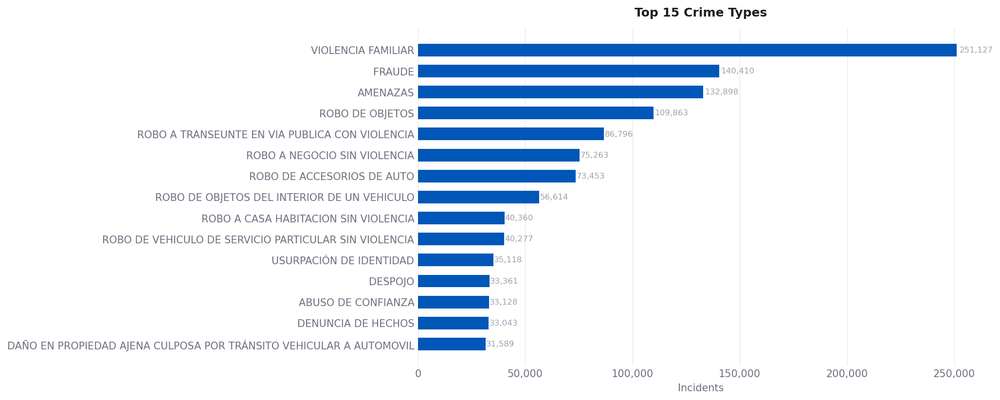

When we group the crimes into categories, we can see that robbery of individuals and car theft remain the main occurrences.

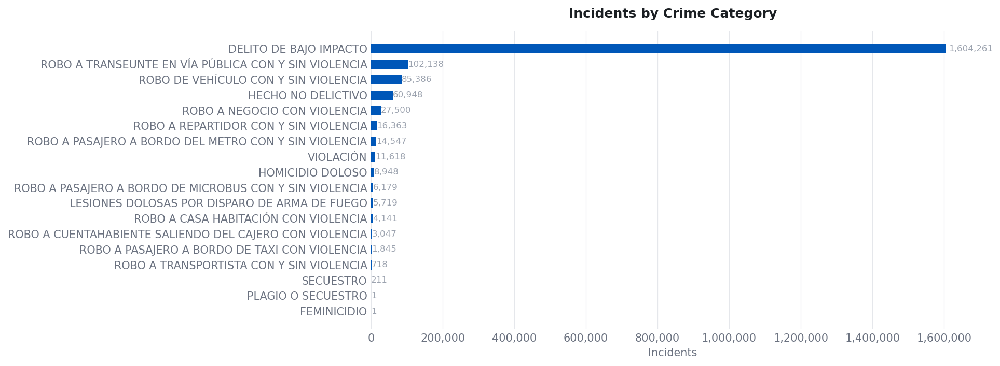

We can see that the monthly crime trend, despite having decreased in recent years, remains at constant levels after the *COVID-19* pandemic.

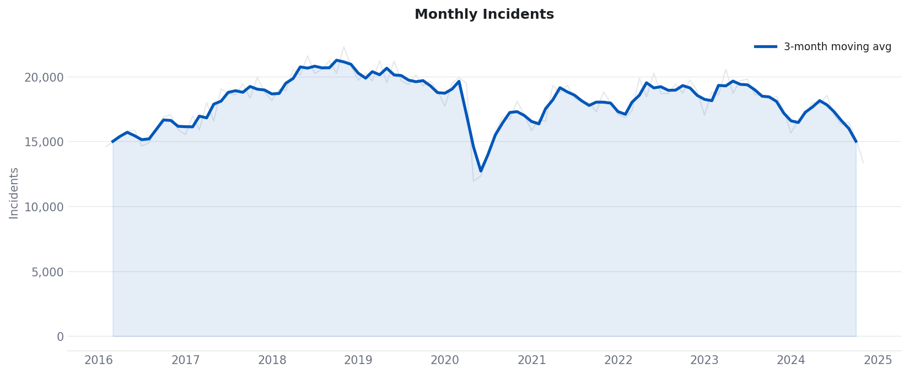

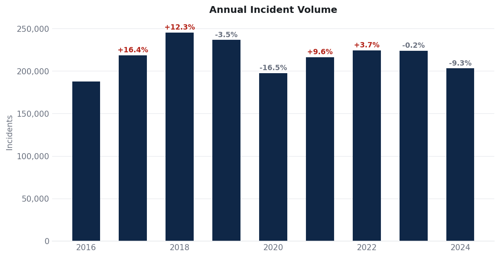

When analyzing incidents by hour and day, we can observe, from the following figures, that most occurrences happen during *working hours*. This could be a natural distribution, but also, when focusing on the hourly detail, it is clear that an *administrative bias* exists, due to the processing of the reports:

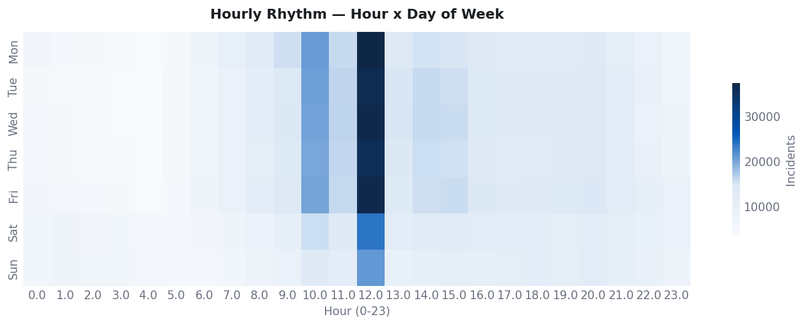

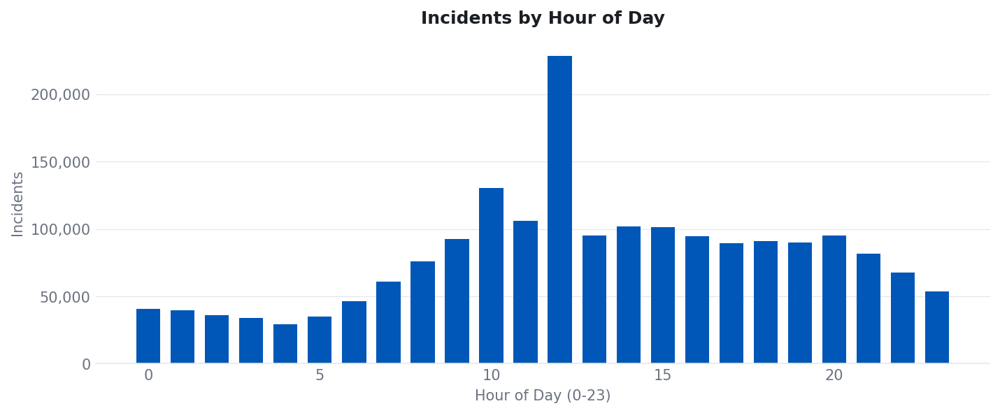

However, when decomposing by the crime itself we can see some patterns in the occurrence of particular crimes throughout the day:

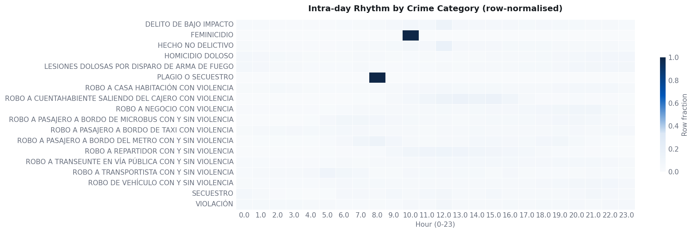

Particularly, for the interest of this report, it is important to understand the spatial patterns in the data.

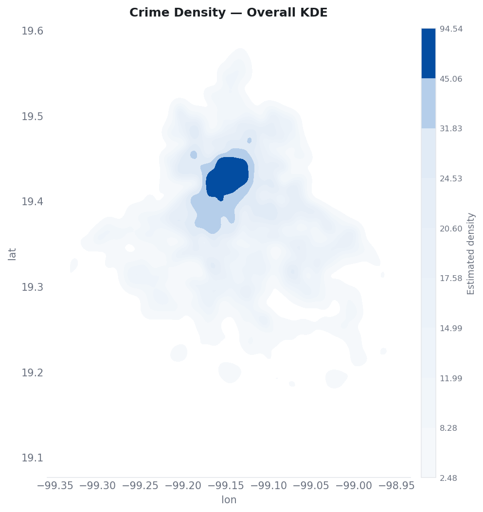

As we can see, there is a concentration of crimes in the center of the city, which can be explained by the total population present in the region. More detailed per capita analytics will be presented later to clarify the concentration of the incidence in a spatial sense.

### A closer look at some crimes

Let us consider some of the most relevant crime categories and use them as an example of a spatial analysis across multiple geometry types; in this case we are taking a closer look at: *homicide, street robbery and home burglary*.

First we create a series of auxiliary databases:

``` python

## Import libraries 
import pandas as pd
import geopandas as gpd 

## Read full data set 
df = pd.read_csv("./data/clean/carpetasFGJ.csv").query("year >= 2016")

## Save filtered data

# Murder 
df.query(" crime_cat == 'HOMICIDIO DOLOSO' ").to_csv("./data/clean/carpetasFGJ_homicidios.csv", index = False)

# Street robbery 
df.query(" crime_cat == 'ROBO A TRANSEUNTE EN VÍA PÚBLICA CON Y SIN VIOLENCIA' ").to_csv("./data/clean/carpetasFGJ_asaltos.csv", index = False)

# House robbery
df.query(" crime_cat == 'ROBO A CASA HABITACIÓN CON VIOLENCIA' ").to_csv("./data/clean/carpetasFGJ_robo.csv", index = False)

``` 

### A deep look at mugging incidents (*Asalto a transeúnte*)

Now, let us take a deep look at a particular crime that is not only one of the most observed in the database, but also, because of its structural definition, will force us to understand the nature of its geometry: that is mugging (*Robo a Transeúnte con y sin violencia*, in its Spanish denomination).

The monthly trend of mugging had a relevant peak in 2019, prior to the *COVID-19 pandemic*, and since then has kept a stable incidence across time, particularly from 2022 to 2024, the candidate years for a deeper analysis.

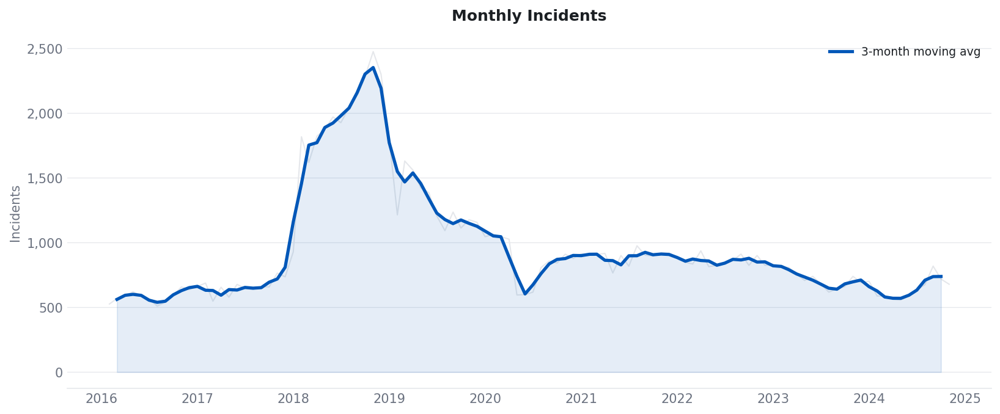

Consider the following day-of-week and month-level rhythms, and also the hourly cadence for reported mugging in CDMX. As we can see, it is clear that the most frequent moments are on weekdays and at dinner times and the typical end of the working day, which indicates that this crime is highly opportunistic, that is, it tends to occur depending on the flow of transit.

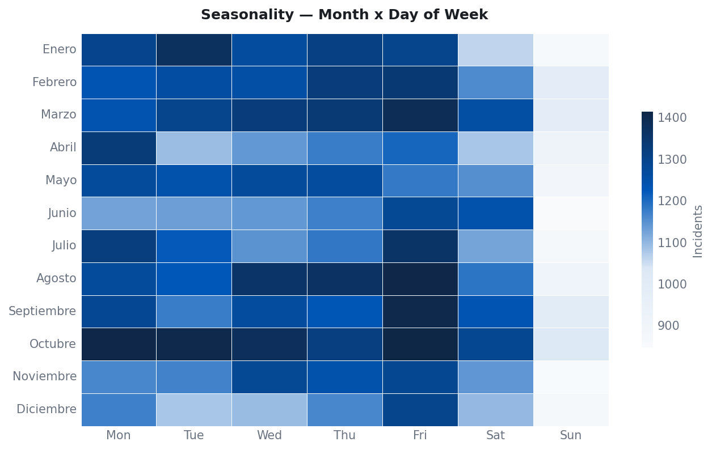

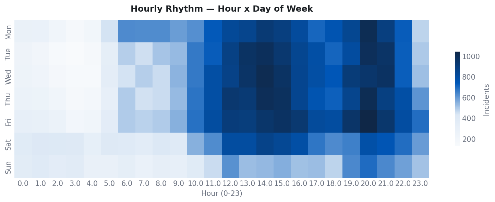

A first spatial analysis to understand is the direct location in space of the crime event. As observed in the figure below, despite being distributed throughout the whole populated area of the city, there are clear patterns that resemble some *accumulation* or grouping of the points into *hotspots*.

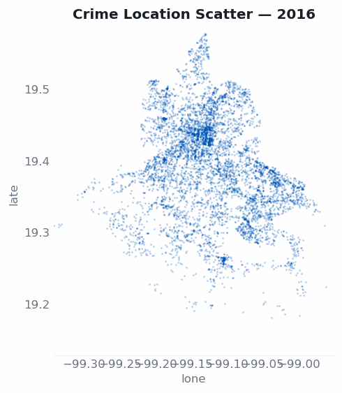

In order to evaluate the apparent grouping, we apply a DBSCAN, an unsupervised algorithm designed to identify the spatial grouping of points, given some proximity parameter and a minimum cluster size, based both on the number of points and on their proximity.

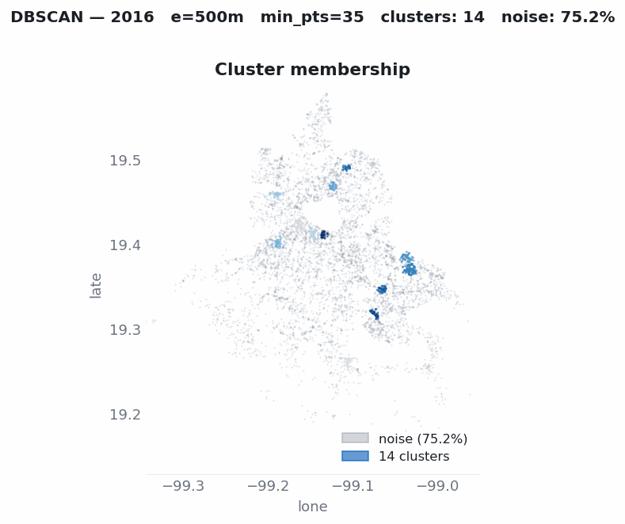

As we can see, we confirm that for each year clusters form in contrast with the identified noise. This supports the thesis that crime apparently tends to cluster across space for each year.

Despite the positive results, there are some particular criticisms of this approach, namely that, even under DBSCAN's assumption, incidence is assumed to be continuous across space, when in reality crime is bounded by geographic space, which is discrete, non-uniform and designed by humans, and dynamically changed by societies; this is why, from a serious analysis, it is important to keep the correct geographic referencing.

For example, for this particular crime that by definition occurs on the street, the correct referencing and aggregation level must be at the street level.

See the figure below, where crime events are aggregated at the street level (corner to corner) by year.

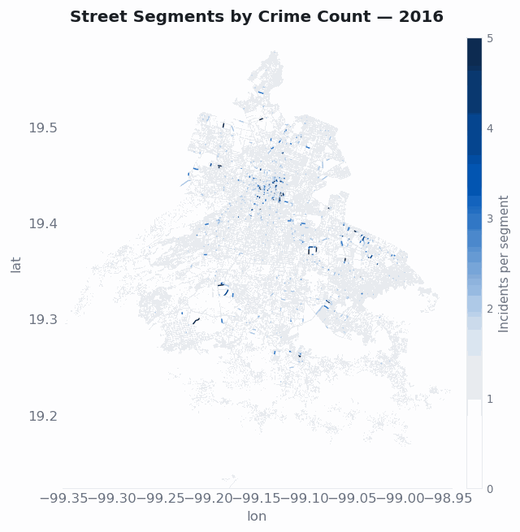

Now we can see that, even without being continuous, the spatial patterns hold, supporting the thesis that crime is not constant across urban space.

## Resources

[INEGI — Encuesta Nacional de Victimización y Percepción sobre Seguridad Pública (ENVIPE) 2025](https://www.inegi.org.mx/programas/envipe/2025/). Press release: [ENVIPE 2025 (PDF)](https://www.inegi.org.mx/contenidos/saladeprensa/boletines/2025/ENVIPE/ENVIPE_25.pdf).

[INEGI — Encuesta Nacional de Seguridad Pública Urbana (ENSU)](https://www.inegi.org.mx/programas/ensu/).

[Sistema Ajolote de Datos Abiertos CDMX](https://www.datos.cdmx.gob.mx/) — *Carpetas de Investigación* (FGJ) and C5 citizen-report datasets.

[C5 — Centro de Comando, Control, Cómputo, Comunicaciones y Contacto Ciudadano de la Ciudad de México](https://www.c5.cdmx.gob.mx/).

[Mexico INEGI's Marco Geoestadístico](https://www.inegi.org.mx/app/biblioteca/ficha.html?upc=794551163061).
