El poder de los embeddings para enriquecer modelos y dar la oportunidad de crear analítica geoespacial con solo una variable objetivo se mencionó en el [Capítulo 2](02_working_with_embeddings.qmd).

La mayoría de las aplicaciones provienen de las ciencias de la Tierra, la dinámica económica y la logística; hay una gran oportunidad para entender el comportamiento social y político en general, pero en particular para el uso de embeddings en las ciencias sociales y políticas. En el caso de este trabajo intentaremos aplicarlo a entender el crimen en la Ciudad de México.

## Modelando el Crimen {#modeling-crime}

Uno de los problemas más desafiantes en las ciencias sociales es modelar el crimen, y esto se debe a la complejidad y a la naturaleza multidisciplinaria del crimen.

Comenzando con advertencias de los datos tales como el subregistro, las denuncias falsas, la fricción burocrática y el desajuste de datos, sin mencionar la corrupción y los sesgos de percepción pública.

Luego surgen también problemas al usar earth embeddings y otras variables ambientales en la investigación de ciencias sociales, por ejemplo el *sesgo oportunista*, es decir, donde hay más población también hay más incidencia y propensión a cometer delitos.

Otra cosa importante que hay que saber es que el enfoque aquí, a pesar del objetivo o característica de entrenamiento y evaluación, al final no busca predecir per se los incidentes delictivos que ocurrirán en las calles, sino usar las salidas predictivas para evaluar niveles de riesgo y sugerir estrategias a nuestros stakeholders (ya sean estos agencias gubernamentales, tomadores de decisiones o investigadores).

Así que, a pesar de que los modelos finalmente se usan para predecir incidentes sobre datos nuevos, el objetivo final es etiquetar los objetos de interés bajo un nivel (tier) de riesgo y usar el modelo no como una bola de cristal, sino como una herramienta auxiliar para entender los patrones delictivos con base en características estructurales, geográficas y ambientales.

### Decisiones a modelar

Al trabajar en modelos hay una serie de decisiones que forman parte del modelado y del diseño del sistema para un modelo; no se trata solo de seleccionar el modelo, sino también de alinear las definiciones de datos y reunir los elementos requeridos para realizar un análisis. Por ejemplo, para este modelado en particular existen los siguientes retos:

- Diferentes agregaciones geoespaciales y geometrías puntuales de los elementos (Rásteres/polígonos) para los embeddings, versus la geometría de punto (coordenada) para los reportes de incidentes delictivos.
- Variaciones en los límites de los datos: Validar las entradas de coordenadas correctas tanto de los datos de embeddings como de los datos puntuales dentro de la división política oficial para la delimitación territorial de la ciudad.
- Definir el(los) modelo(s) y las variables objetivo para explotar los datos de embeddings para tareas predictivas y de inferencia.

Entonces, las decisiones de modelado a tomar serían las siguientes:

- Definición de la variable objetivo (eventos delictivos, eventos delictivos por población, etc.)
- Definiciones del nivel de agregación geográfico apropiado.
- Pipelines de datos y verificaciones de calidad.
- Modelos generadores de datos (familias de tipo de modelo e hiperparámetros para cada uno, métricas de evaluación).

Cada enfoque de modelo tomará en cuenta estos factores y se presentará en cada escenario.


### Procesamiento y agregación de datos


Para ejecutar el flujo de datos y el entrenamiento, se asume que los siguientes archivos ya están descargados y guardados en los directorios apropiados con base en las rutas de código:

- Geometría de calles de la CDMX [SHP]: Descargar del [Marco Geoestadístico de INEGI](https://www.inegi.org.mx/app/biblioteca/ficha.html?upc=794551163061). O cualquier otro polígono de interés (Ver unidades de edificios o MZA).
- Carpetas FGJ [CSV]: Base de datos CSV con incidencias delictivas geocodificadas (puntos lat/lon), del área de interés.
- Google Earth Embeddings.

La razón por la que las bases de datos no se proveen, ni hay un código productivo ejecutable (aunque incluimos los scripts necesarios para ejecutar y obtener los datos), va más allá de un problema de volumen: para los conjuntos de datos delictivos, los cambios en los conjuntos de datos públicos hacen inestables los endpoints, mientras que INEGI y Google Earth son fuentes altamente confiables en términos de datos y APIs; para este conjunto particular de geometrías y assets de ráster se necesita una instancia de interacción manual con la interfaz de usuario. Pero los códigos provistos en las presentes notas y en el repositorio permanecen altamente confiables.

Para ejecutar el entrenamiento supervisado y no supervisado de extremo a extremo y obtener resultados, pasando por la limpieza de datos y la construcción del conjunto de entrenamiento descritos en esta página, el orden correcto para ejecutar los códigos del repositorio es el siguiente:

Scripts y tipo de script:

| Script | Etapa | Ruta |
|---|---|---|
| App de EDA | Validación - Trabajo previo | `./src/eda/app.py` |
| Cobertura de Embeddings | Validación - Trabajo previo | `./src/eda/dq.py` |
| Datos Socioeconómicos | Extracción | `./src/etl/get_socioecon_data.py` |
| Procesamiento de Embeddings | Transformación | `./src/etl/process_embeddings.py` |
| Limpieza de Datos de Crimen | Transformación | `./src/eda/core.py` |
| División por Esquinas | Transformación (si se trabaja con calles) | `./src/utils/geom.py` |
| Asignar punto a Geometría | Transformación | `./src/etl/assign_point_to_geometry.py` |
| Conjunto de Datos de Entrenamiento | Carga | `./src/etl/get_training_sets.py` |
| Supervisado: Corrida Única | Entrenamiento | `./src/supervised/model_single_run.py` |
| No Supervisado: Reducción de Dimensionalidad | Entrenamiento | `./src/unsupervised/dim_reduction.py` |
| No Supervisado: Aprendizaje de Variedades (Manifold) | Entrenamiento | `./src/unsupervised/manifold_learning.py` |
| No Supervisado: Clustering K-means | Entrenamiento | `./src/unsupervised/clustering_kmeans.py` |

Las relaciones entre ellos, como un  (Directed Acyclic Graph, por sus siglas en inglés), son las siguientes:

```{mermaid}
graph LR
    SocioEcon["Datos Socioeconómicos"] --> TrainSet["Conjunto de Datos de Entrenamiento"]
    ProcEmb["Procesamiento de Embeddings"] --> TrainSet
    CleanCrime["Datos de Delitos Limpios"] --> AssignPoint["Asignar Punto a Geometría"]
    CornerSplit["División de Esquinas"] --> AssignPoint
    AssignPoint --> TrainSet
    TrainSet --> SupSingle["Supervisado: Ejecución Única"]
    TrainSet --> UnsupDim["No Supervisado: Reducción de Dimensionalidad"]
    TrainSet --> UnsupManifold["No Supervisado: Aprendizaje de Manifold"]
    TrainSet --> UnsupKmeans["No Supervisado: Clustering K-means"]
    SupSingle --> AppCase["Caso de Aplicación"]
    UnsupDim --> AppCase
    UnsupManifold --> AppCase
    UnsupKmeans --> AppCase
```


### Supuestos habituales (implícitos)

Hay algunos supuestos particulares que provienen del uso de earth embeddings como proxy o covariables en un análisis de crimen, algunos de los más importantes en términos de definición estructural.

#### Supuesto 1: El crimen es estructural

Un supuesto es que las características naturales, geográficas, económicas, políticas y de seguridad de los vecindarios y regiones predisponen a la población a cometer delitos o a ser víctima de ellos.

A pesar de la crítica fundada de que el crimen en sí mismo impacta a la población, la dinámica y el desarrollo de la región, trabajaremos con un supuesto válido del ciclo de retroalimentación constante:

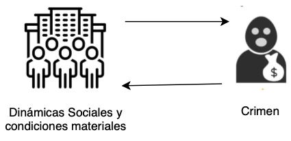

Un análisis de cuánto impacta cada componente al otro y de cómo funcionan las dinámicas temporales está fuera del alcance del presente análisis. Sin embargo, es una investigación adicional forzosa y necesaria que debe realizarse para entender el problema.

Por lo tanto, las relaciones causales esperadas que estamos explorando aquí se definen de la siguiente manera (supuesto):

```{mermaid}
graph LR
    Desarrollo --> Crimen
    Población --> Crimen
    Empleo --> Crimen
    Educación --> Crimen
    Infraestructura --> Crimen
    Seguridad_Publica["Seguridad Pública"] --> Crimen
    Politica_Urbana["Política Urbana"] --> Crimen
    Natural_Geographical["Condiciones Geográficas y Naturales"] --> Crimen
    Urban_Design["Diseño Urbano"] --> Crimen
```

#### Supuesto 2: Los embeddings capturan condiciones geográficas estructurales y naturales

Es importante revisar cómo se conceptualizan los embeddings como una representación de las características del espacio:

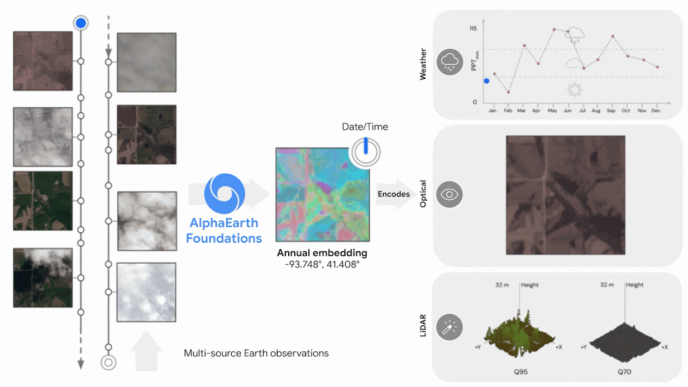

*Fuente: [Google DeepMind — AlphaEarth Foundations](https://deepmind.google/blog/alphaearth-foundations-helps-map-our-planet-in-unprecedented-detail/).*

Como podemos ver, el supuesto es que los embeddings para una región dada capturan múltiples cambios y dinámicas ambientales del terreno dado durante el año, sensores satelitales y múltiples procesamientos de imagen de la región, por lo tanto también capturan múltiples características estructurales tales como infraestructura, actividad humana, clima regional, etc.

A veces los datos no están disponibles o no son confiables para uno o más de estos factores para una cierta región, por ejemplo:

```{mermaid}
graph LR
    Desarrollo --> Embedding
    Población --> Embedding
    Empleo --> Embedding
    Educación --> Embedding
    Infraestructura --> Embedding
    Public_Security["Seguridad Pública"] --> Embedding
    Urban_Policy["Política Urbana"] --> Embedding
    Natural_Geographical["Condiciones naturales y geográficas"] --> Embedding
    Urban_Design["Diseño Urbano"] --> Embedding
    Inflación --> Embedding
    Geo_relations["Relaciones Geográficas"] --> Embedding
```

A partir de esto, entonces, dadas las restricciones y limitaciones de datos al hablar de datos delictivos, buscamos llegar a un punto en el que estimamos una función $f$ vía el modelo $\hat{f}$, de:

$$ y_{\text{crime}} = f(\text{embedding})$$

Donde $y_{\text{crime}}$ podría ser ya sea un indicador de incidentes delictivos o incluso la cantidad de incidentes delictivos esperados que se reportarían en una unidad espacial en un lapso temporal.

## Procesamiento de Datos {#data-processing}


### Agregación a nivel de objeto

Para el siguiente modelo, usaremos los datos agregados de asalto por calle, entendiendo por calle el segmento de calle entre esquinas, con la siguiente lógica:

- Asignamos cada incidente delictivo a la calle más cercana al punto de ocurrencia.
- Para los datos socio-demográficos, asignamos a cada calle el valor del centroide de la MZA que está más cerca de dicha calle.
- Finalmente, para asignar los valores de embedding, tomamos el mosaico de ráster de cobertura que cubre completamente la calle y luego los promediamos y normalizamos a 1 (para mantener la norma del embedding con base en AlphaEarth), asignando ese valor a la calle.

Además, el proceso de entrenamiento consiste en los siguientes modelos, cada uno de los cuales fue entrenado con la siguiente lógica:

- Validación K-fold agrupada a nivel de año y municipio.
- Dejar fuera 2 municipios y un año para una evaluación fuera de muestra (out-of-sample) de los modelos entrenados.
- Las columnas de características que no forman parte de las capas de embedding se procesaron mínimamente, solo con el fin de observar la mejora (lift) generada sobre un conjunto de datos *simple* al agregar las capas de embedding.


Es importante notar que, en el caso en que tenemos una variable geoespacial continua de interés (en este caso coordenadas con delitos), es importante seleccionar el nivel de agregación correcto que tenga una interpretación real en campo, no solo una agregación de datos conveniente; tomemos por ejemplo la siguiente figura:

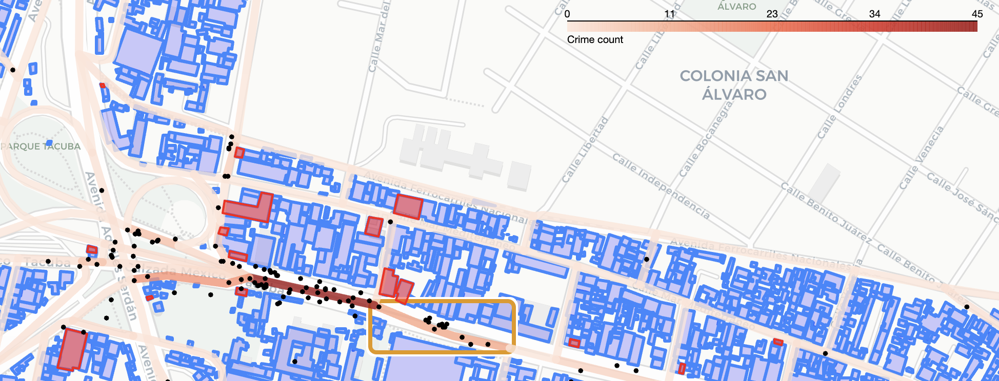

En puntos negros, las coordenadas de los delitos reportados, y diferentes agregaciones usando los edificios de Google Earth y las geometrías oficiales de calles. Nos gustaría hacer coincidir el delito de calle, como el *Asalto a transeúnte*, o incluso la agregación de edificio/MZA para el *Robo a casa habitación*.

Por lo cual se sigue la regla de asignación a nivel calle como pivote:

  - **Crimen**: Se asigna el punto (incidencia) a la línea (calle) más cercana en distancia euclidiana (después de aplicar una proyección sobre un espacio métrico).
  - **Datos Manzana**: Los valores reportados por el INEGI a nivel MZA se asignan atribuyendo a la calle los valores de la manzana cuyo centroide está más cerca de la calle en un sentido euclidiano (después de la propia proyección métrica).
  - **Embedding**: Se realiza una agregación (promedio) de todos los embeddings que cubren la calle (ver la siguiente Figura 21) y se normalizan.

La siguiente figura ejemplifica la lógica de asignación para la construcción del set de entrenamiento para calles.

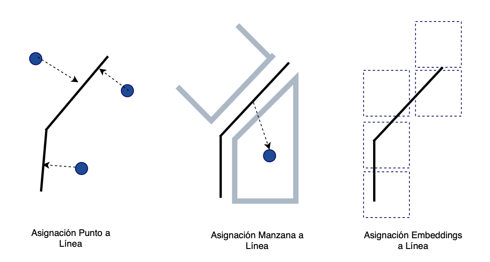


### Conjunto de datos de entrenamiento

El conjunto de datos final de características a incluir se compone de 3 bases de datos:

- Los 64 Embeddings completos de AlphaEarth.
- Selección de Datos Socio-demográficos.
- Variable objetivo para el conteo: $y_{count}$.
- Variable objetivo para la clasificación: $y_{ind}$.

Todo agregado a nivel de calle.

## Ajuste de Modelos: Métodos de Aprendizaje Supervisado {#supervised-methods}

Siguiendo los patrones *plug and play* descritos en el [Capítulo 2](./02_working_with_embeddings.qmd#plug-and-play-patterns), el enfoque supervisado toma el conjunto de entrenamiento a nivel de calle, embeddings más una selección de covariables socio-demográficas, y ajusta un modelo $\hat{f}$ contra una de las dos variables objetivo definidas arriba: el conteo $y_{count}$ (cuántos incidentes se reportaron en esa calle en ese año) o el indicador $y_{ind}$ (si al menos uno ocurrió).

Para cada objetivo evaluamos (benchmark) tres familias de modelos, desde el plug-in lineal más simple hasta una cabeza no lineal aprendida, a través de los mismos tres conjuntos de características (solo embeddings, solo otras covariables, y ambos combinados), de manera que la mejora atribuible a los propios embeddings sea directamente comparable:

- **Regresión de conteo**: dado que los conteos de delitos por calle están inflados en ceros (la mayoría de las calles no reportan ninguno, unas pocas reportan muchos), ajustamos XGBoost y una cabeza de conteo de Red Neuronal, ambos bajo una especificación de Poisson Inflada en Ceros (y familias relacionadas), en lugar de una regresión lineal o de Poisson simple.
- **Clasificación**: los mismos conjuntos de características, pero ajustados contra el indicador binario $y_{ind}$ con Regresión Logística, XGBoost y una cabeza de Red Neuronal, dada la naturaleza altamente desbalanceada del objetivo.

Cada modelo se entrena con validación K-fold consciente de grupos (agrupada por año y municipio, de modo que ninguna calle se filtre entre folds) y se evalúa en un año y un par de municipios reservados nunca vistos durante el entrenamiento, siguiendo la lógica de procesamiento de datos descrita arriba.

La siguiente tabla muestra una serie de modelos, tanto supervisados como no supervisados, que fueron utilizados e iterados como parte del ejercicio de evaluación previa a
la propuesta del producto de datos. Es importante enfatizar que estos modelos se entrenaron con tres tablas de datos: datos socioeconómicos (INEGI), 64−dim AlphaEarth
Embeddings y ambas simultáneamente, optimizando hiperparámetros sobre cada grupo de variables por sí mismos. Además, se utilizó validación cruzada para el entrenamiento y evaluación de modelos, y finalmente para el benchmark se utilizaron muestras holdout
(nunca vistas antes y fuera del entrenamiento y ajuste):

| Tipo de aprendizaje | Modelo | Hiperparámetros de diseño | Métricas de evaluación |
|---|---|---|---|
| **Supervisado** (clasificación, objetivo `y_ind`) | Regresión Logística (línea base) | `C=1.0`, `penalty=l2`, `class_weight=balanced`, `max_iter=2000`; pipeline con `StandardScaler`; solver `lbfgs`/`liblinear` | ROC-AUC, PR-AUC (precisión promedio), F1, precisión, recall, exactitud balanceada, MCC, log loss, Brier (barrido completo de umbrales) |
| | XGBoost (clasificador) | `n_estimators=300`, `max_depth=4`, `learning_rate=0.05`, `scale_pos_weight=auto`, `tree_method=hist`, `eval_metric=aucpr` | *(ídem fila anterior)* |
| | Cabeza de red neuronal (MLP, PyTorch) | `hidden_dims=[64,32]`, `dropout=0.2`, `lr=1e-3`, `weight_decay=1e-4`, `epochs=60`, `batch_size=256`, `pos_weight=auto`; `BCEWithLogitsLoss`; Adam | *(ídem fila anterior)* |
| **Supervisado** (regresión de conteo, objetivo `y_cnt`) | XGBoost (conteo) | familias `poisson`/`negbin`/`hurdle`; `num_boost_round=300`, `max_depth=4`, `learning_rate=0.05`, `subsample=0.8`, `colsample_bytree=0.8`, `min_child_weight=5`, `reg_lambda=1.0`, `alpha=1.0` | Desviación de Poisson, MAE, RMSE, ρ de Spearman; tasa de ceros observada vs. predicha |
| | Cabeza de conteo de red neuronal (MLP, PyTorch) | familias `zip`/`poisson`/`negbin`; `hidden_dims=[64,32]`, `dropout=0.2`, `lr=1e-3`, `weight_decay=1e-4`, `epochs=80`, `batch_size=256`; pérdida NLL específica por familia; Adam | *(ídem fila anterior)* |
| **No supervisado** (reducción de dimensionalidad) | PCA | `n_components=3`, `svd_solver=randomized`; características estandarizadas | Razón de varianza explicada |
| | SVD truncado | `n_components=3`; características escaladas, no centradas | Razón de varianza explicada |
| | Distancia de Mahalanobis (diagnóstico) | covarianza regularizada tipo ridge `reg=1e-6` (blanqueamiento por Cholesky) | Distribución de la distancia por bucket de `y_cnt` |
| **No supervisado** (aprendizaje de variedades) | t-SNE | `n_components=2`, `perplexity=50`, `learning_rate=auto`, `max_iter=500`; muestra de 50k | Cualitativa: proyección 2-D inspeccionada para verificar separación por nivel de incidencia (sin puntaje escalar) |
| | UMAP | `n_components=2`, `n_neighbors=30`, `min_dist=0.1`; ajustado sobre muestra (100k) + transformación por lotes | *(ídem fila anterior)* |
| | LLE (Locally Linear Embedding) | `n_components=2`, `n_neighbors=10`; muestra de 5k | *(ídem fila anterior)* |
| | MDS | `n_components=2`, `n_init=1`; muestra de 15k | *(ídem fila anterior)* |
| **No supervisado** (clustering) | K-means esférico (`MiniBatchKMeans` sobre características normalizadas en L2) | barrido de `k` (p. ej. `range(2,15)`), `batch_size=10000`, `n_init=5`, `max_iter=200`, esférico `n_iter=50`, `tol=1e-4` | Inercia (WCSS), silhouette (submuestreada), Calinski-Harabasz, Davies-Bouldin; H de Kruskal-Wallis y ε² vs. `y_cnt` |


### Regresión de conteo

La regresión para conteos constituye una generalización del modelo lineal (en el marco de los Modelos Lineales Generalizados, GLM) orientada a ajustar eventos de ocurrencia discreta. Dada la naturaleza de los eventos delictivos —intrínsecamente un conteo de ocurrencias en el espacio y el tiempo—, resulta natural modelar dicha ocurrencia $y$ mediante una distribución *Poisson* o distribuciones afines para variables de conteo (por ejemplo, *Binomial Negativa*), donde la variable objetivo $y$ toma valores en los enteros no negativos, esto es,

$$
y \in \mathbb{Z}_{\geq 0} = \{0, 1, 2, \dots\}.
$$

En particular, los eventos delictivos se consideran *raros* en términos de frecuencia de ocurrencia, y la evidencia del análisis exploratorio confirma una sobrerrepresentación de valores nulos (exceso de ceros) respecto a lo esperado bajo una Poisson o Binomial Negativa estándar. Por ello, se opta por un modelo discreto *cero-inflado* (*zero-inflated*), cuya función de masa de probabilidad se define por partes como

$$
P(Y = y) =
\begin{cases}
\pi + (1-\pi)\, f_Y(0 \mid \theta), & y = 0, \\[4pt]
(1-\pi)\, f_Y(y \mid \theta), & y \in \{1, 2, 3, \dots\},
\end{cases}
$$

donde:


  - $\pi \in [0,1]$ es la probabilidad de que la observación provenga del componente de *cero estructural*, es decir, de la sobrerrepresentación de observaciones nulas ajena al proceso de conteo propiamente dicho.
  - $1-\pi$ es la probabilidad de que la observación provenga del proceso generador de conteos en sí, es decir, del subconjunto de casos en los que el fenómeno delictivo efectivamente ocurre, y $f_Y(\cdot \mid \theta)$ determina cuántos eventos se observan.
  - $f_Y(\cdot \mid \theta)$ es la función de masa de probabilidad del proceso generador de los datos, parametrizada por $\theta$.


En este trabajo se emplean como distribuciones base para $f_Y(\cdot \mid \theta)$ las distribuciones Poisson y Binomial Negativa, además de contrastarse con modelos de tipo *Hurdle* como especificación alternativa para el tratamiento del exceso de ceros.

Es importante mencionar que se utiliza el método de *boosting* por eficiencia computacional. Para un mejor y más apropiado ajuste es recomendable utilizar modelación bayesiana y librerías como *STAN* para el flujo de modelado. Dicho esto, es importante resaltar que este enfoque no ajusta directamente los modelos cero-inflados, sino que, para conseguir un ajuste equivalente, se realiza en dos partes: un primer ajuste de clasificación y luego una regresión sobre los casos positivos.

Más aún, una aplicación bayesiana es poco interpretable dada la naturaleza de las características en los embeddings, por lo que no estaríamos ganando interpretabilidad y estaríamos perdiendo tiempo de cómputo. Si se quisiera estudiar los efectos aleatorios por calle, entonces sí debería ajustarse un modelo bayesiano, pero el número de parámetros a estimar lo vuelve intratable; se podría utilizar un modelo CAR para la autocorrelación espacial, pero eso no es necesario por los supuestos de correlación espacial implícita en los embeddings.


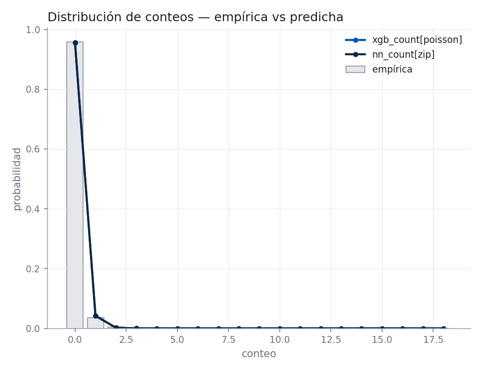


Como podemos ver, el desempeño predicho parece estar realmente cerca de los valores reales al predecir la incidencia inflada en ceros para el crimen a nivel de calle. Aquí, un riesgo particular podría ser el sobreajuste de nuestro modelo. Y también una subrepresentación de conteos de eventos raros, es decir, para calles con incidencia mayor a $3$. Se necesita un ajuste vía regularización para atender este problema.

A pesar de tener un sobreajuste en los valores 0 y cercanos a cero como lo son 1 y 2, al decir que el modelo ha ajustado correctamente la variable discreta objetivo $Y ∈{0,1,2,3,...}$, se podría decir que el modelo ha aprendido a clasificar entre incidencia muy probable (incidencia positiva) y no incidencia, ignorando casos extremos. Si bien se puede trabajar en mejorar los resultados en tanto que un modelo de regresión, la naturaleza del problema exige pensar en el entrenamiento más allá de una predicción puntual, hacia una aplicación de la regresión como un instrumento de evaluación de riesgo de incidencia. Como trabajo futuro se sugiere investigar el uso de predicción conforme para crear intervalos de confianza a partir de estos modelos.

### Clasificación sobre la ocurrencia del evento

En esta parte, entrenamos el modelo solo con una variable indicadora: si una calle tuvo o no algún delito registrado a lo largo del año.

Entonces entrenamos las mismas familias de modelos, pero para un problema de clasificación binaria con clases desbalanceadas (dado el comportamiento inflado en ceros presente en la incidencia delictiva).

Es importante recordar cuál es el objetivo de la clasificación binaria en tanto que algoritmo de aprendizaje supervisado: en este caso, la variable respuesta $Y$ no corresponde al número de incidentes, sino al hecho de que, dado un elemento —en este caso, una calle—, se identifique con $Y=1$ si hubo al menos un delito registrado, o con $Y=0$ si no se registró ningún incidente. Formalmente,

$$
Y =
\begin{cases}
1, & \text{si la calle registró al menos un delito en el periodo,} \\
0, & \text{en caso contrario.}
\end{cases}
$$

En este trabajo se plantea así un problema de clasificación binaria: dado un conjunto de características $\mathbb{X}$, se busca encontrar una función $g$ tal que

$$
g: \mathbb{X} \longrightarrow \{0,1\},
$$

y se define el clasificador como

$$
f(x \mid \theta) =
\begin{cases}
1, & \text{si } g(x) \geq \tau, \\
0, & \text{en otro caso,}
\end{cases}
$$

donde $\tau$ es el umbral de decisión. Los parámetros $\theta$ se ajustan de forma que minimicen la función objetivo

$$
\frac{1}{N} \sum_{i=1}^N \mathbb{L}\left(y_i, f(x_i \mid \theta)\right) + \lambda\, R(\theta),
$$

donde $\mathbb{L}$ es una función de pérdida, $R$ una función de regularización, y $\lambda \geq 0$ el parámetro que controla el peso relativo de dicha regularización.

Posteriormente, entrenamos las mismas familias de modelos, ahora bajo el enfoque de un problema de clasificación binaria con clases desbalanceadas, dado el comportamiento inflado en cero característico de la incidencia delictiva.

En las siguientes figuras, se pueden observar los resultados de desempeño en una muestra no vista en el entrenamiento y reservada exclusivamente para la validación para las diferentes configuraciones de clasificación, esto es, los diferentes modelos, descritos en el Cuadro $1$, con diferentes grupos de datos: $1)$ datos socioeconómicos (*other*), $2)$ embeddings, $3)$ ambos (*combined*).

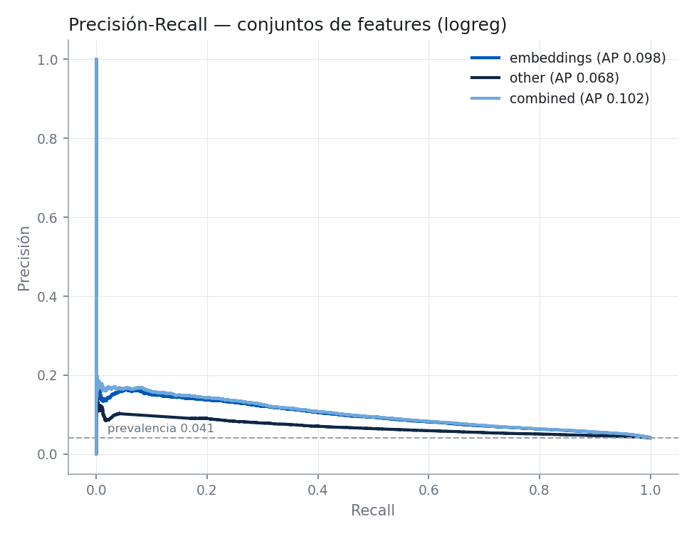


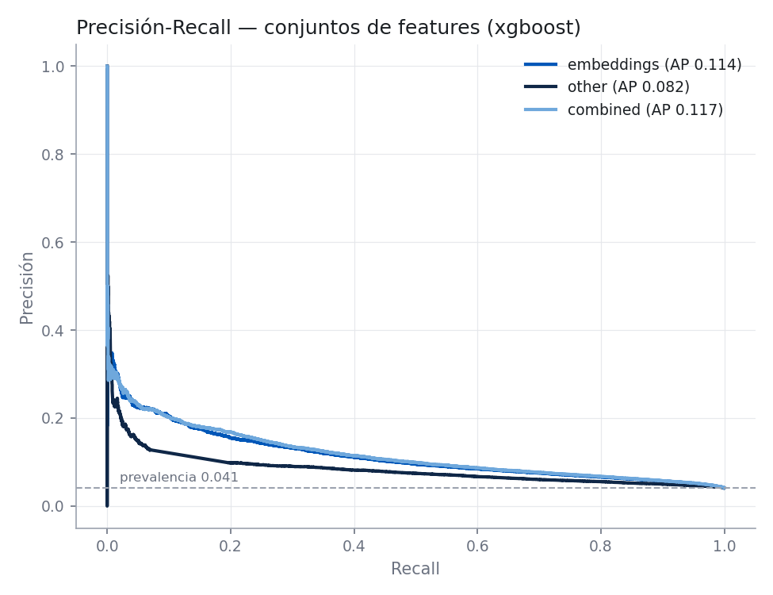

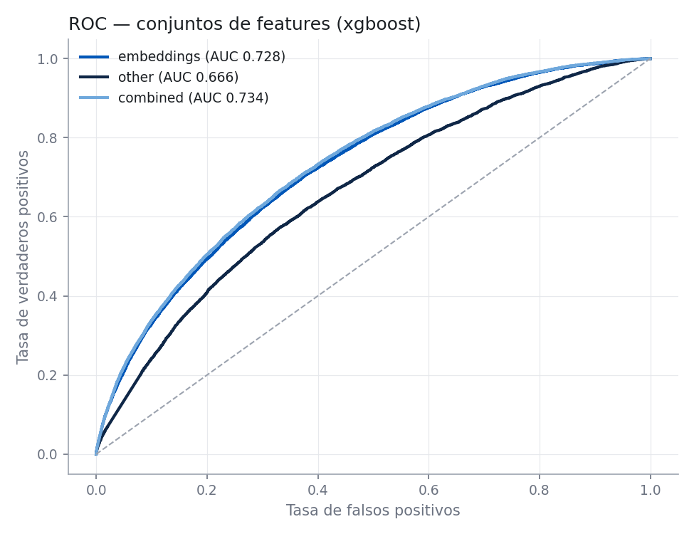

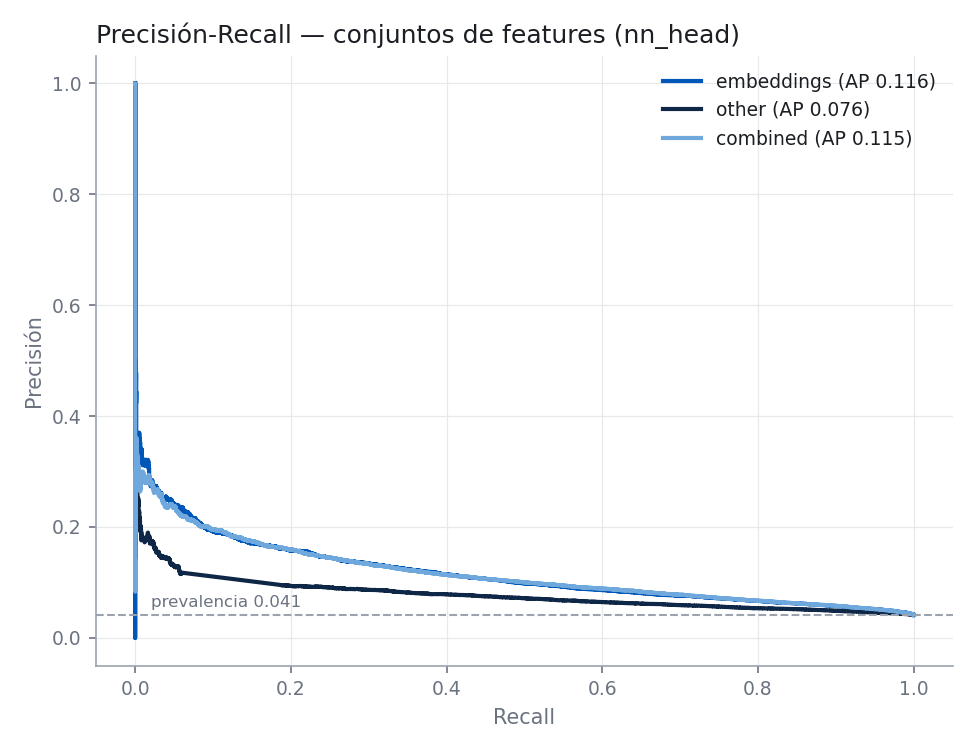

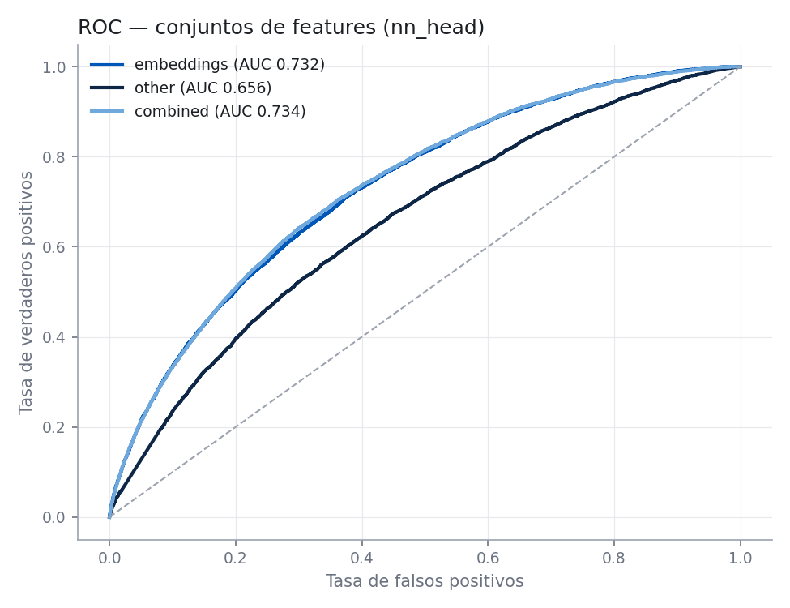

Comparando las curvas de precisión-recall con respecto a los 3 modelos:

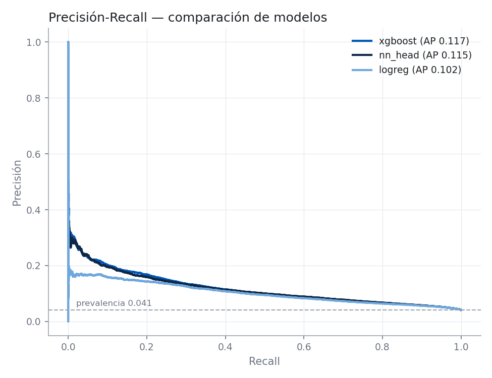

Ahora, tras revisar los datos obtenidos de la evaluación y graficados en las Figuras anteriores, podemos concluir dos puntos importantes, una mala y una buena noticia, es decir, lo siguiente:

**¿Aprendió el modelo a clasificar?** No. Dado el nivel de desbalance de las muestras, el modelo puede alcanzar un nivel alto de exhaustividad (*recall*) simplemente seleccionando la clase mayoritaria, aunque a un costo muy alto en precisión. Si consideramos el conjunto de las curvas de Precisión-Exhaustividad, la historia que nos cuentan es consistente: el costo en precisión por recuperar casos positivos correctos es demasiado alto, de modo que para recuperar apenas el $20\%$ de los casos positivos, todos los modelos se ubican alrededor de un $10\%$ de precisión.

Retomando el punto de la clasificación, dado un modelo entrenado $\hat{f}$, la función de pérdida o error empírico

$$
\frac{1}{N} \sum_{i=1}^{N} \left| \hat{f}(x_i) - y_i \right|
$$

no alcanza un valor lo suficientemente bajo como para que el modelo sea utilizable en aplicaciones prácticas con una interpretación directa sobre la clasificación.

**¿Sirvieron de algo los embeddings?** Sin embargo, lo que sí podemos ver es que, al menos cuando se utilizan embeddings, el desempeño del modelo mejora. Consideremos que la incidencia o no de un delito entre una calle y otra, particularmente para elementos de baja incidencia, podría ser circunstancial más que sistémica. Más aún, siendo estrictos con la interpretación de la curva ROC-AUC, y abusando de esta interpretación, el modelo mejora la decisión de catalogar una calle como riesgosa o no comparada con una selección aleatoria, pero remarcando que no lo suficiente para proponer una solución *as is*. Esto se debe consultar con un experto en la materia; en términos técnicos y propios del entrenamiento, la clasificación es pobre, pero el valor que aporte y la tolerancia a falsos positivos, entre otros, queda bajo la determinación del experto en la materia para una decisión o implementación final.


### Comparativas (Benchmarks)

De las siguientes figuras, podemos concluir que tanto NN como XGBoost tienen mejor desempeño que la regresión logística para la Clasificación, y para la Regresión de Conteo, tanto XGB como NN son bastante similares bajo el mismo conjunto de datos, ambos con Regresión de Poisson Inflada en Ceros, mientras que claramente hay una gran ganancia en las métricas de evaluación con los conjuntos de datos que incluyen embeddings vectoriales.

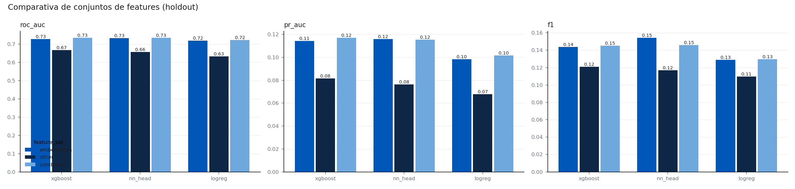

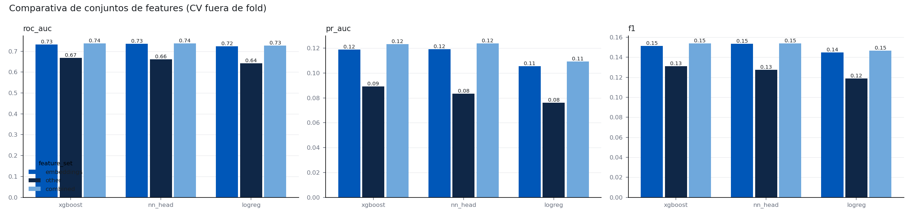

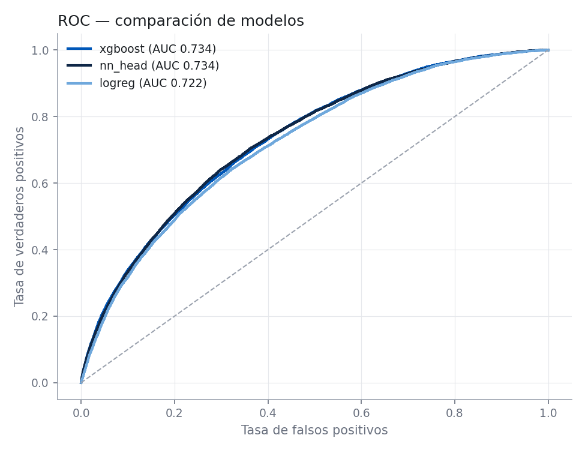

## Descubriendo Patrones Ocultos: Métodos de Aprendizaje No Supervisado {#unsupervised-methods}

A diferencia del enfoque supervisado, aquí no hay una variable objetivo contra la cual ajustar; solo tenemos el propio espacio de características de embedding (y covariables), y la pregunta cambia de *"¿podemos predecir $y$?"* a *"¿el espacio de características, por sí mismo, organiza las calles en grupos significativamente distintos?"*. Esto importa para el modelado de crimen precisamente por la lógica de *arquetipo* introducida arriba: si las calles con características estructurales y ambientales similares (según lo capturado por los embeddings) se agrupan sin importar su incidencia reportada, entonces esa estructura puede usarse para señalar *calles más riesgosas* incluso donde los incidentes están subreportados o simplemente aún no han ocurrido, usando la vecindad en el espacio de características como un proxy del riesgo en lugar del conteo histórico únicamente.

Abordamos esto de dos maneras complementarias, ambas puramente sobre el espacio de características: primero, la reducción de dimensionalidad (PCA, t-SNE y otros métodos de aprendizaje de variedades) para visualizar si las calles de alta y baja incidencia ya se separan en una proyección de baja dimensión; y segundo, el clustering (K-means esférico) para asignar a cada calle, reportada o no, a un grupo discreto que después pueda caracterizarse y ordenarse por riesgo.

### Reducción de Dimensionalidad

Primero, dado que tenemos una serie de características no etiquetadas, un primer paso es realizar una serie de reducciones de dimensionalidad para visualizar el potencial de los embeddings para agrupar o caracterizar los datos, particularmente manteniendo el significado en el contexto de los delitos cometidos en las calles.

#### Análisis de Componentes Principales


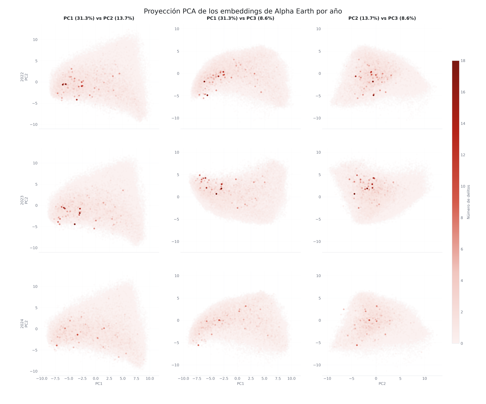

Como podemos ver, al reducir la dimensionalidad podemos ver que los registros o calles con alta incidencia muestran un agrupamiento que podría caracterizarse mediante modelos de clustering u otros algoritmos no supervisados.

#### t-SNE

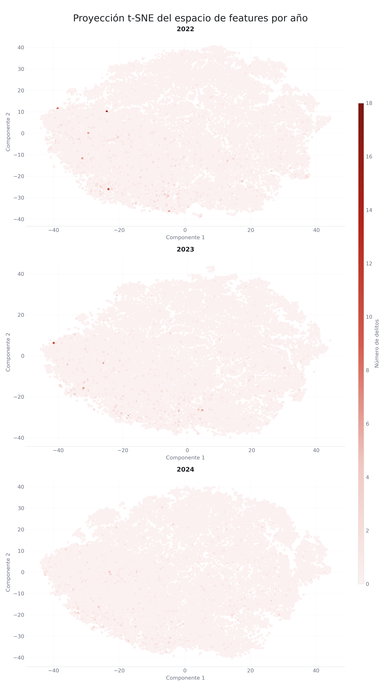

Aquí también vemos algún tipo de agrupamiento por nivel de incidencia, y dado que t-SNE es un algoritmo que mantiene tanto la similitud local como la global, verificaremos si el clustering puede generar una caracterización para los hotspots delictivos.

#### SVD

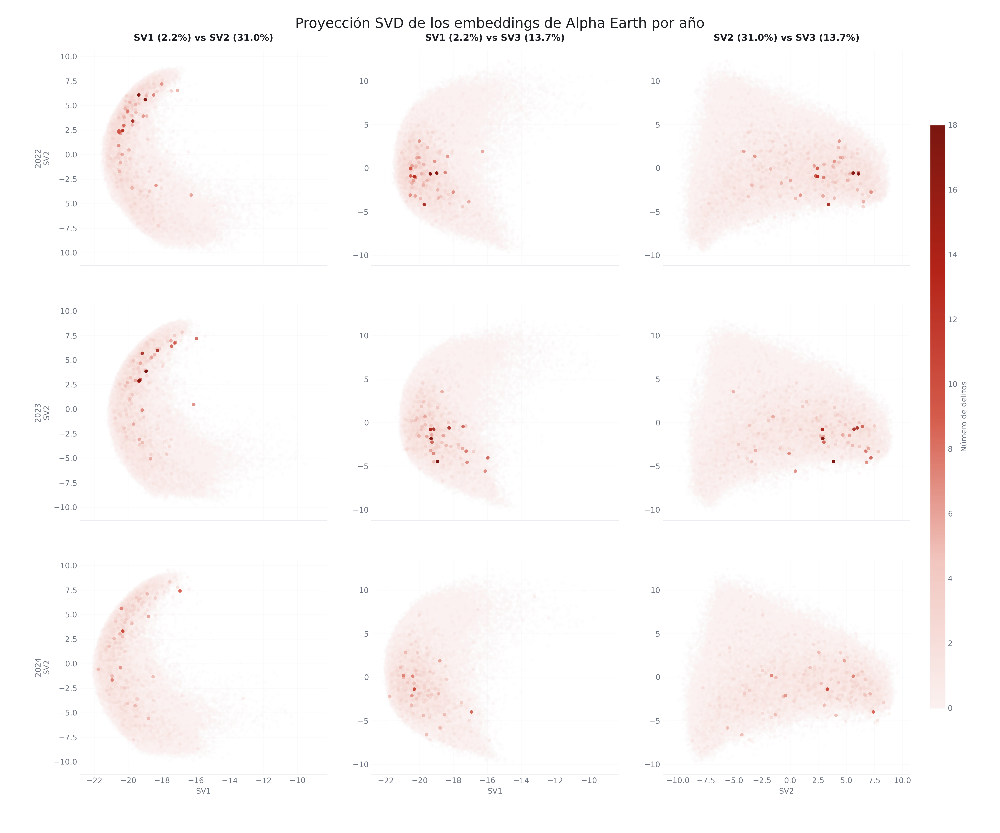

Aquí podemos observar otra técnica poderosa para la factorización de matrices llamada Descomposición en Valores Singulares (SVD), que es una generalización de la descomposición en vectores propios (eigenvectores), usada a veces como una técnica de compresión de datos (reducción de dimensionalidad) que consiste en operaciones geométricas: rotación, escalamiento y rotación. Podemos observar la naturaleza de los embeddings y los patrones de dispersión para los valores de ocurrencia delictiva. Dado que, en el fondo, la mayoría de las operaciones de PCA a gran escala usan una forma de SVD, continuamos usando PCA como nuestra técnica principal de reducción de dimensionalidad. Sin embargo, una investigación futura más profunda sobre esta descomposición podría ser valiosa.

### Aprendizaje de Variedades (Manifold Learning)

También conocidas como técnicas de Reducción de Dimensionalidad No Lineal, estas son más técnicas de reducción de dimensionalidad donde, en contraste, por ejemplo, con PCA, la reducción no ocurre mediante un proceso lineal sino vía factorización por kernel y técnicas de optimización. Algunas de ellas se presentan aquí para ver si se revela algún patrón interesante en un espacio no lineal con respecto a los valores de embedding relacionados con la incidencia delictiva a nivel de calle.

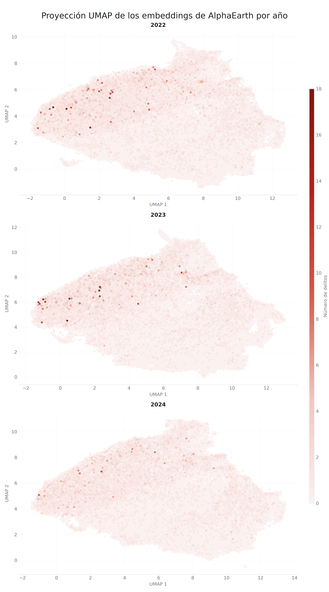

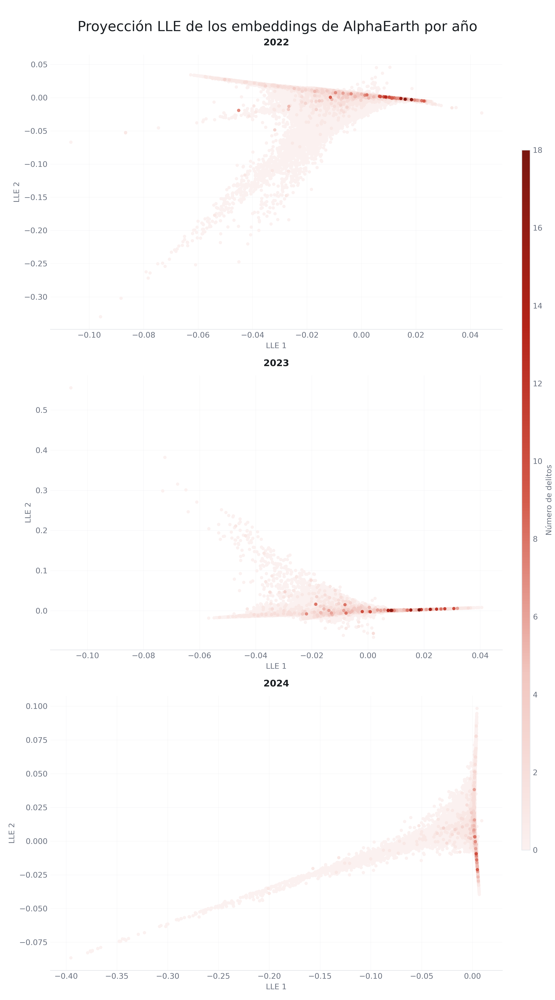


Para el primer modelo UMAP, se puede observar un patrón en la sección superior de la superficie aprendida. En la proyección LLE mostrada en la pareciera que la mayor parte de las calles con incidencias altas están asociadas a características en el espacio aprendido que se encuentran en la misma sección colineal.

Esto nos dice que, si bien no estamos haciendo inferencia alguna, pareciera que en la reducción de dimensionalidad encontramos que las calles con incidencias altas parecen estar cerca en el espacio, tanto de características originales de los embeddings como en espacios aprendidos. De aquí surge la posibilidad de experimentar con las siguientes estrategias o arquitecturas de modelado:

  - Directo: K-means o agrupamiento directo entre vectores (riesgo de varianza por maldición de la dimensionalidad). Particularmente, K-means, como se explica en este trabajo, funciona bien con alta dimensión al reducir la distancia de la dimensión original a una diferencia escalar por medio de la distancia coseno en la esfera (donde viven los embeddings).
  - Reducción de dimensionalidad + Agrupamiento: la reducción de dimensión permite mantener la mayor cantidad de información y tener valores en dimensiones bajas y manejables; dependiendo del modelo de Reducción de Dimensionalidad, el costo computacional podría ser restrictivo. Se sugiere utilizar k vecinos más cercanos o modelos como DBSCAN como agrupamiento, dado el bajo costo a escala y la interpretabilidad.

Es importante resaltar que la validez estadística de la clusterización radica en efectuar pruebas de hipótesis para determinar la diferencia distribucional de los clústeres; métodos como la Energy Distance y dichas pruebas se omitirán por escapar del alcance del presente trabajo y por su costo computacional a esta escala de datos.


### Clustering


Para hacer clustering en una escala tan grande de puntos, y considerando que los datos dados provienen de un intervalo normalizado $[-1,1]$, el camino más directo para obtener un clustering a partir de los embeddings es vía clustering k-Means sobre la esfera (equivalente al clustering K-means esférico coseno, dado que está normalizado).

El ejemplo para 2022, 2023 y 2024:

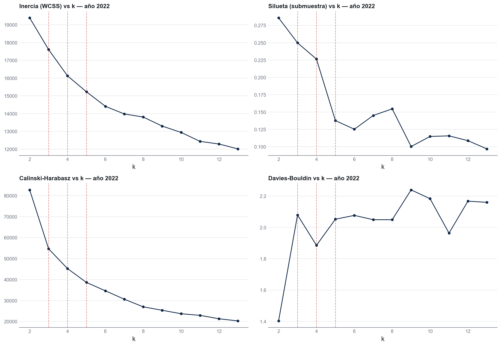

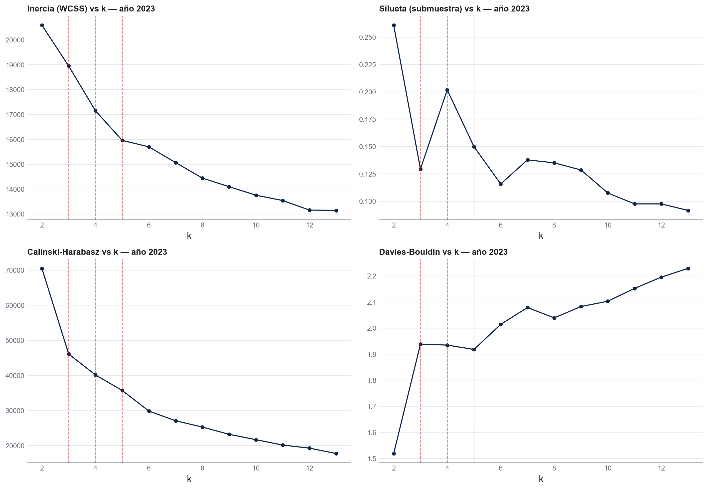

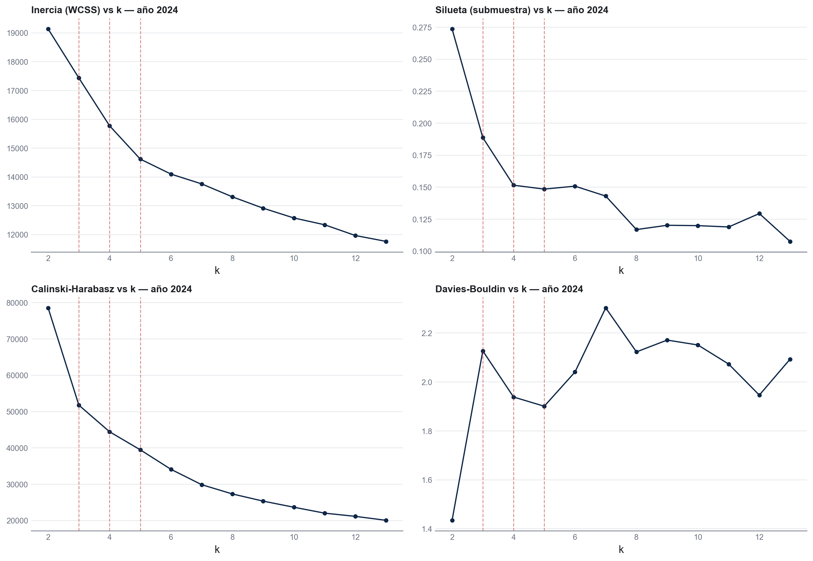

Los clústeres correspondientes generados, cuando se analizan desde el punto de vista del número de incidentes ocurridos, muestran los siguientes patrones:

Para $k=3$:

| Año | Cluster | Conteo | Media | Std | Min | 25% | 50% | 75% | Max |
|---|---|---:|---:|---:|---:|---:|---:|---:|---:|
| 2022 | 0 | 66387 | 0.075 | 0.371 | 0.0 | 0.0 | 0.0 | 0.0 | 17 |
| 2022 | 1 | 53920 | 0.042 | 0.240 | 0.0 | 0.0 | 0.0 | 0.0 | 9 |
| 2022 | 2 | 57730 | 0.058 | 0.285 | 0.0 | 0.0 | 0.0 | 0.0 | 8 |
| 2023 | 0 | 32241 | 0.023 | 0.183 | 0.0 | 0.0 | 0.0 | 0.0 | 8 |
| 2023 | 1 | 85420 | 0.059 | 0.336 | 0.0 | 0.0 | 0.0 | 0.0 | 18 |
| 2023 | 2 | 60376 | 0.050 | 0.272 | 0.0 | 0.0 | 0.0 | 0.0 | 10 |
| 2024 | 0 | 37131 | 0.020 | 0.155 | 0.0 | 0.0 | 0.0 | 0.0 | 4 |
| 2024 | 1 | 53567 | 0.049 | 0.258 | 0.0 | 0.0 | 0.0 | 0.0 | 8 |
| 2024 | 2 | 87339 | 0.054 | 0.276 | 0.0 | 0.0 | 0.0 | 0.0 | 10 |

Para $k=4$:

| Año | Cluster | Conteo | Media | Std | Min | 25% | 50% | 75% | Max |
|---|---|---:|---:|---:|---:|---:|---:|---:|---:|
| 2022 | 0 | 25209 | 0.050 | 0.268 | 0.0 | 0.0 | 0.0 | 0.0 | 5 |
| 2022 | 1 | 44891 | 0.044 | 0.244 | 0.0 | 0.0 | 0.0 | 0.0 | 9 |
| 2022 | 2 | 42985 | 0.057 | 0.285 | 0.0 | 0.0 | 0.0 | 0.0 | 9 |
| 2022 | 3 | 64952 | 0.076 | 0.372 | 0.0 | 0.0 | 0.0 | 0.0 | 17 |
| 2023 | 0 | 25190 | 0.017 | 0.158 | 0.0 | 0.0 | 0.0 | 0.0 | 8 |
| 2023 | 1 | 51453 | 0.062 | 0.365 | 0.0 | 0.0 | 0.0 | 0.0 | 18 |
| 2023 | 2 | 46583 | 0.046 | 0.252 | 0.0 | 0.0 | 0.0 | 0.0 | 8 |
| 2023 | 3 | 54811 | 0.055 | 0.294 | 0.0 | 0.0 | 0.0 | 0.0 | 14 |
| 2024 | 0 | 28203 | 0.017 | 0.145 | 0.0 | 0.0 | 0.0 | 0.0 | 4 |
| 2024 | 1 | 23812 | 0.046 | 0.246 | 0.0 | 0.0 | 0.0 | 0.0 | 6 |
| 2024 | 2 | 48059 | 0.045 | 0.245 | 0.0 | 0.0 | 0.0 | 0.0 | 8 |
| 2024 | 3 | 77963 | 0.055 | 0.282 | 0.0 | 0.0 | 0.0 | 0.0 | 10 |

Para $k=5$:

| Año | Cluster | Conteo | Media | Std | Min | 25% | 50% | 75% | Max |
|---|---|---:|---:|---:|---:|---:|---:|---:|---:|
| 2022 | 0 | 33371 | 0.075 | 0.357 | 0.0 | 0.0 | 0.0 | 0.0 | 13 |
| 2022 | 1 | 33149 | 0.053 | 0.260 | 0.0 | 0.0 | 0.0 | 0.0 | 7 |
| 2022 | 2 | 36797 | 0.051 | 0.274 | 0.0 | 0.0 | 0.0 | 0.0 | 9 |
| 2022 | 3 | 50823 | 0.074 | 0.360 | 0.0 | 0.0 | 0.0 | 0.0 | 17 |
| 2022 | 4 | 23897 | 0.028 | 0.214 | 0.0 | 0.0 | 0.0 | 0.0 | 9 |
| 2023 | 0 | 21153 | 0.016 | 0.152 | 0.0 | 0.0 | 0.0 | 0.0 | 8 |
| 2023 | 1 | 50525 | 0.062 | 0.362 | 0.0 | 0.0 | 0.0 | 0.0 | 18 |
| 2023 | 2 | 24662 | 0.053 | 0.281 | 0.0 | 0.0 | 0.0 | 0.0 | 10 |
| 2023 | 3 | 52336 | 0.056 | 0.297 | 0.0 | 0.0 | 0.0 | 0.0 | 14 |
| 2023 | 4 | 29361 | 0.038 | 0.226 | 0.0 | 0.0 | 0.0 | 0.0 | 8 |
| 2024 | 0 | 23246 | 0.015 | 0.136 | 0.0 | 0.0 | 0.0 | 0.0 | 4 |
| 2024 | 1 | 21313 | 0.049 | 0.253 | 0.0 | 0.0 | 0.0 | 0.0 | 6 |
| 2024 | 2 | 28324 | 0.039 | 0.221 | 0.0 | 0.0 | 0.0 | 0.0 | 6 |
| 2024 | 3 | 48963 | 0.049 | 0.260 | 0.0 | 0.0 | 0.0 | 0.0 | 8 |
| 2024 | 4 | 56191 | 0.056 | 0.286 | 0.0 | 0.0 | 0.0 | 0.0 | 10 |

Como podemos ver, el clustering para $k=4$ muestra un comportamiento más consistente e interpretable, así que profundizaremos en este parámetro del modelo para un análisis posterior.

No solo eso, sino que las cuatro métricas consideradas muestran un mejor desempeño para $k=4$, mostrando ya sea una inflexión o un óptimo local (un máximo para silhouette y Calinski-Harabasz, un mínimo para Davies-Bouldin).

El mapeo se basará en el número máximo de incidencia por clúster, clasificando en los niveles de riesgo Bajo, Medio y Alto.

Aquí están los clústeres anuales generados para cada año estudiado:

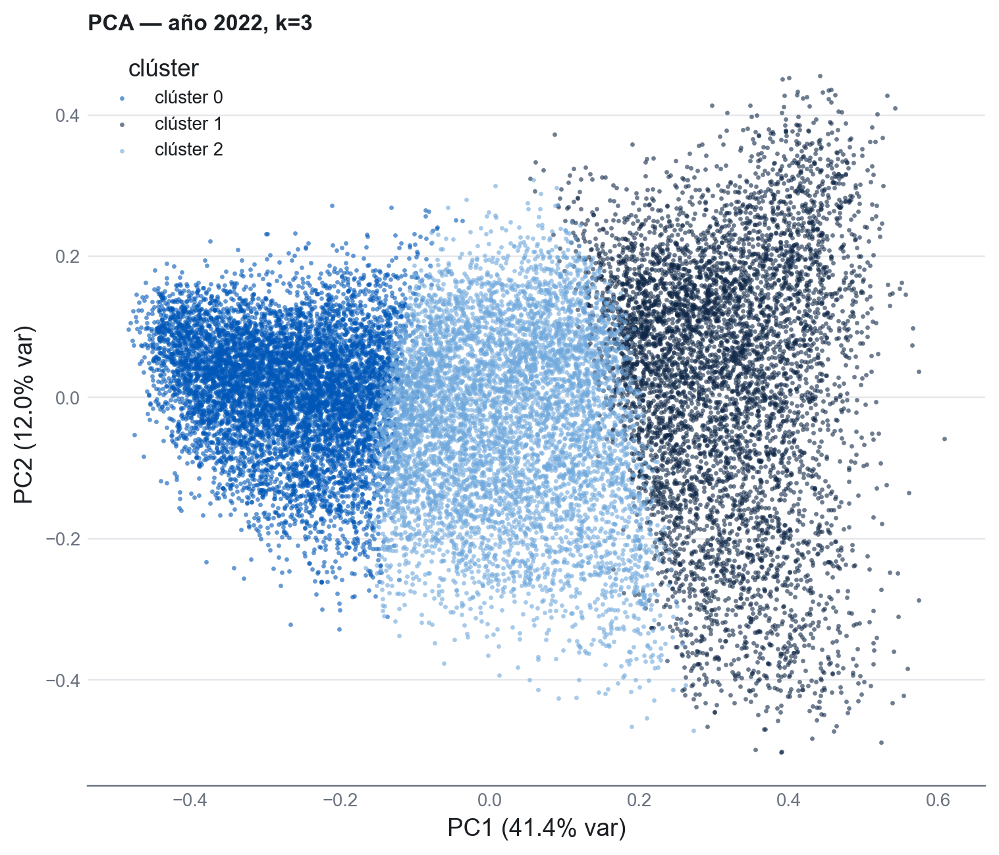

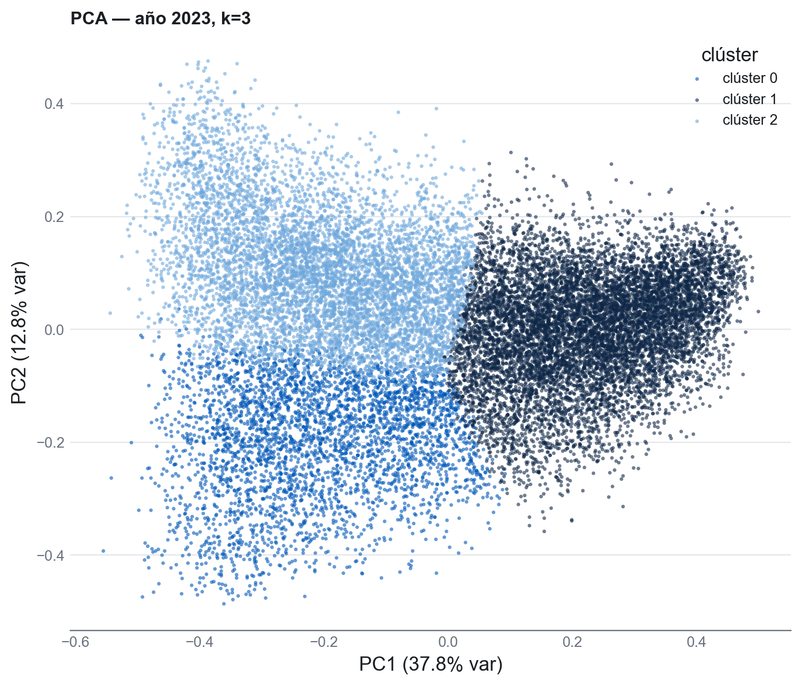

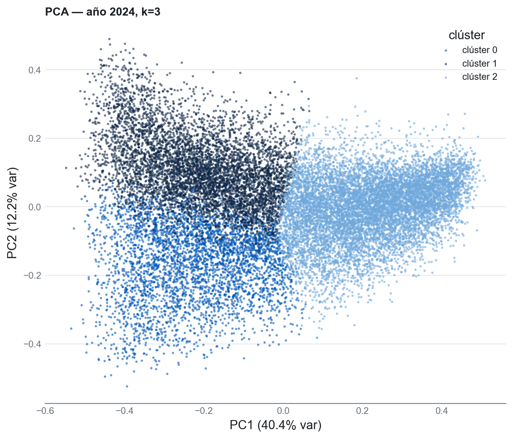


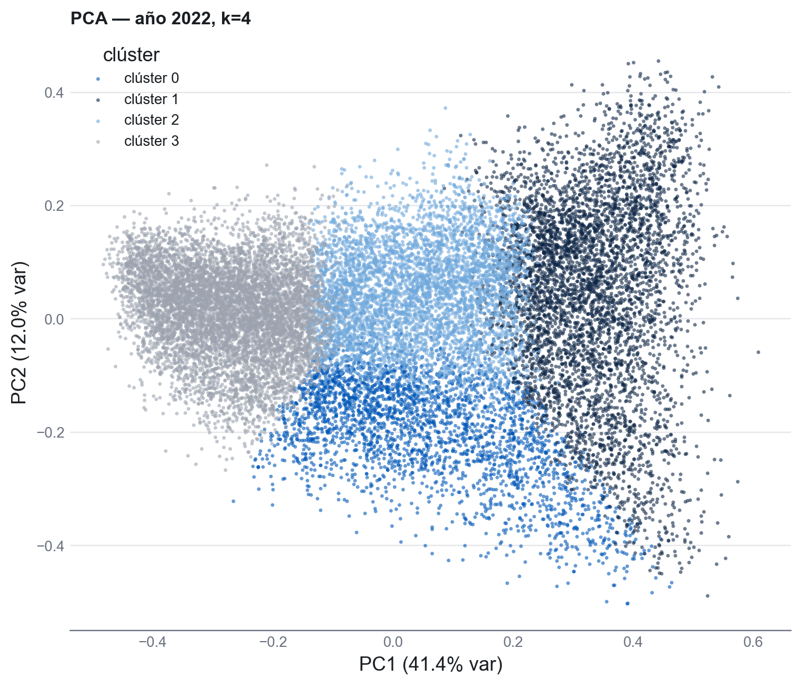

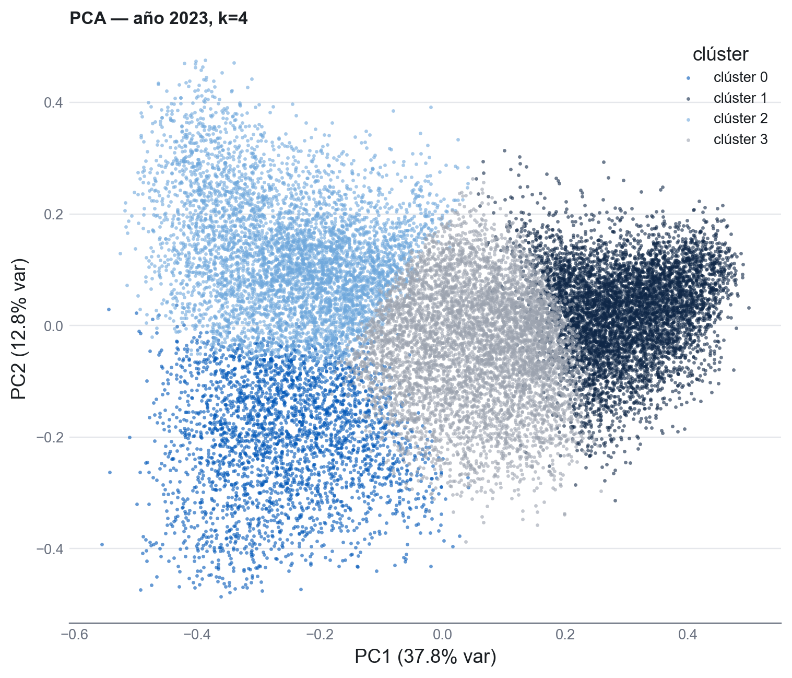

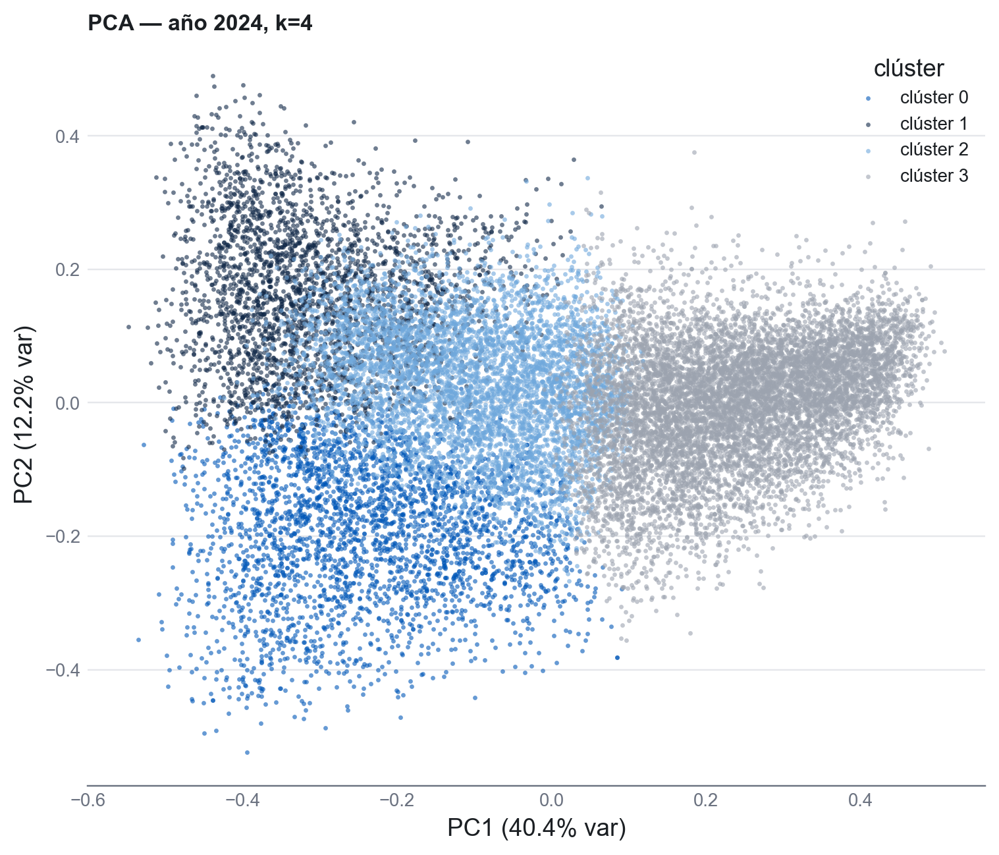

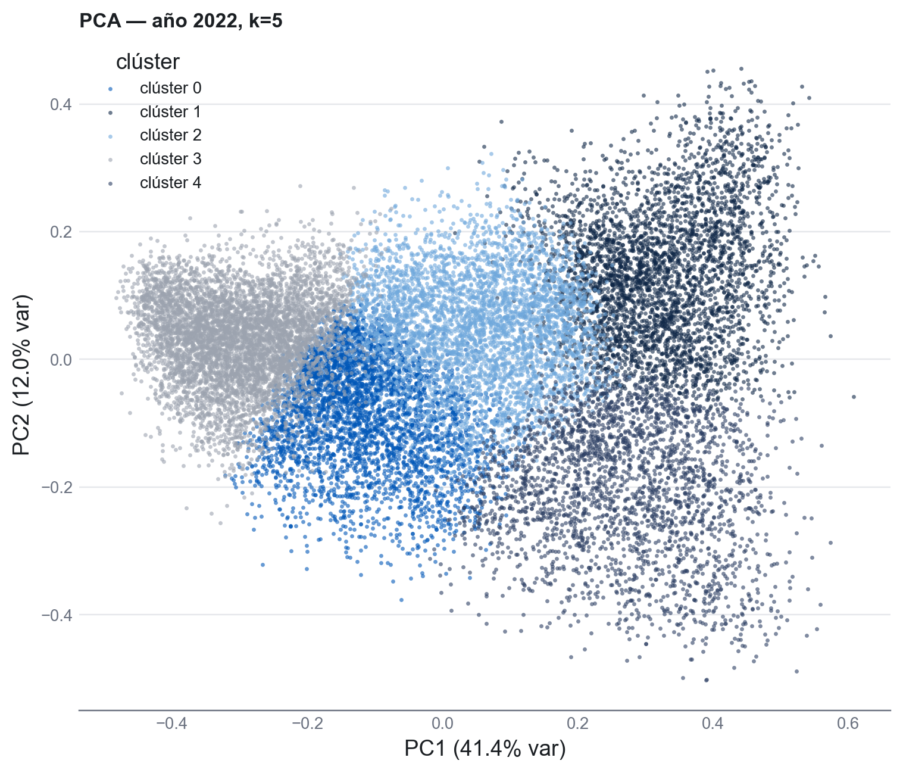

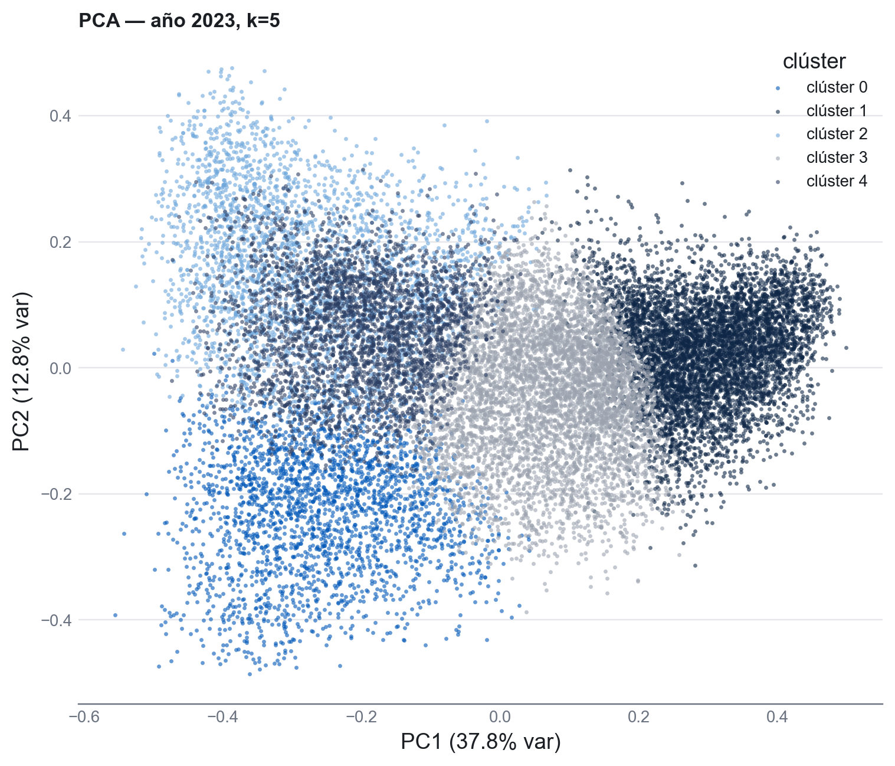

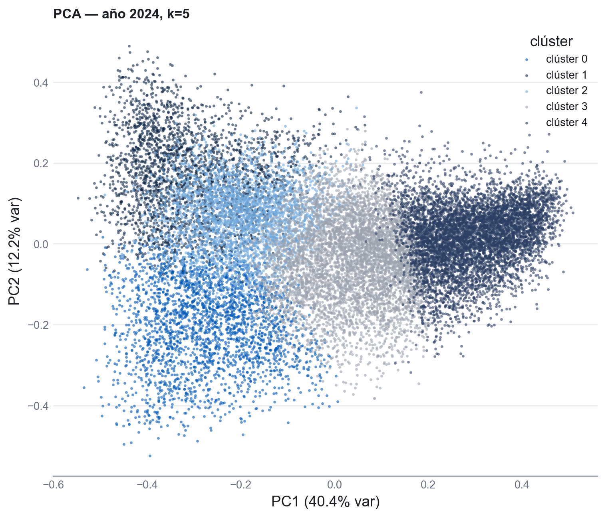

Para interpretar los resultados con el fin de clarificarlos a un stakeholder, por ejemplo, dividiríamos los clústeres en los siguientes 3 niveles de riesgo:

- Calles de alto riesgo: Aquellas dentro del clúster con el mayor número máximo de ocurrencias.
- Moderado: Los dos intermedios en orden de número máximo de ocurrencias.
- Calles de bajo riesgo: Aquellas dentro del clúster con el menor número máximo de ocurrencias.


Una conclusión final apropiada para confirmar que el clustering realmente está identificando grupos estadísticamente diferentes es aplicar pruebas de distribución multivariada para validar estadísticamente el clustering.

**¿Cómo es esto siquiera útil en lugar de simplemente clasificar sin hacer clustering?**

Eso es porque ahora que agrupamos, podemos identificar calles con las mismas características que aquellas con alta incidencia reportada, incluso si no tienen incidentes, usando la estructura geográfica para detectar riesgo en calles incluso si están subreportadas.

Observa el siguiente ejemplo sobre los municipios de Coyoacán, Benito Juárez, Miguel Hidalgo y Álvaro Obregón, agrupados para los años $2022, 2023, 2024$, con base en la lógica descrita arriba:


A partir de la exploración de los incidentes delictivos realizada tanto desde la investigación cualitativa como desde el EDA en el [Capítulo 3](03_crime_eda.qmd), podemos ver que el clustering para Coyoacán y Álvaro Obregón es muy similar a la incidencia y percepción de seguridad de algunas áreas subdesarrolladas y de zonas de alto ingreso y alta seguridad. Sin embargo, para Benito Juárez (BJ) los resultados parecen ser más drásticos de lo que dicen los datos, y esto puede tener dos explicaciones distintas: una es el subregistro: tal vez el modelo realmente nos está diciendo dónde están ocurriendo los incidentes y estos no se están reportando adecuadamente. La otra es que el modelo en realidad está capturando el *sesgo oportunista*, es decir, ha identificado que las zonas peatonales conectadas de alta movilidad son propensas a registrar incidencias de asalto, y entonces clasifica una gran cantidad de calles en BJ como un nivel de Riesgo, debido a la naturaleza del propio municipio como centro de movilidad para zonas turísticas, comerciales y de experiencia.

## Aplicaciones: Obteniendo Arquetipos {#archetypes}

Como se ha mencionado antes, el ideal de modelar los incidentes delictivos no es predecir dónde y en qué cantidad ocurrirá el crimen, sino entender las características de las calles —y, en general, del objeto geométrico de interés— vía las características de embedding: las características de las calles que son propensas a crear incentivos y oportunidad para que el crimen ocurra.

Por lo tanto, la idea es que, ya sea vía aprendizaje supervisado (Regresión/Clasificación) o aprendizaje no supervisado (clustering), las calles puedan agruparse por nivel de riesgo; esto permite, de nuevo, no predecir en un sentido literal, sino definir las áreas de alto riesgo, y abre la puerta a entender, con la ayuda de un especialista de campo, los casos de uso:

- Definir estrategias de seguridad en términos de priorización o asignación de capital humano.
- Comparación preventiva dentro del clúster (futuro): Tomar calles de alto riesgo y comparar las no reportadas de ese grupo; podría usarse como zonas de vigilancia donde, de no atenderse, la incidencia podría aumentar.
- Comparación preventiva dentro del clúster (diagnóstico): Tomar calles de alto riesgo y comparar las no reportadas de ese grupo; en retrospectiva, podría llevarnos a encontrar lugares donde el crimen está siendo subreportado.
- Entender características de calles más particulares con datos exclusivos de gobierno de alta calidad: Infraestructura, mantenimiento de cámaras de seguridad, impacto del despliegue de fuerzas y efecto causal.

Entre muchos otros casos de uso. Esto muestra que, a pesar de no poder prometer una predicción, ambos enfoques de modelado nos dan herramientas útiles para generar insights y acciones (actionables) valiosas.

### Puntuación de riesgo (Risk scoring)

Tanto el aprendizaje supervisado como el no supervisado son herramientas intermedias para nuestra aplicación principal de puntuación de riesgo en calles, como habilitador para la toma de decisiones y estrategia y modelado posteriores.


**Riesgo basado en regresión**

Aquí usamos modelos de regresión entrenados para el proceso de conteo, no para simplemente predecir el nivel de incidencia en cada calle, sino que, particularmente al elegir la cabeza de NN, nos enfocamos en obtener una puntuación de probabilidad por calle que nos permita clasificar cada entidad en un nivel de riesgo personalizado.

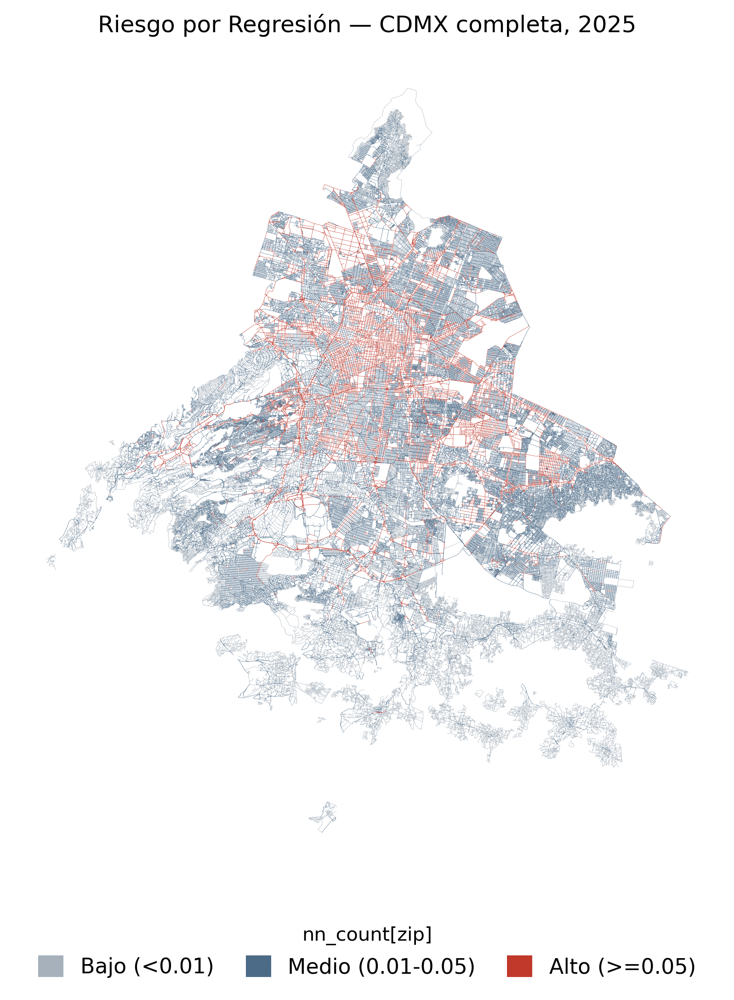

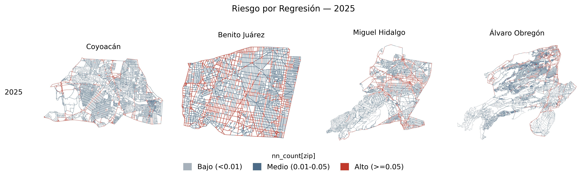

**Riesgo basado en clasificación**

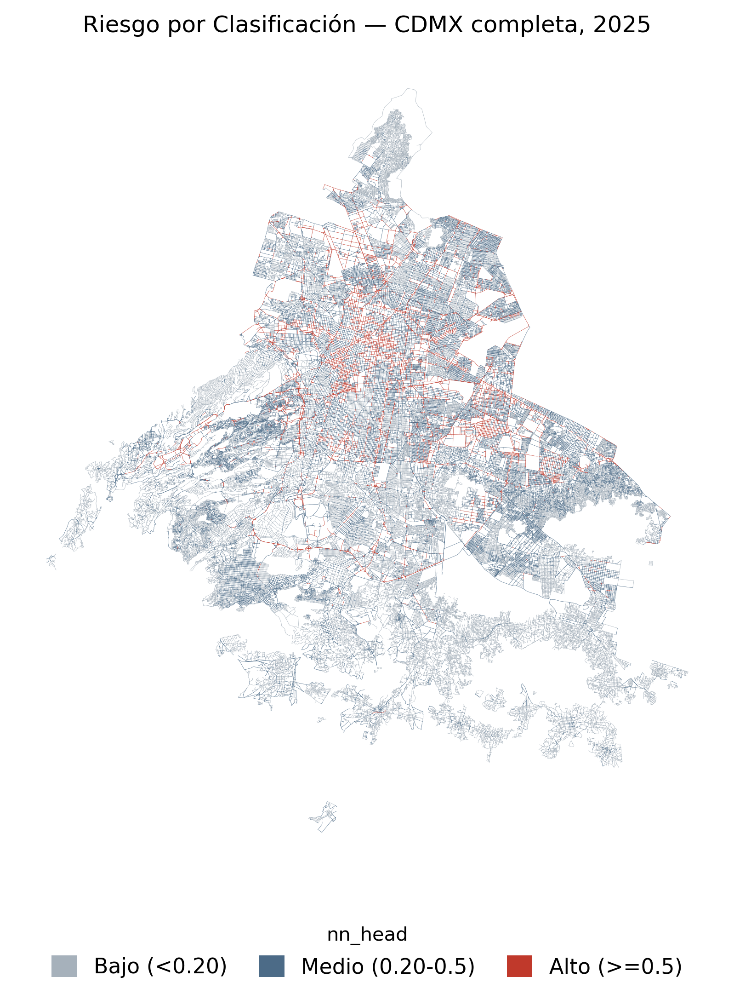

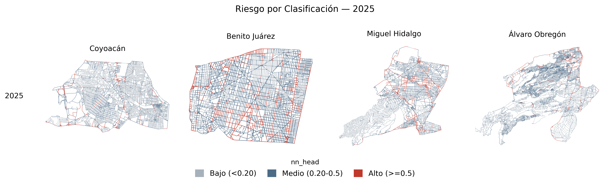

### Puntuación por clustering

Volviendo al clustering, podemos seleccionar algunas de las calles de nivel alto con base en las estadísticas descriptivas de los incidentes, y comenzar un estudio más profundo sobre lo que realmente está ocurriendo en esas calles, y entender si es realmente una señal válida o solo un falso positivo.


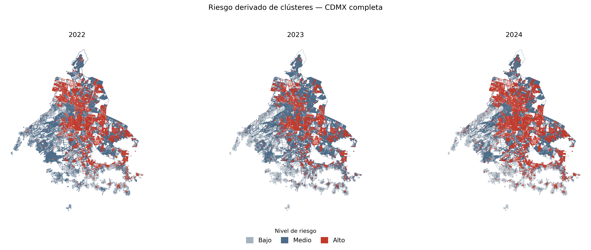


**Algoritmo 1:** Asignación de niveles de riesgo mediante agrupamiento

**Entrada:** Matriz de datos `X`

**Salida:** Etiqueta de riesgo `ℓ(C_j)` para `j = 1, …, k*`

```
1:  Fit a clustering model on X; select the optimal number of clusters k*
2:  for j = 1 to k* do
3:      Compute descriptive statistics of cluster C_j
4:      M_j ← max{ incidences within C_j }
5:  end for
6:  j⁻ ← argmin_j M_j          ▷ cluster with lowest statistic of interest
7:  j⁺ ← argmax_j M_j          ▷ cluster with highest statistic of interest
8:  ℓ(C_{j⁻}) ← "bajo riesgo"
9:  ℓ(C_{j⁺}) ← "alto riesgo"
10: for all j ∉ {j⁻, j⁺} do
11:     ℓ(C_j) ← "riesgo moderado"
12: end for
13: return ℓ
```

**Nota sobre buena definición (well-posedness)**

Los pasos 4–5 asumen implícitamente que `argmin_j M_j` y `argmax_j M_j` son cada uno único. Si `M_j` presenta empates en los extremos (plausible si las incidencias son valores enteros y los clústeres son pequeños), `j⁻` o `j⁺` quedan multivaluados y el etiquetado no está completamente especificado. Se recomienda una regla de desempate (p. ej. menor índice de clúster, o mayor `|C_j|`) para que el procedimiento sea determinista y reproducible.

Algunas decisiones particulares de modelado y diseño de datos que importan:
- La mayoría de los intervalos de riesgo se definen de manera determinista; es importante hacerlo conjuntamente con un experto de campo para calibrar los umbrales.
- Las visualizaciones de datos se han diseñado para ser neutrales en términos de comunicar el mensaje de los datos, pero siempre está abierto a redefiniciones y mejoras; ten cuidado de cómo se ve.
- La arquitectura de la NN, los hiperparámetros y otras decisiones de entrenamiento pueden impactar los resultados finales y las interpretaciones.
- Los modelos y datos de conteo inflados en ceros hacen que cada modelo, sin importar qué tan optimizado esté, sea un pobre predictor de conteos futuros a nivel de segmento (calle).


### Usabilidad y Mock-ups para el producto de datos

Como resultado, se propone profundizar en el estudio de los resultados obtenidos del índice de riesgo que se definió anteriormente y, en conjunto con expertos en el área, evaluar el mejor modelo en términos de representación estructural de riesgo de seguridad pública y, posteriormente, llevar a producción las aplicaciones propuestas a continuación.

#### Monitor de eventos delictivos

Se trata de un panel de Streamlit basado en configuraciones para el análisis exploratorio de datos sobre incidentes delictivos en la Ciudad de México. La carga, preparación y agregación de datos se delegan a los códigos fuente y se envuelven en cachés de Streamlit, de modo que los pasos más costosos (carga, división de calles en intersecciones, uniones espaciales) solo se ejecutan una vez. Una barra lateral muestra filtros para el intervalo de años, la categoría de delito, el tipo de delito y el municipio, e indica cuántos incidentes se han seleccionado y cuántos están geolocalizados.

En la siguiente figura se puede ver la ventana de inicio de la aplicación desplegada con ayuda del código *src/eda/app_esp.py* (*src/eda/app.py*, en inglés).

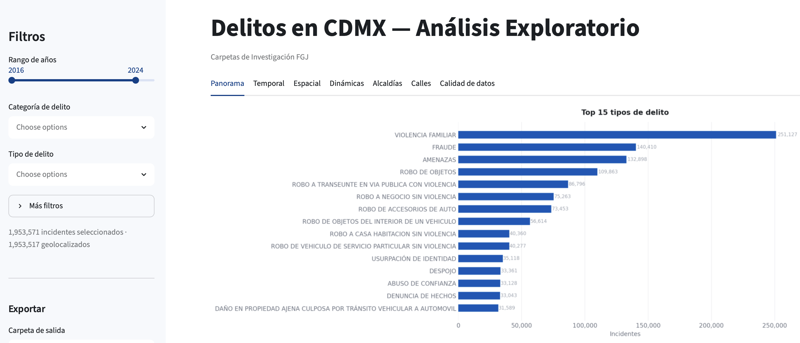

#### Marcaje predictivo de zonas de riesgo

Se trata de una presentación interactiva ligera y con un volumen reducido de datos de los resultados de la modelización. Contiene la geometría real LineString de cada calle, su nombre, las predicciones, el nivel de riesgo, el clúster de k-means y las coordenadas de PCA. El diseño presenta dos paneles vinculados uno al lado del otro: a la izquierda, un mapa de calles de la CDMX sobre un mapa base de Carto Positron en el que cada calle aparece representada con el color correspondiente a su nivel de riesgo de regresión (paleta de riesgos de viviendas); a la derecha, un gráfico de dispersión en el espacio de características del PCA con puntos coloreados según su clúster esférico k-means k=4.

Las dos vistas están vinculadas entre sí a través del identificador CVEGEO de cada calle: al hacer clic en una calle de cualquiera de los paneles, la selección se guarda en el estado de la sesión y se vuelve a ejecutar la aplicación. Se espera que, de ser aceptada por los interesados, las funcionalidades aumenten, permitiendo su uso para los casos de uso descritos anteriormente como base para la toma de decisiones relacionadas con la seguridad pública basada en datos enriquecidos.

En la siguiente figura se puede ver la ventana de inicio de la aplicación desplegada con ayuda del código *src/showcase/app_esp.py* (*src/showcase/app.py*, en inglés).

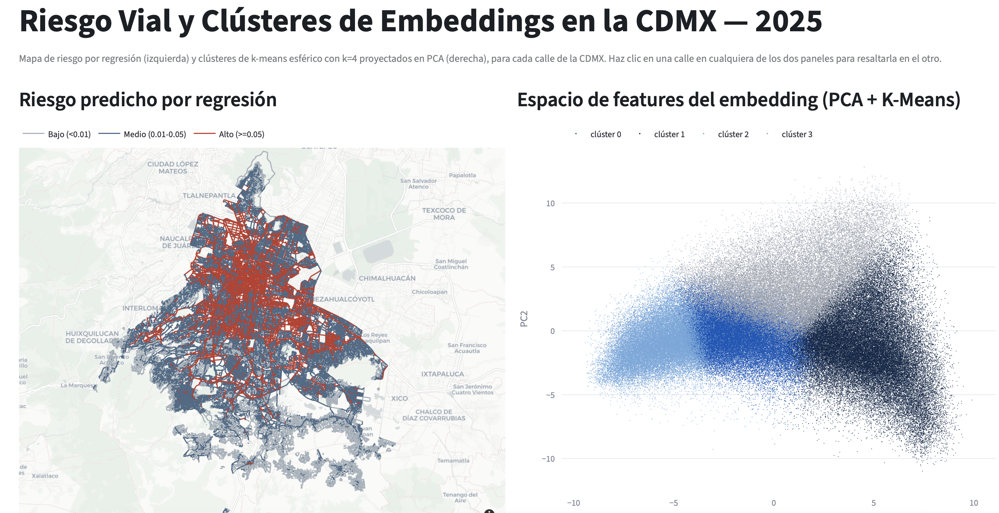

## Recursos

[Google DeepMind Official Alpha Earth Site](https://deepmind.google/blog/alphaearth-foundations-helps-map-our-planet-in-unprecedented-detail/)

[scikit-learn: Clustering, PCA, t-SNE and manifold learning](https://scikit-learn.org/stable/modules/clustering.html)

[XGBoost Documentation](https://xgboost.readthedocs.io/)

[Optuna: Hyperparameter Optimization Framework](https://optuna.org/)

[Mexico INEGI's Marco Geoestadístico](https://www.inegi.org.mx/app/biblioteca/ficha.html?upc=794551163061)
