The power of embeddings to enrich models and to give the opportunity to create geospatial analytics with just one target variable was mentioned in [Chapter 2](02_working_with_embeddings_eng.qmd).

Most applications come from Earth sciences, economic dynamics and logistics; there is a great opportunity to understand social and political behavior in general, but particularly for the use of embeddings in the social and political sciences. In the case of this work we will try to apply it to understanding crime in Mexico City.

## Modeling Crime {#modeling-crime}

One of the most challenging problems in the social sciences is modeling crime, and this is due to the complexity and the multidisciplinary nature of crime.

Starting with data caveats such as under-reporting, false reports, bureaucratic friction and data mismatch, not to mention corruption and public perception biases.

Then problems also arise when using earth embeddings and other environmental variables in social science research, for example the *opportunistic bias*, that is, where there is more population there is also more incidence and propensity to commit crimes.

Another important thing to know is that the approach here, despite the training and evaluation target or feature, in the end does not seek to predict per se the crime incidents that will occur on the streets, but to use the predictive outputs to evaluate risk levels and suggest strategies to our stakeholders (whether these are government agencies, decision makers or researchers).

So, even though the models are ultimately used to predict incidents on new data, the final goal is to label the objects of interest under a risk tier and to use the model not as a crystal ball, but as an auxiliary tool to understand crime patterns based on structural, geographic and environmental features.

### Decisions to model

When working on models there are a series of decisions that are part of the modeling and of the system design for a model; it is not only about selecting the model, but also about aligning the data definitions and gathering the elements required to perform an analysis. For example, for this particular modeling there are the following challenges:

- Different geospatial aggregations and point geometries of the elements (Rasters/polygons) for the embeddings, versus the point (coordinate) geometry for the crime incident reports.
- Variations in the data boundaries: Validating the correct coordinate entries of both the embedding data and the point data within the official political division for the territorial delimitation of the city.
- Defining the model(s) and target variables to exploit the embedding data for predictive and inference tasks.

Thus, the modeling decisions to be made would be the following:

- Definition of the target variable (crime events, crime events per population, etc.)
- Definitions of the appropriate geographic aggregation level.
- Data pipelines and quality checks.
- Data-generating models (model type families and hyperparameters for each one, evaluation metrics).

Each model approach will take these factors into account and will be presented in each scenario.

### Data processing and aggregation

To run the data flow and the training, it is assumed that the following files are already downloaded and saved in the appropriate directories based on the code paths:

- CDMX street geometry [SHP]: Download from [INEGI's Marco Geoestadístico](https://www.inegi.org.mx/app/biblioteca/ficha.html?upc=794551163061). Or any other polygon of interest (See building units or MZA).
- FGJ Carpetas [CSV]: CSV database with geocoded crime incidences (lat/lon points), from the area of interest.
- Google Earth Embeddings.

The reason why the databases are not provided, nor is there executable production code (although we include the scripts needed to run and obtain the data), goes beyond a volume issue: for the crime datasets, changes in the public datasets make the endpoints unstable, while INEGI and Google Earth are highly reliable sources in terms of data and APIs; for this particular set of geometries and raster assets an instance of manual interaction with the user interface is needed. But the codes provided in these notes and in the repository remain highly reliable.

To run the end-to-end supervised and unsupervised training and obtain results, going through the data cleaning and the training set construction described on this page, the correct order to run the repository's code is the following:

Scripts and script type:

| Script | Stage | Path |
|---|---|---|
| EDA App | Validation - Previous work | `./src/eda/app.py` |
| Embedding Coverage | Validation - Previous work | `./src/eda/dq.py` |
| Socioeconomic Data | Extraction | `./src/etl/get_socioecon_data.py` |
| Embedding Processing | Transformation | `./src/etl/process_embeddings.py` |
| Crime Data Cleaning | Transformation | `./src/eda/core.py` |
| Corner Split | Transformation (if working with streets) | `./src/utils/geom.py` |
| Assign point to Geometry | Transformation | `./src/etl/assign_point_to_geometry.py` |
| Training Dataset | Load | `./src/etl/get_training_sets.py` |
| Supervised: Single Run | Training | `./src/supervised/model_single_run.py` |
| Unsupervised: Dimensionality Reduction | Training | `./src/unsupervised/dim_reduction.py` |
| Unsupervised: Manifold Learning | Training | `./src/unsupervised/manifold_learning.py` |
| Unsupervised: K-means Clustering | Training | `./src/unsupervised/clustering_kmeans.py` |

The relationships between them, as a DAG, are the following:

```{mermaid}
graph LR
    SocioEcon["Socio Economic Data"] --> TrainSet["Training Dataset"]
    ProcEmb["Processing Embeddings"] --> TrainSet
    CleanCrime["Clean Crime Data"] --> AssignPoint["Assign Point to Geometry"]
    CornerSplit["Corner Split"] --> AssignPoint
    AssignPoint --> TrainSet
    TrainSet --> SupSingle["Supervised: Single Run"]
    TrainSet --> UnsupDim["Unsupervised: Dim Reduction"]
    TrainSet --> UnsupManifold["Unsupervised: Manifold Learning"]
    TrainSet --> UnsupKmeans["Unsupervised: K-means Clustering"]
    SupSingle --> AppCase["Application Case"]
    UnsupDim --> AppCase
    UnsupManifold --> AppCase
    UnsupKmeans --> AppCase
```

### Usual (implicit) assumptions

There are some particular assumptions that come from using earth embeddings as a proxy or covariates in a crime analysis, some of the most important in terms of structural definition.

#### Assumption 1: Crime is structural

One assumption is that the natural, geographic, economic, political and security features of neighborhoods and regions predispose the population to commit crimes or to be victims of them.

Despite the well-founded criticism that crime itself impacts the population, the dynamics and the development of the region, we will work with a valid assumption of the constant feedback loop:

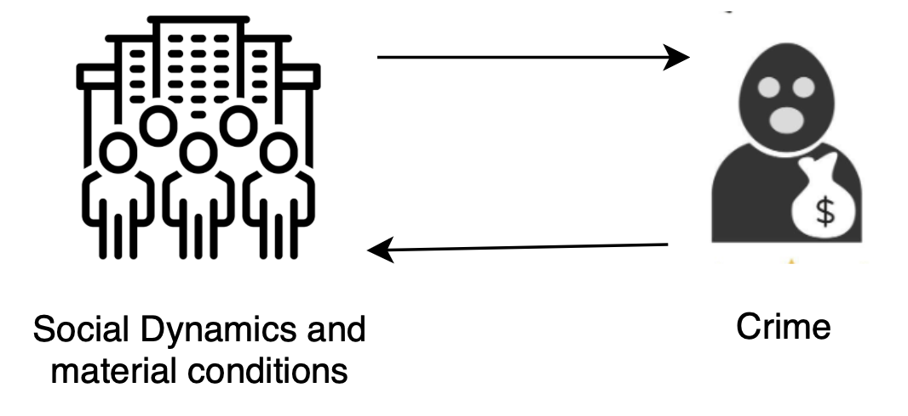

An analysis of how much each component impacts the other and of how the temporal dynamics work is outside the scope of the present analysis. However, it is a compulsory and necessary additional research that must be carried out to understand the problem.

Therefore, the expected causal relationships we are exploring here are defined as follows (assumption):

```{mermaid}
graph LR
    Development --> Crime
    Population --> Crime
    Employment --> Crime
    Education --> Crime
    Infrastructure --> Crime
    Public_Security["Public Security"] --> Crime
    Urban_Policy["Urban Policy"] --> Crime
    Natural_Geographical["Natural and Geographical Conditions"] --> Crime
    Urban_Design["Urban Design"] --> Crime
```

#### Assumption 2: Embeddings capture structural and natural geographic conditions

It is important to review how embeddings are conceptualized as a representation of the features of space:


*Source: [Google DeepMind — AlphaEarth Foundations](https://deepmind.google/blog/alphaearth-foundations-helps-map-our-planet-in-unprecedented-detail/).*

As we can see, the assumption is that the embeddings for a given region capture multiple environmental changes and dynamics of the given terrain during the year, satellite sensors and multiple image processings of the region, therefore they also capture multiple structural features such as infrastructure, human activity, regional climate, etc.

Sometimes the data is not available or is not reliable for one or more of these factors for a certain region, for example:

```{mermaid}
graph LR
    Development --> Embedding
    Population --> Embedding
    Employment --> Embedding
    Education --> Embedding
    Infrastructure --> Embedding
    Public_Security["Public Security"] --> Embedding
    Urban_Policy["Urban Policy"] --> Embedding
    Natural_Geographical["Natural and Geographical Conditions"] --> Embedding
    Urban_Design["Urban Design"] --> Embedding
    Inflation --> Embedding
    Geo_relations["Geographical Relations"] --> Embedding
```

From this, then, given the data constraints and limitations when talking about crime data, we seek to reach a point where we estimate a function $f$ via the model $\hat{f}$, of:

$$ y_{\text{crime}} = f(\text{embedding})$$

Where $y_{\text{crime}}$ could be either an indicator of crime incidents or even the amount of expected crime incidents that would be reported in a spatial unit over a time span.

## Data Processing {#data-processing}

### Object-level aggregation

For the following model, we will use the mugging data aggregated by street, understanding by street the street segment between corners, with the following logic:

- We assign each crime incident to the street closest to the point of occurrence.
- For the socio-demographic data, we assign to each street the value of the MZA centroid that is closest to that street.
- Finally, to assign the embedding values, we take the coverage raster mosaic that completely covers the street and then average them and normalize to 1 (to keep the embedding norm based on AlphaEarth), assigning that value to the street.

In addition, the training process consists of the following models, each of which was trained with the following logic:

- Grouped K-fold validation at the year and municipality level.
- Leaving out 2 municipalities and one year for an out-of-sample evaluation of the trained models.
- The feature columns that are not part of the embedding layers were minimally processed, only in order to observe the lift generated over a *plain* dataset by adding the embedding layers.

It is important to note that, in the case where we have a continuous geospatial variable of interest (in this case coordinates with crimes), it is important to select the correct aggregation level that has a real interpretation in the field, not just a convenient data aggregation; take for example the following figure:


In black dots, the coordinates of the reported crimes, and different aggregations using Google Earth buildings and the official street geometries. We would like to match the street crime, such as *Asalto a transeúnte* (mugging), or even the building/MZA aggregation for *Robo a casa habitación* (home burglary).

Hence the street-level assignment rule as a pivot is followed:

- **Crime**: The point (incidence) is assigned to the line (street) closest in Euclidean distance (after applying a projection onto a metric space).
- **Block (Manzana) data**: The values reported by INEGI at the MZA level are assigned by attributing to the street the values of the block whose centroid is closest to the street in a Euclidean sense (after the corresponding metric projection).
- **Embedding**: An aggregation (average) of all the embeddings covering the street is performed (see the following Figure 21) and they are normalized.

The following figure exemplifies the assignment logic for building the street training set.


### Training dataset

The final feature dataset to be included is composed of 3 databases:

- The full 64 AlphaEarth Embeddings.
- A selection of Socio-demographic Data.
- Target variable for the count: $y_{count}$.
- Target variable for the classification: $y_{ind}$.

All aggregated at the street level.

## Model Fitting: Supervised Learning Methods {#supervised-methods}

Following the *plug and play* patterns described in [Chapter 2](02_working_with_embeddings_eng.qmd#plug-and-play-patterns), the supervised approach takes the street-level training set, embeddings plus a selection of socio-demographic covariates, and fits a model $\hat{f}$ against one of the two target variables defined above: the count $y_{count}$ (how many incidents were reported on that street in that year) or the indicator $y_{ind}$ (whether at least one occurred).

For each target we benchmark three model families, from the simplest linear plug-in to a learned non-linear head, across the same three feature sets (embeddings only, other covariates only, and both combined), so that the lift attributable to the embeddings themselves is directly comparable:

- **Count regression**: since the crime counts per street are zero-inflated (most streets report none, a few report many), we fit XGBoost and a Neural Network count head, both under a Zero-Inflated Poisson specification (and related families), instead of a plain linear or Poisson regression.
- **Classification**: the same feature sets, but fitted against the binary indicator $y_{ind}$ with Logistic Regression, XGBoost and a Neural Network head, given the highly imbalanced nature of the target.

Each model is trained with group-aware K-fold validation (grouped by year and municipality, so that no street leaks between folds) and is evaluated on a reserved year and pair of municipalities never seen during training, following the data processing logic described above.

The following table shows a series of models, both supervised and unsupervised, that were used and iterated as part of the evaluation exercise prior to the proposal of the data product. It is important to emphasize that these models were trained with three data tables: socioeconomic data (INEGI), 64−dim AlphaEarth Embeddings and both simultaneously, optimizing hyperparameters over each group of variables on their own. In addition, cross-validation was used for model training and evaluation, and finally for the benchmark, holdout samples were used (never seen before and outside training and tuning):

| Learning type | Model | Design hyperparameters | Evaluation metrics |
|---|---|---|---|
| **Supervised** (classification, target `y_ind`) | Logistic Regression (baseline) | `C=1.0`, `penalty=l2`, `class_weight=balanced`, `max_iter=2000`; pipeline with `StandardScaler`; solver `lbfgs`/`liblinear` | ROC-AUC, PR-AUC (average precision), F1, precision, recall, balanced accuracy, MCC, log loss, Brier (full threshold sweep) |
| | XGBoost (classifier) | `n_estimators=300`, `max_depth=4`, `learning_rate=0.05`, `scale_pos_weight=auto`, `tree_method=hist`, `eval_metric=aucpr` | *(same as previous row)* |
| | Neural network head (MLP, PyTorch) | `hidden_dims=[64,32]`, `dropout=0.2`, `lr=1e-3`, `weight_decay=1e-4`, `epochs=60`, `batch_size=256`, `pos_weight=auto`; `BCEWithLogitsLoss`; Adam | *(same as previous row)* |
| **Supervised** (count regression, target `y_cnt`) | XGBoost (count) | `poisson`/`negbin`/`hurdle` families; `num_boost_round=300`, `max_depth=4`, `learning_rate=0.05`, `subsample=0.8`, `colsample_bytree=0.8`, `min_child_weight=5`, `reg_lambda=1.0`, `alpha=1.0` | Poisson deviance, MAE, RMSE, Spearman's ρ; observed vs. predicted zero rate |
| | Neural network count head (MLP, PyTorch) | `zip`/`poisson`/`negbin` families; `hidden_dims=[64,32]`, `dropout=0.2`, `lr=1e-3`, `weight_decay=1e-4`, `epochs=80`, `batch_size=256`; family-specific NLL loss; Adam | *(same as previous row)* |
| **Unsupervised** (dimensionality reduction) | PCA | `n_components=3`, `svd_solver=randomized`; standardized features | Explained variance ratio |
| | Truncated SVD | `n_components=3`; scaled, non-centered features | Explained variance ratio |
| | Mahalanobis distance (diagnostic) | ridge-type regularized covariance `reg=1e-6` (Cholesky whitening) | Distance distribution per `y_cnt` bucket |
| **Unsupervised** (manifold learning) | t-SNE | `n_components=2`, `perplexity=50`, `learning_rate=auto`, `max_iter=500`; 50k sample | Qualitative: 2-D projection inspected to verify separation by incidence level (no scalar score) |
| | UMAP | `n_components=2`, `n_neighbors=30`, `min_dist=0.1`; fitted on a sample (100k) + batch transform | *(same as previous row)* |
| | LLE (Locally Linear Embedding) | `n_components=2`, `n_neighbors=10`; 5k sample | *(same as previous row)* |
| | MDS | `n_components=2`, `n_init=1`; 15k sample | *(same as previous row)* |
| **Unsupervised** (clustering) | Spherical K-means (`MiniBatchKMeans` over L2-normalized features) | `k` sweep (e.g. `range(2,15)`), `batch_size=10000`, `n_init=5`, `max_iter=200`, spherical `n_iter=50`, `tol=1e-4` | Inertia (WCSS), silhouette (subsampled), Calinski-Harabasz, Davies-Bouldin; Kruskal-Wallis H and ε² vs. `y_cnt` |

### Count regression

Regression for counts constitutes a generalization of the linear model (within the Generalized Linear Models, GLM, framework) oriented to fitting discrete occurrence events. Given the nature of crime events —intrinsically a count of occurrences in space and time— it is natural to model that occurrence $y$ through a *Poisson* distribution or related distributions for count variables (for example, *Negative Binomial*), where the target variable $y$ takes values in the non-negative integers, that is,

$$
y \in \mathbb{Z}_{\geq 0} = \{0, 1, 2, \dots\}.
$$

In particular, crime events are considered *rare* in terms of occurrence frequency, and the evidence from the exploratory analysis confirms an over-representation of null values (excess zeros) relative to what is expected under a standard Poisson or Negative Binomial. For this reason, a *zero-inflated* discrete model is chosen, whose probability mass function is defined piecewise as

$$
P(Y = y) =
\begin{cases}
\pi + (1-\pi)\, f_Y(0 \mid \theta), & y = 0, \\[4pt]
(1-\pi)\, f_Y(y \mid \theta), & y \in \{1, 2, 3, \dots\},
\end{cases}
$$

where:

- $\pi \in [0,1]$ is the probability that the observation comes from the *structural zero* component, that is, from the over-representation of null observations extraneous to the count process itself.
- $1-\pi$ is the probability that the observation comes from the count-generating process itself, that is, from the subset of cases in which the criminal phenomenon actually occurs, and $f_Y(\cdot \mid \theta)$ determines how many events are observed.
- $f_Y(\cdot \mid \theta)$ is the probability mass function of the data-generating process, parameterized by $\theta$.

In this work, the Poisson and Negative Binomial distributions are used as base distributions for $f_Y(\cdot \mid \theta)$, and they are additionally contrasted with *Hurdle*-type models as an alternative specification for handling the excess of zeros.

It is important to mention that the *boosting* method is used for computational efficiency. For a better and more appropriate fit it is advisable to use Bayesian modeling and libraries such as *STAN* for the modeling flow. That said, it is important to highlight that this approach does not directly fit the zero-inflated models but, in order to achieve an equivalent fit, it is done in two parts: a first classification fit and then a regression over the positive cases.

Moreover, a Bayesian application is hardly interpretable given the nature of the features in the embeddings, so we would not be gaining interpretability and we would be losing compute time. If one wanted to study random effects per street, then a Bayesian model should indeed be fitted, but the number of parameters to estimate makes it intractable; a CAR model could be used for spatial autocorrelation, but that is not necessary because of the implicit spatial correlation assumptions in the embeddings.


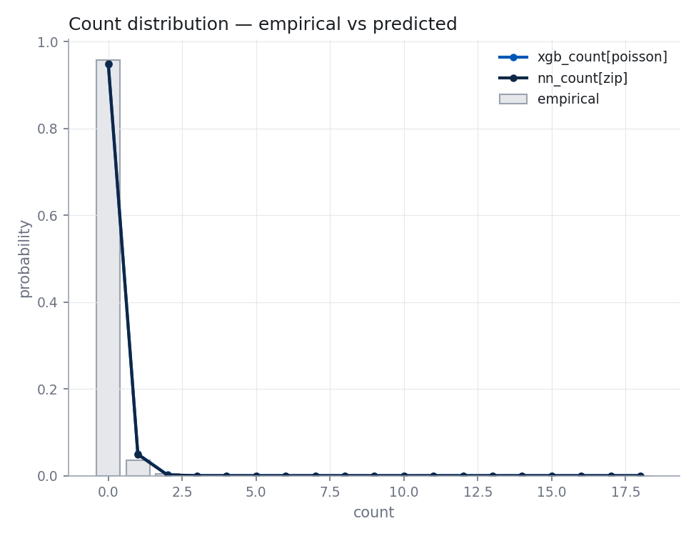

As we can see, the predicted performance seems to be really close to the real values when predicting the zero-inflated incidence for crime at the street level. Here, a particular risk could be the overfitting of our model. And also an under-representation of rare event counts, that is, for streets with incidence greater than $3$. A tuning via regularization is needed to address this problem.

Despite having an overfit at the values 0 and near-zero such as 1 and 2, when saying that the model has correctly fitted the discrete target variable $Y ∈\{0,1,2,3,...\}$, one could say that the model has learned to classify between very likely incidence (positive incidence) and no incidence, ignoring extreme cases. While work can be done to improve the results insofar as it is a regression model, the nature of the problem demands thinking about the training beyond a point prediction, toward an application of the regression as an instrument for assessing incidence risk. As future work it is suggested to investigate the use of conformal prediction to create confidence intervals from these models.

### Classification on event occurrence

In this part, we train the model only with an indicator variable: whether or not a street had any recorded crime throughout the year.

We then train the same model families, but for a binary classification problem with imbalanced classes (given the zero-inflated behavior present in crime incidence).

It is important to recall what the objective of binary classification is insofar as it is a supervised learning algorithm: in this case, the response variable $Y$ does not correspond to the number of incidents, but to the fact that, given an element —in this case, a street— it is identified with $Y=1$ if there was at least one recorded crime, or with $Y=0$ if no incident was recorded. Formally,

$$
Y =
\begin{cases}
1, & \text{if the street recorded at least one crime in the period,} \\
0, & \text{otherwise.}
\end{cases}
$$

In this work a binary classification problem is thus posed: given a set of features $\mathbb{X}$, we seek to find a function $g$ such that

$$
g: \mathbb{X} \longrightarrow \{0,1\},
$$

and the classifier is defined as

$$
f(x \mid \theta) =
\begin{cases}
1, & \text{if } g(x) \geq \tau, \\
0, & \text{otherwise,}
\end{cases}
$$

where $\tau$ is the decision threshold. The parameters $\theta$ are fitted so as to minimize the objective function

$$
\frac{1}{N} \sum_{i=1}^N \mathbb{L}\left(y_i, f(x_i \mid \theta)\right) + \lambda\, R(\theta),
$$

where $\mathbb{L}$ is a loss function, $R$ a regularization function, and $\lambda \geq 0$ the parameter that controls the relative weight of that regularization.

Subsequently, we train the same model families, now under the approach of a binary classification problem with imbalanced classes, given the zero-inflated behavior characteristic of crime incidence.

In the following figures, one can observe the performance results on a sample not seen in training and reserved exclusively for validation for the different classification configurations, that is, the different models, described in Table $1$, with different data groups: $1)$ socioeconomic data (*other*), $2)$ embeddings, $3)$ both (*combined*).


Comparing the precision-recall curves with respect to the 3 models:


Now, after reviewing the data obtained from the evaluation and plotted in the previous Figures, we can conclude two important points, one bad and one good piece of news, that is, the following:

**Did the model learn to classify?** No. Given the level of imbalance of the samples, the model can reach a high level of recall simply by selecting the majority class, although at a very high cost in precision. If we consider the set of Precision-Recall curves, the story they tell is consistent: the cost in precision for recovering correct positive cases is too high, so that to recover barely $20\%$ of the positive cases, all models sit at around $10\%$ precision.

Returning to the classification point, given a trained model $\hat{f}$, the loss function or empirical error

$$
\frac{1}{N} \sum_{i=1}^{N} \left| \hat{f}(x_i) - y_i \right|
$$

does not reach a value low enough for the model to be usable in practical applications with a direct interpretation of the classification.

**Were the embeddings of any use?** However, what we can see is that, at least when embeddings are used, the model's performance improves. Consider that the incidence or not of a crime between one street and another, particularly for low-incidence elements, could be circumstantial rather than systemic. Moreover, being strict with the interpretation of the ROC-AUC curve, and abusing this interpretation, the model improves the decision of cataloguing a street as risky or not compared to a random selection, but noting that it is not enough to propose an *as is* solution. This must be consulted with a subject-matter expert; in technical terms and proper to the training, the classification is poor, but the value it brings and the tolerance for false positives, among others, remains subject to the determination of the subject-matter expert for a final decision or implementation.

### Benchmarks

From the following figures, we can conclude that both NN and XGBoost perform better than logistic regression for Classification, and for Count Regression, both XGB and NN are quite similar under the same dataset, both with Zero-Inflated Poisson Regression, while there is clearly a large gain in the evaluation metrics with the datasets that include vector embeddings.


## Discovering Hidden Patterns: Unsupervised Learning Methods {#unsupervised-methods}

Unlike the supervised approach, here there is no target variable to fit against; we only have the embedding (and covariate) feature space itself, and the question changes from *"can we predict $y$?"* to *"does the feature space, by itself, organize the streets into meaningfully distinct groups?"*. This matters for crime modeling precisely because of the *archetype* logic introduced above: if streets with similar structural and environmental features (as captured by the embeddings) group together regardless of their reported incidence, then that structure can be used to flag *riskier streets* even where incidents are under-reported or simply have not occurred yet, using neighborhood in the feature space as a proxy for risk instead of the historical count alone.

We approach this in two complementary ways, both purely on the feature space: first, dimensionality reduction (PCA, t-SNE and other manifold learning methods) to visualize whether high- and low-incidence streets already separate in a low-dimensional projection; and second, clustering (spherical K-means) to assign each street, reported or not, to a discrete group that can afterwards be characterized and ordered by risk.

### Dimensionality Reduction

First, since we have a series of unlabeled features, a first step is to perform a series of dimensionality reductions to visualize the potential of the embeddings to group or characterize the data, particularly keeping the meaning in the context of the crimes committed on the streets.

#### Principal Component Analysis

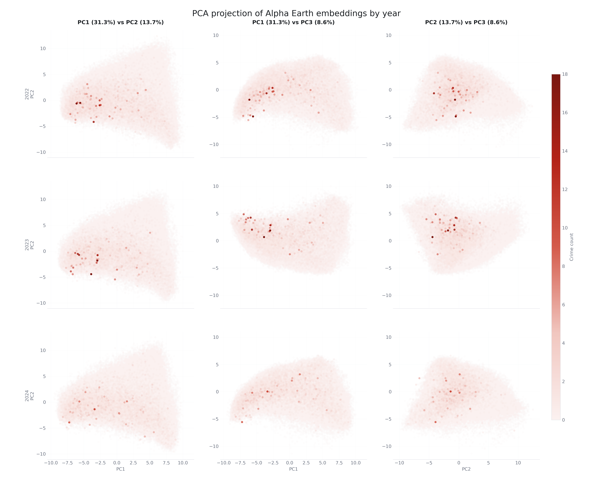

As we can see, by reducing the dimensionality we can see that the records or streets with high incidence show a grouping that could be characterized through clustering models or other unsupervised algorithms.

#### t-SNE

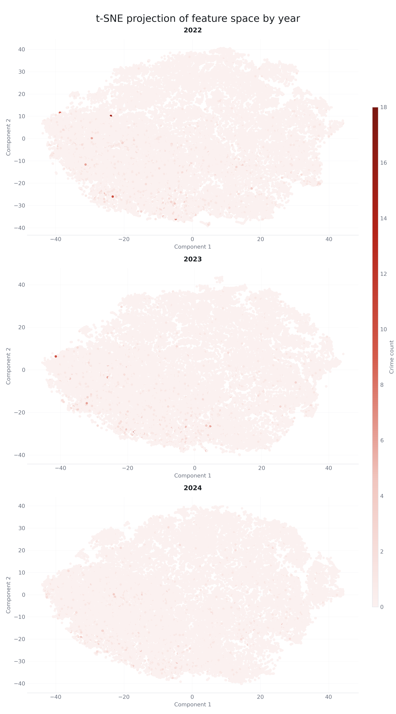

Here we also see some kind of grouping by incidence level, and since t-SNE is an algorithm that keeps both local and global similarity, we will check whether clustering can generate a characterization for crime hotspots.

#### SVD

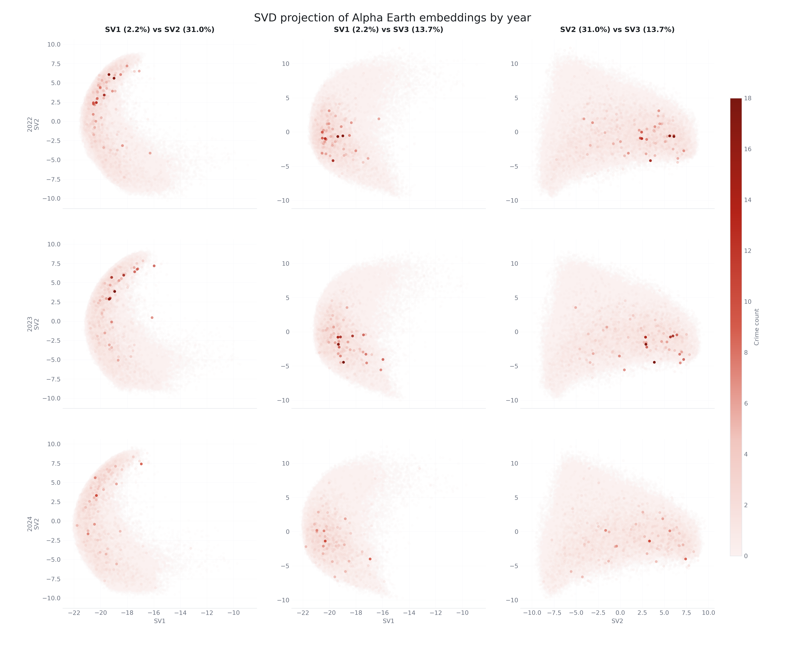

Here we can observe another powerful technique for matrix factorization called Singular Value Decomposition (SVD), which is a generalization of the eigenvector decomposition, sometimes used as a data compression (dimensionality reduction) technique consisting of geometric operations: rotation, scaling and rotation. We can observe the nature of the embeddings and the dispersion patterns for the crime occurrence values. Since, deep down, most large-scale PCA operations use a form of SVD, we continue using PCA as our main dimensionality reduction technique. However, deeper future research on this decomposition could be valuable.

### Manifold Learning

Also known as Non-linear Dimensionality Reduction techniques, these are further dimensionality reduction techniques where, in contrast, for example, with PCA, the reduction does not occur through a linear process but via kernel factorization and optimization techniques. Some of them are presented here to see whether any interesting pattern is revealed in a non-linear space with respect to the embedding values related to street-level crime incidence.

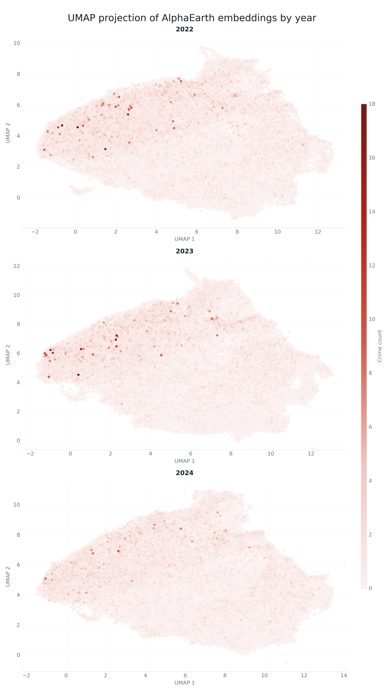

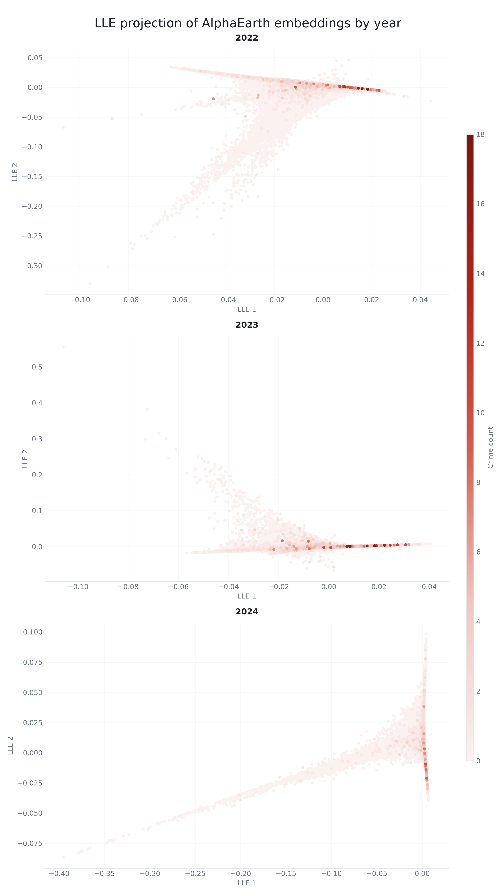

For the first UMAP model, a pattern can be observed in the upper section of the learned surface. In the LLE projection shown, it appears that most of the streets with high incidences are associated with features in the learned space that are located in the same collinear section.

This tells us that, although we are not making any inference, it appears that in the dimensionality reduction we find that streets with high incidences seem to be close in space, both in the original embedding features and in learned spaces. From here arises the possibility of experimenting with the following modeling strategies or architectures:

- Direct: K-means or direct grouping between vectors (risk of variance due to the curse of dimensionality). Particularly, K-means, as explained in this work, works well with high dimension by reducing the distance from the original dimension to a scalar difference by means of the cosine distance on the sphere (where the embeddings live).
- Dimensionality reduction + Grouping: dimension reduction allows keeping as much information as possible and having values in low, manageable dimensions; depending on the Dimensionality Reduction model, the computational cost could be restrictive. It is suggested to use k nearest neighbors or models such as DBSCAN as grouping, given the low cost at scale and the interpretability.

It is important to highlight that the statistical validity of the clustering lies in performing hypothesis tests to determine the distributional difference of the clusters; methods such as the Energy Distance and such tests will be omitted as they fall outside the scope of the present work and because of their computational cost at this data scale.

### Clustering

To perform clustering at such a large scale of points, and considering that the given data comes from a normalized interval $[-1,1]$, the most direct path to obtain a clustering from the embeddings is via k-Means clustering on the sphere (equivalent to cosine spherical K-means clustering, given that it is normalized).

The example for 2022, 2023 and 2024:

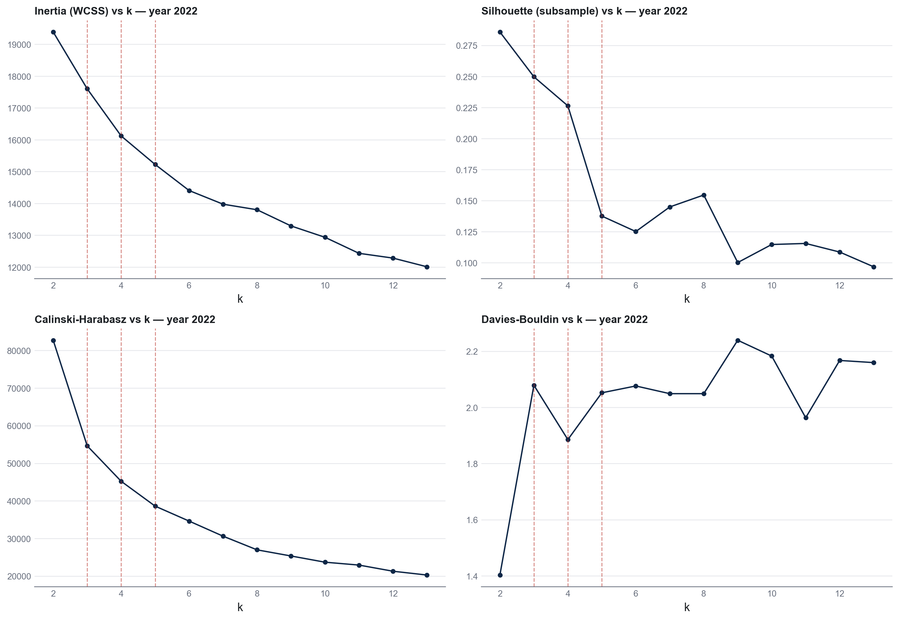

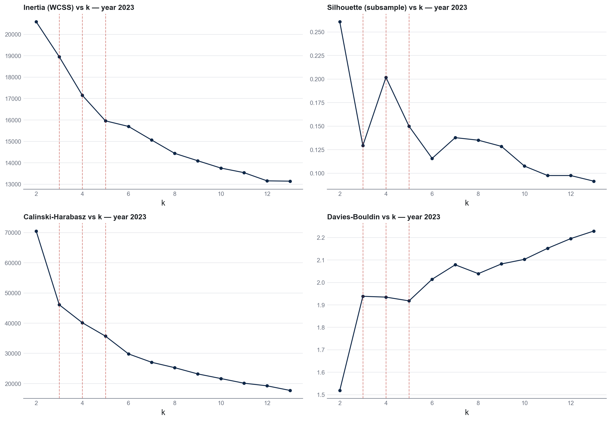

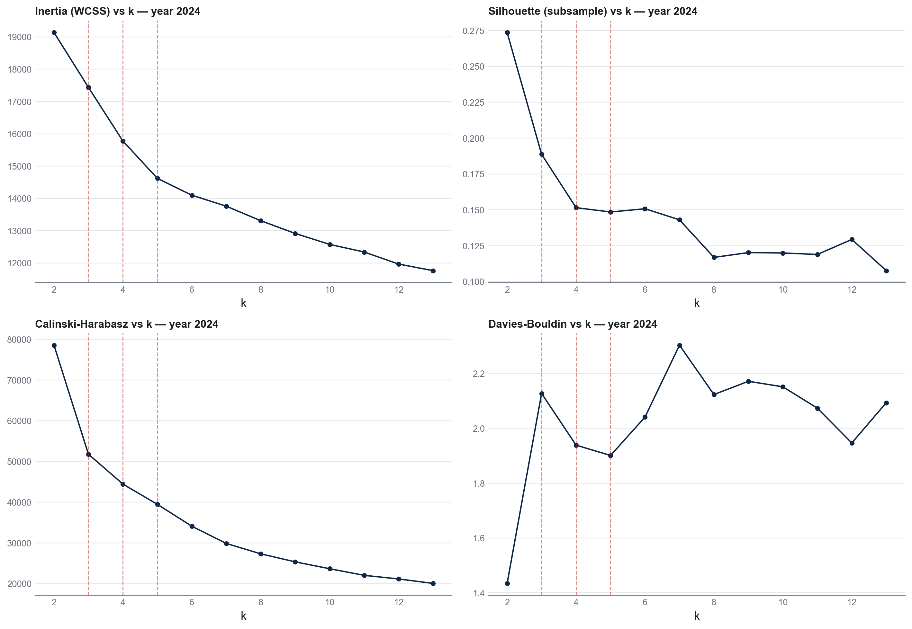

The corresponding generated clusters, when analyzed from the point of view of the number of incidents that occurred, show the following patterns:

For $k=3$:

| Year | Cluster | Count | Mean | Std | Min | 25% | 50% | 75% | Max |
|---|---|---:|---:|---:|---:|---:|---:|---:|---:|
| 2022 | 0 | 66387 | 0.075 | 0.371 | 0.0 | 0.0 | 0.0 | 0.0 | 17 |
| 2022 | 1 | 53920 | 0.042 | 0.240 | 0.0 | 0.0 | 0.0 | 0.0 | 9 |
| 2022 | 2 | 57730 | 0.058 | 0.285 | 0.0 | 0.0 | 0.0 | 0.0 | 8 |
| 2023 | 0 | 32241 | 0.023 | 0.183 | 0.0 | 0.0 | 0.0 | 0.0 | 8 |
| 2023 | 1 | 85420 | 0.059 | 0.336 | 0.0 | 0.0 | 0.0 | 0.0 | 18 |
| 2023 | 2 | 60376 | 0.050 | 0.272 | 0.0 | 0.0 | 0.0 | 0.0 | 10 |
| 2024 | 0 | 37131 | 0.020 | 0.155 | 0.0 | 0.0 | 0.0 | 0.0 | 4 |
| 2024 | 1 | 53567 | 0.049 | 0.258 | 0.0 | 0.0 | 0.0 | 0.0 | 8 |
| 2024 | 2 | 87339 | 0.054 | 0.276 | 0.0 | 0.0 | 0.0 | 0.0 | 10 |

For $k=4$:

| Year | Cluster | Count | Mean | Std | Min | 25% | 50% | 75% | Max |
|---|---|---:|---:|---:|---:|---:|---:|---:|---:|
| 2022 | 0 | 25209 | 0.050 | 0.268 | 0.0 | 0.0 | 0.0 | 0.0 | 5 |
| 2022 | 1 | 44891 | 0.044 | 0.244 | 0.0 | 0.0 | 0.0 | 0.0 | 9 |
| 2022 | 2 | 42985 | 0.057 | 0.285 | 0.0 | 0.0 | 0.0 | 0.0 | 9 |
| 2022 | 3 | 64952 | 0.076 | 0.372 | 0.0 | 0.0 | 0.0 | 0.0 | 17 |
| 2023 | 0 | 25190 | 0.017 | 0.158 | 0.0 | 0.0 | 0.0 | 0.0 | 8 |
| 2023 | 1 | 51453 | 0.062 | 0.365 | 0.0 | 0.0 | 0.0 | 0.0 | 18 |
| 2023 | 2 | 46583 | 0.046 | 0.252 | 0.0 | 0.0 | 0.0 | 0.0 | 8 |
| 2023 | 3 | 54811 | 0.055 | 0.294 | 0.0 | 0.0 | 0.0 | 0.0 | 14 |
| 2024 | 0 | 28203 | 0.017 | 0.145 | 0.0 | 0.0 | 0.0 | 0.0 | 4 |
| 2024 | 1 | 23812 | 0.046 | 0.246 | 0.0 | 0.0 | 0.0 | 0.0 | 6 |
| 2024 | 2 | 48059 | 0.045 | 0.245 | 0.0 | 0.0 | 0.0 | 0.0 | 8 |
| 2024 | 3 | 77963 | 0.055 | 0.282 | 0.0 | 0.0 | 0.0 | 0.0 | 10 |

For $k=5$:

| Year | Cluster | Count | Mean | Std | Min | 25% | 50% | 75% | Max |
|---|---|---:|---:|---:|---:|---:|---:|---:|---:|
| 2022 | 0 | 33371 | 0.075 | 0.357 | 0.0 | 0.0 | 0.0 | 0.0 | 13 |
| 2022 | 1 | 33149 | 0.053 | 0.260 | 0.0 | 0.0 | 0.0 | 0.0 | 7 |
| 2022 | 2 | 36797 | 0.051 | 0.274 | 0.0 | 0.0 | 0.0 | 0.0 | 9 |
| 2022 | 3 | 50823 | 0.074 | 0.360 | 0.0 | 0.0 | 0.0 | 0.0 | 17 |
| 2022 | 4 | 23897 | 0.028 | 0.214 | 0.0 | 0.0 | 0.0 | 0.0 | 9 |
| 2023 | 0 | 21153 | 0.016 | 0.152 | 0.0 | 0.0 | 0.0 | 0.0 | 8 |
| 2023 | 1 | 50525 | 0.062 | 0.362 | 0.0 | 0.0 | 0.0 | 0.0 | 18 |
| 2023 | 2 | 24662 | 0.053 | 0.281 | 0.0 | 0.0 | 0.0 | 0.0 | 10 |
| 2023 | 3 | 52336 | 0.056 | 0.297 | 0.0 | 0.0 | 0.0 | 0.0 | 14 |
| 2023 | 4 | 29361 | 0.038 | 0.226 | 0.0 | 0.0 | 0.0 | 0.0 | 8 |
| 2024 | 0 | 23246 | 0.015 | 0.136 | 0.0 | 0.0 | 0.0 | 0.0 | 4 |
| 2024 | 1 | 21313 | 0.049 | 0.253 | 0.0 | 0.0 | 0.0 | 0.0 | 6 |
| 2024 | 2 | 28324 | 0.039 | 0.221 | 0.0 | 0.0 | 0.0 | 0.0 | 6 |
| 2024 | 3 | 48963 | 0.049 | 0.260 | 0.0 | 0.0 | 0.0 | 0.0 | 8 |
| 2024 | 4 | 56191 | 0.056 | 0.286 | 0.0 | 0.0 | 0.0 | 0.0 | 10 |

As we can see, the clustering for $k=4$ shows a more consistent and interpretable behavior, so we will dig deeper into this model parameter for a subsequent analysis.

Not only that, but the four metrics considered show a better performance for $k=4$, showing either an inflection or a local optimum (a maximum for silhouette and Calinski-Harabasz, a minimum for Davies-Bouldin).

The mapping will be based on the maximum incidence number per cluster, classifying into the Low, Medium and High risk levels.

Here are the annual clusters generated for each year studied:

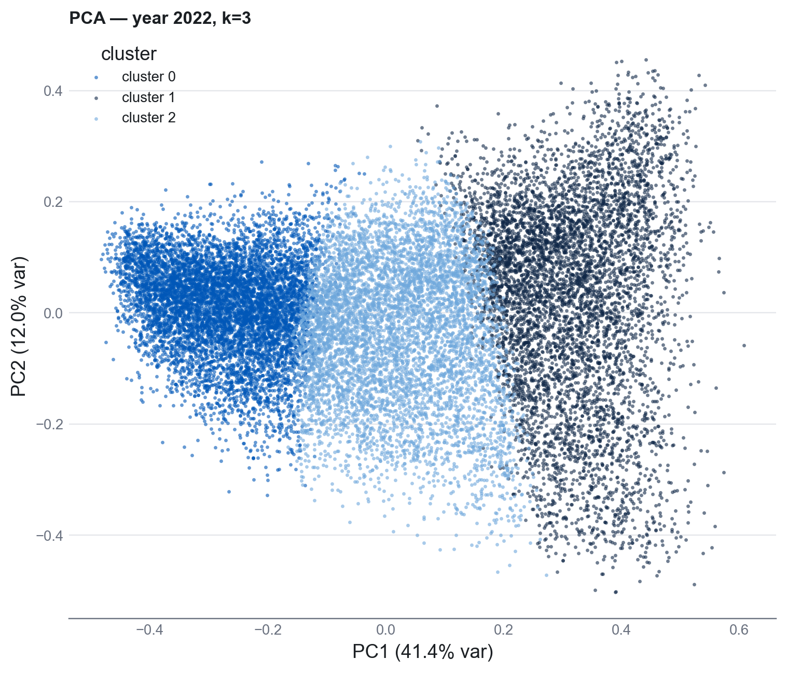

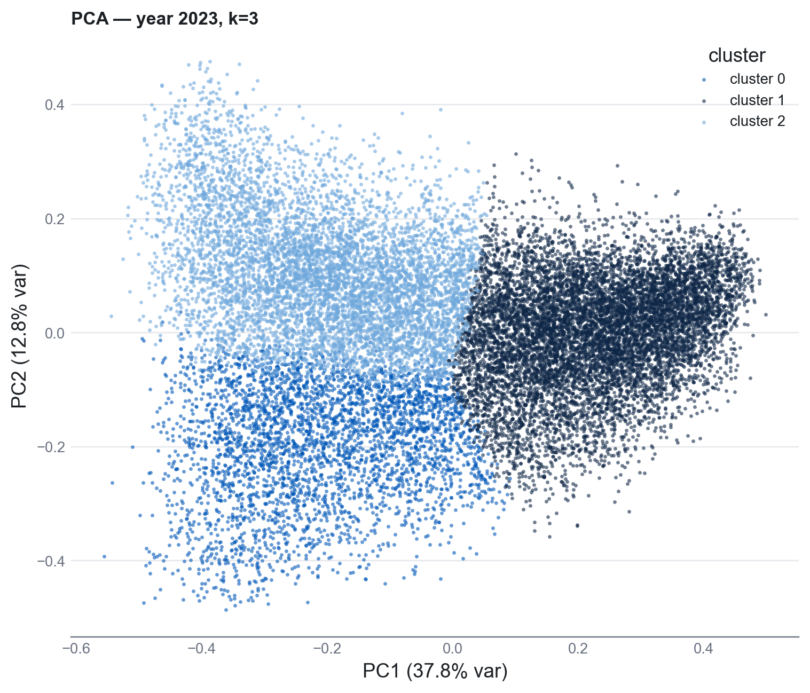

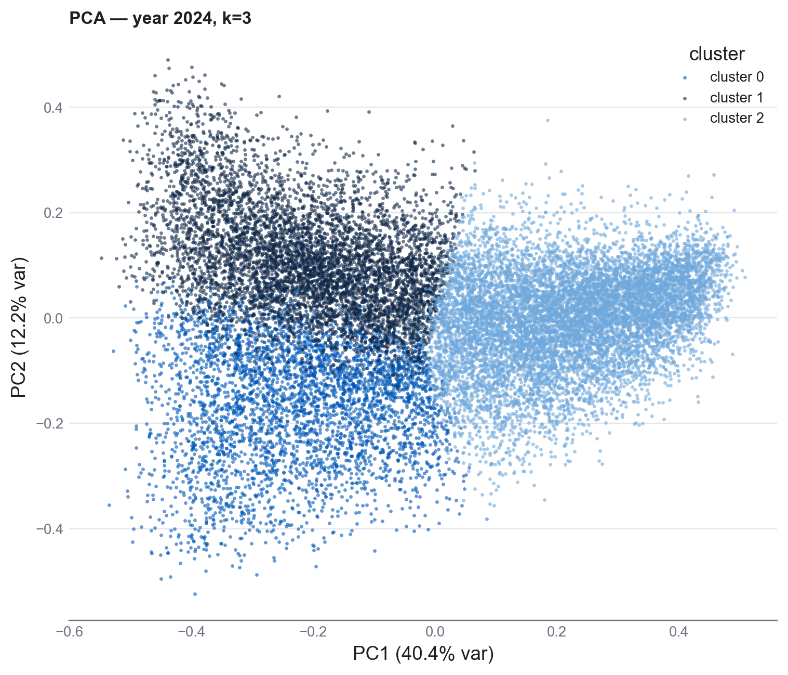

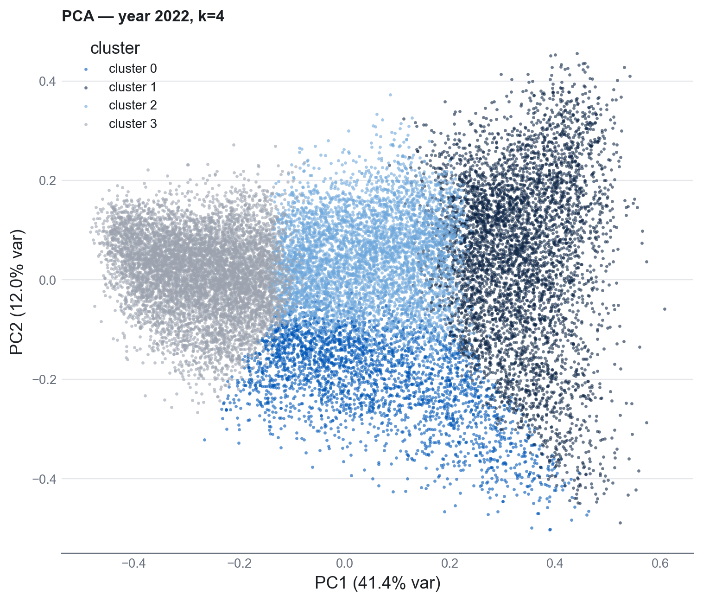

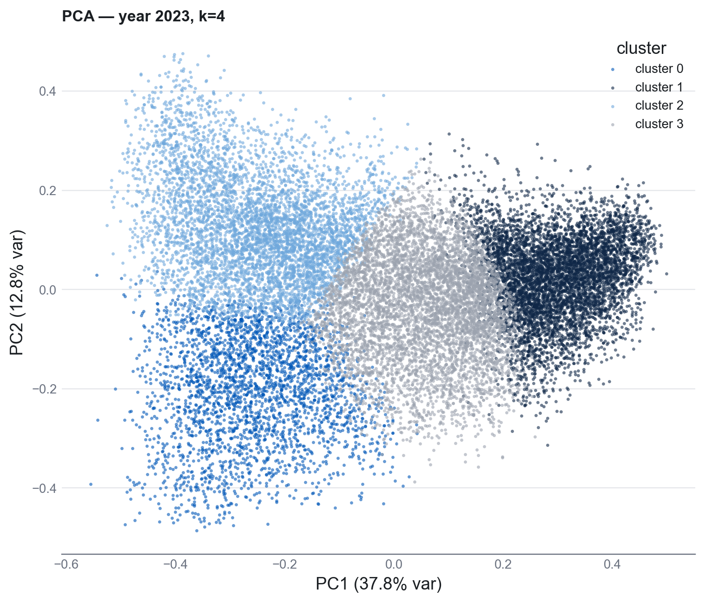

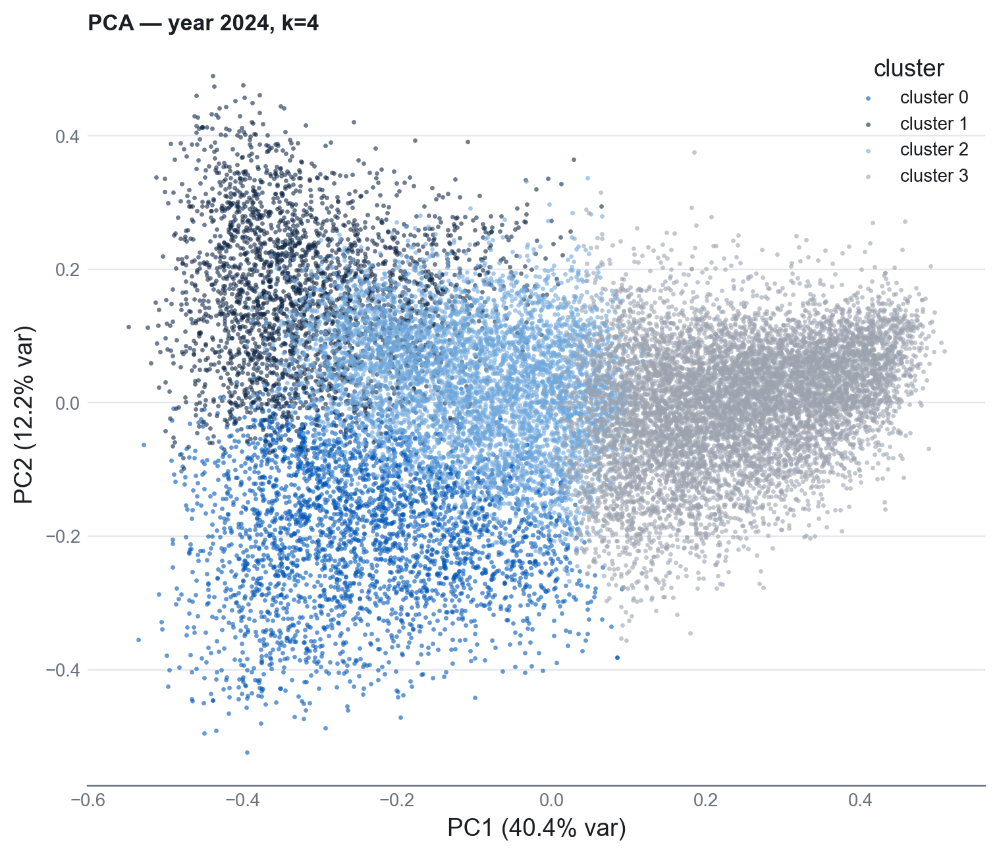

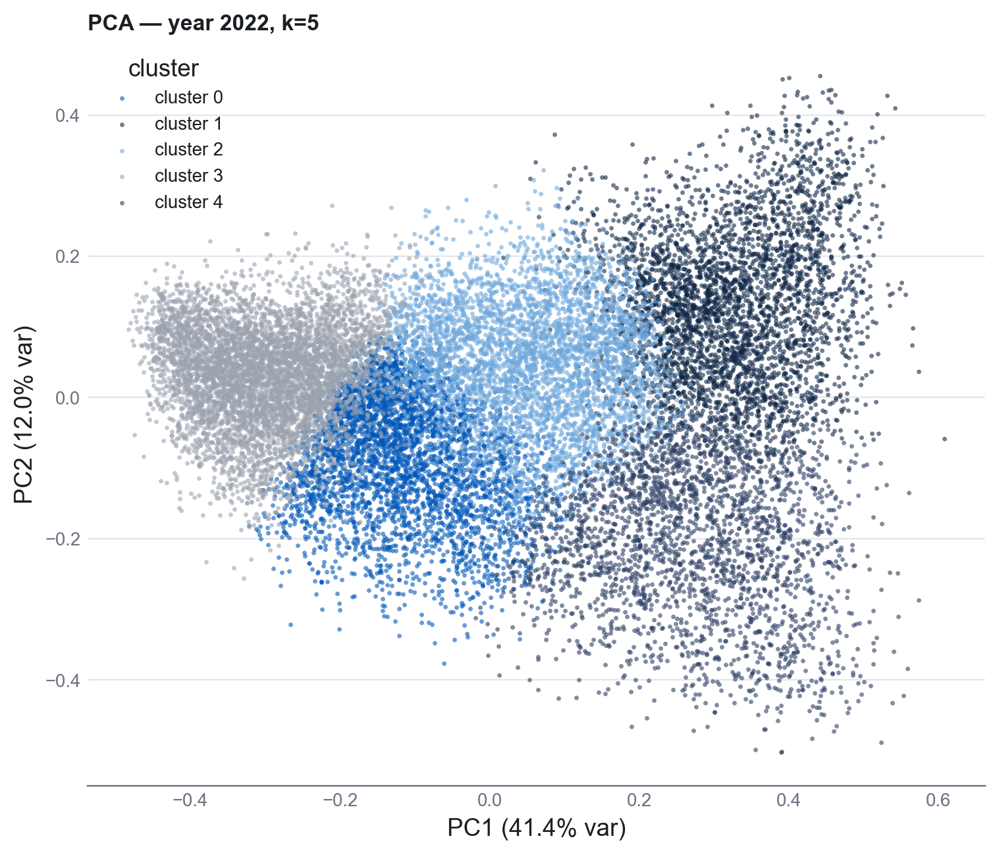

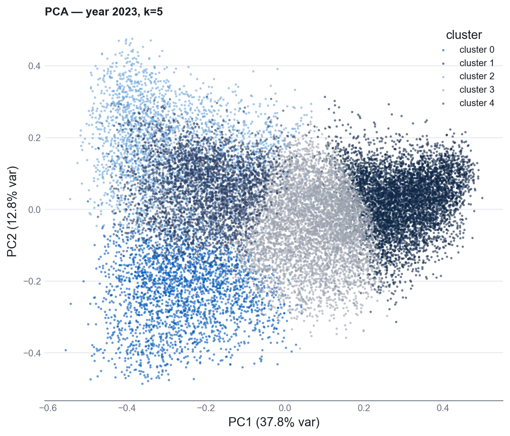

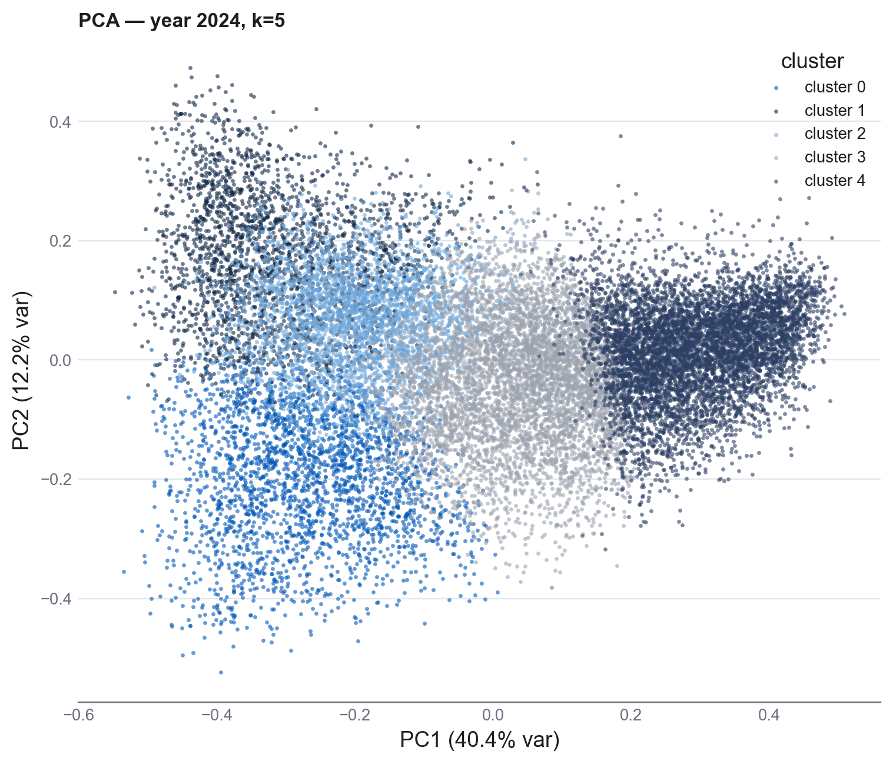

To interpret the results in order to clarify them for a stakeholder, for example, we would divide the clusters into the following 3 risk levels:

- High-risk streets: Those within the cluster with the highest maximum number of occurrences.
- Moderate: The two intermediate ones in order of maximum number of occurrences.
- Low-risk streets: Those within the cluster with the lowest maximum number of occurrences.

An appropriate final conclusion to confirm that the clustering is really identifying statistically different groups is to apply multivariate distribution tests to statistically validate the clustering.

**How is this even useful instead of simply classifying without clustering?**

That is because now that we grouped, we can identify streets with the same features as those with high reported incidence, even if they have no incidents, using the geographic structure to detect risk on streets even if they are under-reported.

Look at the following example over the municipalities of Coyoacán, Benito Juárez, Miguel Hidalgo and Álvaro Obregón, clustered for the years $2022, 2023, 2024$, based on the logic described above:


From the exploration of crime incidents performed both from qualitative research and from the EDA in [Chapter 3](03_crime_eda_eng.qmd), we can see that the clustering for Coyoacán and Álvaro Obregón is very similar to the incidence and security perception of some underdeveloped areas and of high-income, high-security zones. However, for Benito Juárez (BJ) the results seem to be more drastic than what the data says, and this can have two different explanations: one is under-reporting: maybe the model is really telling us where the incidents are occurring and these are not being properly reported. The other is that the model is actually capturing the *opportunistic bias*, that is, it has identified that connected, high-mobility pedestrian zones are prone to record mugging incidences, and so it classifies a large number of streets in BJ as a Risk level, due to the nature of the municipality itself as a mobility hub for tourist, commercial and experience zones.

## Applications: Getting Archetypes {#archetypes}

As has been mentioned before, the ideal of modeling crime incidents is not to predict where and in what quantity crime will occur, but to understand the features of the streets —and, in general, of the geometric object of interest— via the embedding features: the features of the streets that are prone to create incentives and opportunity for crime to occur.

Therefore, the idea is that, whether via supervised learning (Regression/Classification) or unsupervised learning (clustering), the streets can be grouped by risk level; this allows, again, not to predict in a literal sense, but to define the high-risk areas, and it opens the door to understanding, with the help of a field specialist, the use cases:

- Define security strategies in terms of prioritization or allocation of human capital.
- Preventive within-cluster comparison (future): Take high-risk streets and compare the unreported ones of that group; it could be used as surveillance zones where, if not addressed, the incidence could increase.
- Preventive within-cluster comparison (diagnostic): Take high-risk streets and compare the unreported ones of that group; in retrospect, it could lead us to find places where crime is being under-reported.
- Understand more particular street features with exclusive, high-quality government data: Infrastructure, security camera maintenance, impact of force deployment and causal effect.

Among many other use cases. This shows that, despite not being able to promise a prediction, both modeling approaches give us useful tools to generate valuable insights and actionables.

### Risk scoring

Both supervised and unsupervised learning are intermediate tools for our main application of street risk scoring, as an enabler for subsequent decision making, strategy and modeling.

**Regression-based risk**

Here we use regression models trained for the count process, not to simply predict the incidence level on each street but, particularly when choosing the NN head, we focus on obtaining a probability score per street that allows us to classify each entity into a customized risk level.

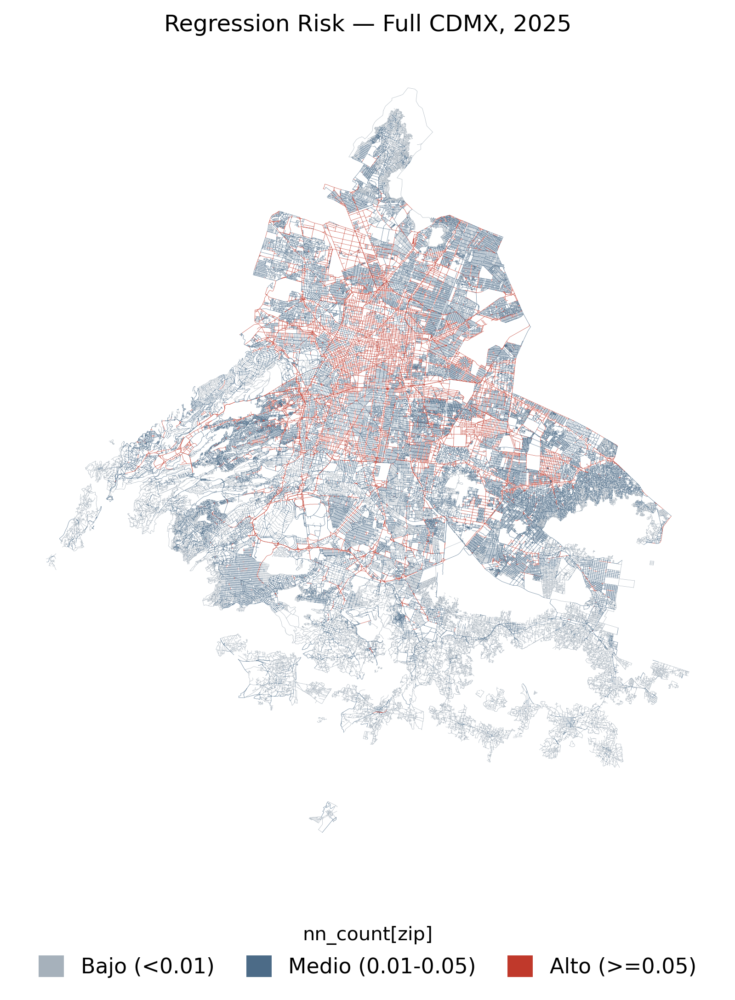

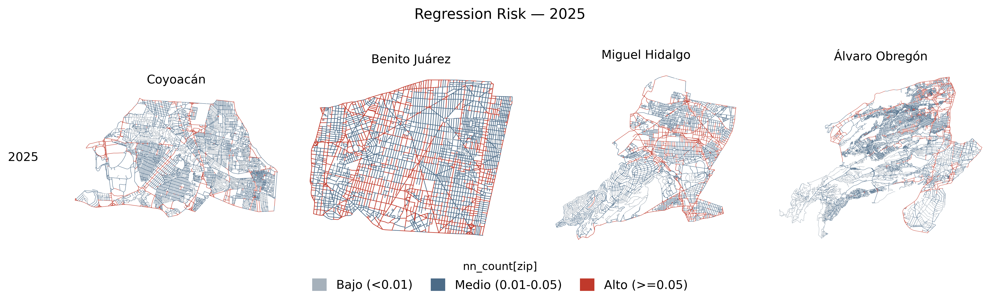

**Classification-based risk**

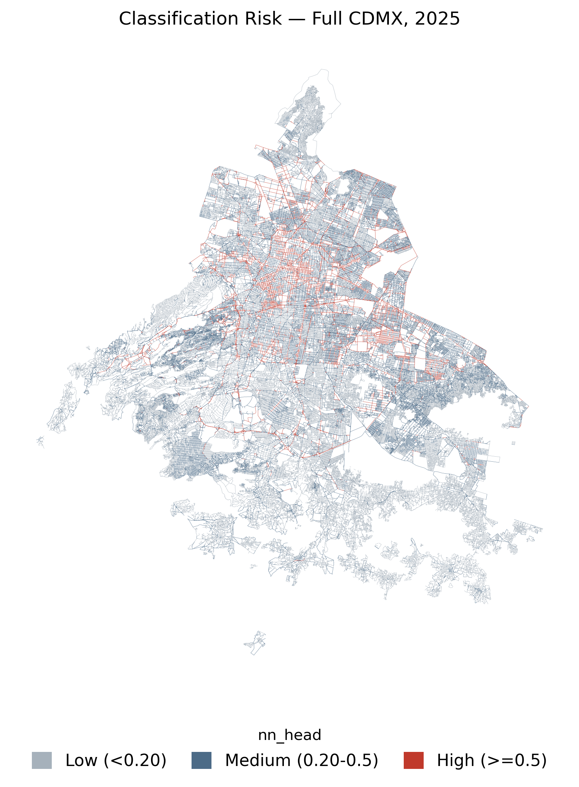

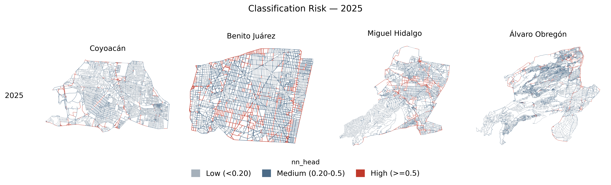

### Scoring by clustering

Going back to clustering, we can select some of the high-level streets based on the descriptive statistics of the incidents, and start a deeper study on what is really occurring on those streets, and understand whether it is really a valid signal or just a false positive.


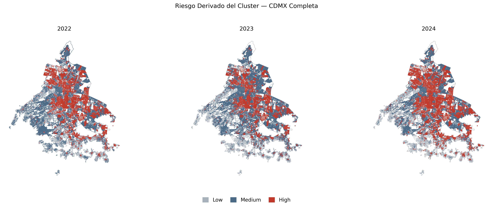

**Algorithm 1:** Assignment of risk levels through clustering

**Input:** Data matrix `X`

**Output:** Risk label `ℓ(C_j)` for `j = 1, …, k*`

```
1:  Fit a clustering model on X; select the optimal number of clusters k*
2:  for j = 1 to k* do
3:      Compute descriptive statistics of cluster C_j
4:      M_j ← max{ incidences within C_j }
5:  end for
6:  j⁻ ← argmin_j M_j          ▷ cluster with lowest statistic of interest
7:  j⁺ ← argmax_j M_j          ▷ cluster with highest statistic of interest
8:  ℓ(C_{j⁻}) ← "low risk"
9:  ℓ(C_{j⁺}) ← "high risk"
10: for all j ∉ {j⁻, j⁺} do
11:     ℓ(C_j) ← "moderate risk"
12: end for
13: return ℓ
```

**Note on well-posedness**

Steps 4–5 implicitly assume that `argmin_j M_j` and `argmax_j M_j` are each unique. If `M_j` presents ties at the extremes (plausible if the incidences are integer values and the clusters are small), `j⁻` or `j⁺` become multivalued and the labeling is not fully specified. A tie-breaking rule is recommended (e.g. lowest cluster index, or largest `|C_j|`) so that the procedure is deterministic and reproducible.

Some particular modeling and data design decisions that matter:

- Most of the risk intervals are defined deterministically; it is important to do this jointly with a field expert to calibrate the thresholds.
- The data visualizations have been designed to be neutral in terms of communicating the message of the data, but it is always open to redefinitions and improvements; be careful about how it looks.
- The NN architecture, hyperparameters and other training decisions can impact the final results and interpretations.
- Zero-inflated count models and data make every model, no matter how optimized, a poor predictor of future counts at the segment (street) level.

### Usability and Mock-ups for the data product

As a result, it is proposed to deepen the study of the results obtained from the risk index defined above and, jointly with experts in the area, to evaluate the best model in terms of structural representation of public security risk and, subsequently, to bring the applications proposed below into production.

#### Crime event monitor

This is a configuration-based Streamlit panel for exploratory data analysis of crime incidents in Mexico City. Data loading, preparation and aggregation are delegated to the source code and wrapped in Streamlit caches, so that the most expensive steps (loading, splitting streets at intersections, spatial joins) run only once. A sidebar shows filters for the year range, crime category, crime type and municipality, and indicates how many incidents have been selected and how many are geolocated.

The following figure shows the start window of the application deployed with the help of the code *src/eda/app.py* (*src/eda/app_esp.py*, in Spanish).

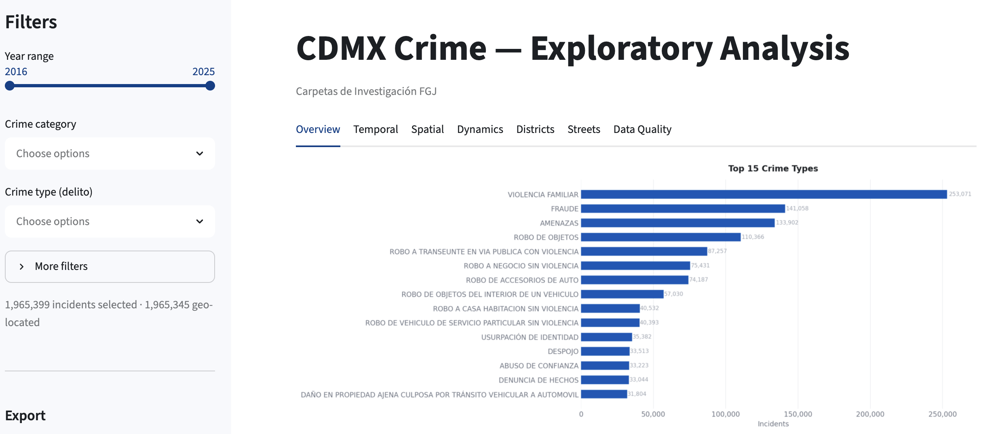

#### Predictive flagging of risk zones

This is a lightweight, reduced-data-volume interactive presentation of the modeling results. It contains the actual LineString geometry of each street, its name, the predictions, the risk level, the k-means cluster and the PCA coordinates. The design presents two linked side-by-side panels: on the left, a CDMX street map over a Carto Positron basemap in which each street is represented with the color corresponding to its regression risk level (housing risk palette); on the right, a scatter plot in the PCA feature space with points colored according to their spherical k-means k=4 cluster.

The two views are linked to each other through the CVEGEO identifier of each street: when clicking on a street in either panel, the selection is saved in the session state and the application is re-run. It is expected that, if accepted by the stakeholders, the functionalities will grow, allowing their use for the use cases described above as a basis for decision making related to public security based on enriched data.

The following figure shows the start window of the application deployed with the help of the code *src/showcase/app.py* (*src/showcase/app_esp.py*, in Spanish).

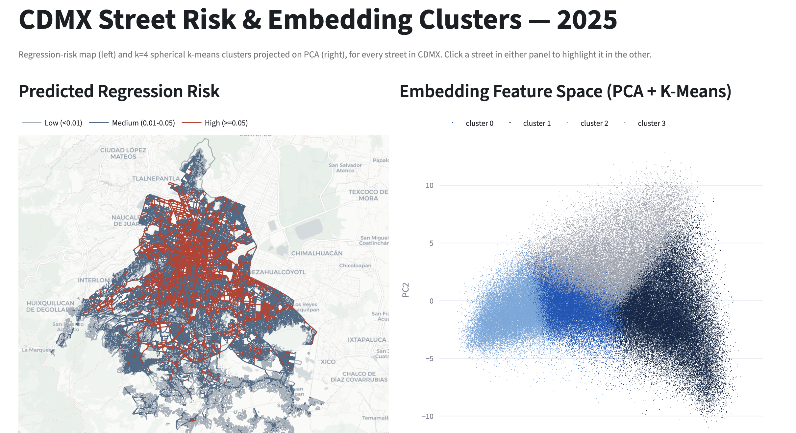

## Resources

[Google DeepMind Official Alpha Earth Site](https://deepmind.google/blog/alphaearth-foundations-helps-map-our-planet-in-unprecedented-detail/)

[scikit-learn: Clustering, PCA, t-SNE and manifold learning](https://scikit-learn.org/stable/modules/clustering.html)

[XGBoost Documentation](https://xgboost.readthedocs.io/)

[Optuna: Hyperparameter Optimization Framework](https://optuna.org/)

[Mexico INEGI's Marco Geoestadístico](https://www.inegi.org.mx/app/biblioteca/ficha.html?upc=794551163061)
