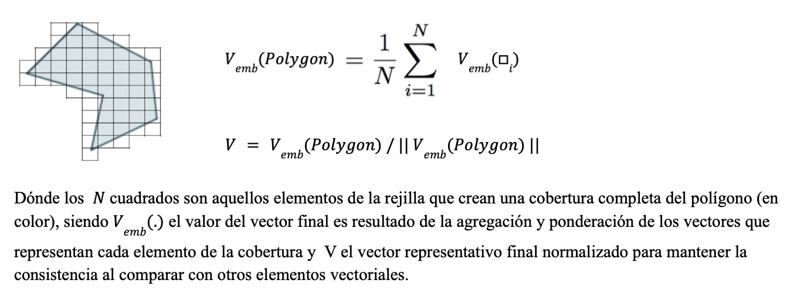

Este apéndice reúne, en un solo lugar, los conceptos, formatos y operaciones geoespaciales realmente usados a lo largo de este repositorio. No es una referencia general de SIG, solo un mapa rápido de vuelta a las ideas y rutas de código de las que depende este proyecto, para quien necesite un repaso mientras lee los capítulos anteriores.

## Estructuras de Datos Geoespaciales {#geospatial-data-structures}

### Datos vectoriales: puntos, líneas y polígonos

Los datos vectoriales representan objetos geométricos discretos con coordenadas exactas: **Point** (Punto), **LineString** (y **MultiLineString**), y **Polygon** (y **MultiPolygon**). La mayor parte de lo que este repositorio maneja son datos vectoriales:

- Los incidentes delictivos son **Puntos**, construidos a partir de columnas crudas de lat/lon con `gpd.points_from_xy`.
- Las calles son **LineStrings** (`09e.shp`), después divididas de esquina a esquina en segmentos más cortos.
- Los municipios, AGEBs y el límite de la CDMX son **Polígonos** (`09m.shp`, `09a.shp`, `09ent.shp`).

### Datos ráster (cuadrícula de píxeles)

Los datos ráster representan un fenómeno como una cuadrícula regular de celdas (píxeles), cada una con uno o más valores de banda, en lugar de objetos geométricos discretos. Los embeddings de AlphaEarth se distribuyen nativamente de esta forma —un vector de 64 valores por píxel de 10m, como GeoTIFFs multibanda. `src/etl/process_embeddings.py` es lo que convierte ese ráster en las filas tabulares (lon, lat, A00..A63) con las que trabaja el resto del pipeline.


### Formatos de archivo usados en este repositorio

- **Shapefile** (`.shp`, más sus archivos compañeros `.shx`/`.dbf`/`.prj`) — el clásico formato vectorial multi-archivo; usado para cada capa de división política de INEGI bajo `data/spatial/pd/`.
- **GeoParquet** — archivos parquet con una columna de geometría, leídos y escritos con `geopandas.read_parquet` / `to_parquet`; usado para los conjuntos de entrenamiento y las tablas procesadas de píxeles de AlphaEarth, ya que mantiene la geometría, los embeddings y los atributos en un solo archivo columnar, apto para particionar.
- **GeoJSON** — un formato vectorial de texto/JSON; la salida del paso de agregación de punto a geometría (`src/etl/assign_point_to_geometry.py`, `driver="GeoJSON"`).
- **CSV/parquet plano con columnas lat/lon** — no es realmente un formato de geometría, solo dos columnas de punto flotante que se promueven a geometrías de Punto bajo demanda con `gpd.points_from_xy` cada vez que realmente se necesita una operación espacial.

### H3: cuadrícula global discreta

H3 divide el globo en celdas hexagonales a múltiples resoluciones, cada una con un id de celda único —una alternativa discreta a una cuadrícula cruda de lat/lon. `h3_heatmap` de `src/eda/core.py` lo usa (`h3.latlng_to_cell`, `h3.cell_to_latlng`) para agrupar puntos delictivos en celdas hexagonales para un mapa de calor de densidad, que se lee mejor que una nube de puntos cruda una vez que la cantidad de puntos crece.


## Sistemas de Referencia de Coordenadas (CRS) {#crs}

**Def (CRS)**: un Sistema de Referencia de Coordenadas define cómo las coordenadas numéricas de una geometría se mapean a posiciones reales sobre la Tierra —su datum, su proyección (si tiene alguna) y sus unidades.


- **CRS Geográfico** (p. ej. `EPSG:4326` / WGS84) — las coordenadas son (longitud, latitud) en grados. Conveniente para almacenamiento y para datos globales, pero un grado no es una unidad constante de distancia (un grado de longitud se encoge hacia los polos), así que es el CRS incorrecto para cálculos de distancia, área o buffer.
- **CRS Proyectado** (p. ej. `EPSG:6372`, `EPSG:3857`) — las coordenadas están en una unidad plana, usualmente metros, obtenida al proyectar la Tierra curva sobre una superficie plana. Correcto para trabajo basado en distancias, a costa de cierta distorsión que crece con el área cubierta.

CRSs realmente usados en este repositorio:

- **`EPSG:4326`** — el CRS nativo/de almacenamiento para los puntos de incidentes delictivos, los embeddings de AlphaEarth, y la mayoría de los shapefiles crudos.
- **`EPSG:6372`** (Mexico ITRF2008 / LCC, metros) — usado para reproyectar los puntos delictivos antes del clustering DBSCAN (`src/eda/core.py`), ya que el `eps` de DBSCAN es una distancia real y solo tiene sentido en metros, no en grados.
- **`EPSG:3857`** (Web Mercator) — usado para reproyectar la red de calles y el límite de la CDMX antes de dibujar un basemap de CartoDB con `contextily` (`src/visuals/flash_highlight_showcase.py`), ya que los tiles web siempre se sirven en esta proyección.

Reproyectar un GeoDataFrame es una sola llamada:

```python
gdf_3857 = gdf.to_crs(3857)
```

Una fuente recurrente de errores en este tipo de proyecto es combinar dos capas que están en CRSs *distintos*, o medir distancia/área en uno geográfico —siempre revisa `gdf.crs` antes de unir, hacer buffer o graficar un basemap bajo dos capas.

## Operaciones Espaciales Fundamentales {#spatial-operations}

### Puntos a partir de coordenadas

```python
gpd.GeoDataFrame(df, geometry=gpd.points_from_xy(df["lon"], df["lat"]), crs="EPSG:4326")
```

Usado en todos lados donde un CSV o parquet solo trae columnas lat/lon en lugar de una columna de geometría real (`src/etl/assign_point_to_geometry.py`, `src/etl/get_training_sets.py`).

### Unión espacial (`sjoin`) y unión por vecino más cercano (`sjoin_nearest`)

**Def**: una unión espacial adjunta atributos de una capa a otra con base en un predicado espacial (intersecta, contiene, más cercano, ...) en lugar de una columna clave compartida.

- `sjoin(..., predicate="intersects")` — asigna los puntos delictivos al polígono de AGEB dentro del cual caen (`agg_points_to_geometry`, rama de POLYGON).
- `sjoin_nearest(...)` — asigna cada punto delictivo a su segmento de calle *más cercano* en lugar de requerir que caiga exactamente sobre la línea (`agg_points_to_geometry`, rama de LINESTRING); también se usa para adjuntar los píxeles de AlphaEarth y los centroides socio-demográficos de MZA a las geometrías de calles.

### Buffering

`.buffer(distance)` expande una geometría hacia afuera por `distance` (en las unidades del propio CRS de la capa), convirtiendo una línea o un punto en un polígono. Se usa para convertir un LINESTRING de calle en un polígono tipo corredor, de modo que pueda tratarse como un área para la agregación de cobertura de píxeles (`src/etl/assign_point_to_geometry.py`).


### Centroide

`.centroid` devuelve el punto central de una geometría. Se usa para convertir los polígonos de MZA (manzana) en puntos representativos únicos antes de unirlos a las calles (`src/etl/get_socioecon_data.py`), y para colocar un único marcador de un segmento de calle en las demostraciones animadas (`src/visuals/flash_highlight_showcase.py`).


### División de geometrías

- **En intersecciones** — `split_streets_at_intersections` de `src/utils/geom.py` recorre cada línea de calle, usa un índice espacial para encontrar líneas candidatas cercanas, calcula sus puntos de intersección exactos, y corta la línea en cada uno de ellos con `shapely.ops.split`. Así es como la red de calles cruda se convierte en los segmentos esquina a esquina usados como la unidad espacial a lo largo de todo el pipeline de modelado de crimen.
- **Por longitud** — `split_gdf_by_length` usa `shapely.ops.substring` para cortar cualquier línea más larga que un umbral en piezas acotadas.

### Índice espacial (`.sindex`)

Un índice R-tree sobre los rectángulos delimitadores (bounding boxes) de una capa, de modo que "¿qué geometrías están cerca de esta?" se resuelve en aproximadamente $O(\log n)$ en lugar de comparar contra cada otra geometría una por una. Esto es lo que mantiene tratables a `split_streets_at_intersections` y a las búsquedas de calle más cercana a escala de la CDMX (cientos de miles de segmentos).

### Filtrado por caja delimitadora (bounding box)

Un prefiltro barato antes de una operación más costosa: conservar solo las filas cuyas coordenadas caen dentro de un rectángulo —ya sea directamente, `df["lat"].between(lat_lo, lat_hi) & df["lon"].between(lon_lo, lon_hi)` (`geo_split` de `src/eda/core.py`), o con el propio indexador `.cx[xmin:xmax, ymin:ymax]` de geopandas.

### Agregación por geometría

Unión espacial, luego `groupby`, luego fusionar los polígonos de vuelta —el patrón detrás de cada tabla de "conteo de crímenes por distrito/calle/año" en este repositorio (`cvegeo_aggregate`, `street_aggregate` en `src/eda/core.py`).

## Agregación de Ráster a Vector (Cobertura de Píxeles) {#raster-to-vector}

Esta es la técnica geoespacial central de todo el proyecto: convertir un *ráster* (la cuadrícula de píxeles de AlphaEarth) en un único vector para una geometría *vectorial* (una calle, un polígono).



La receta es la misma sin importar si la geometría objetivo es un polígono o una línea (`src/etl/assign_point_to_geometry.py`, `src/etl/get_training_sets.py`):

1. Encontrar cada píxel (su centro, tratado como un punto) que toque la geometría objetivo.
2. Promediar los vectores de embedding de 64 dimensiones de esa cobertura.
3. Normalizar en L2 el vector promediado, de modo que el agregado quede de vuelta sobre la esfera unitaria ($S^{63}$) sobre la que se definen nativamente los embeddings de AlphaEarth —el promedio de vectores unitarios no es en sí mismo un vector unitario.

```python
normalize(df[feat_cols], norm="l2", axis=1)
```

### Streaming de ráster de gran tamaño

Los GeoTIFFs crudos de AlphaEarth son demasiado grandes para cargarse completos en memoria. `tif_to_parquet_partition` de `src/etl/process_embeddings.py` los lee en ventanas deslizantes de tamaño fijo (`rasterio.windows.Window`), enmascara los píxeles `nodata`, recupera la verdadera (lon, lat) de cada píxel con `rasterio.transform.xy`, y añade cada ventana como un chunk a un conjunto de datos parquet particionado —convirtiendo un ráster arbitrariamente grande a forma tabular en memoria acotada.

## Almacenamiento Geoespacial-Tabular a Gran Escala: Particionamiento Hive

Los embeddings procesados (decenas de millones de filas, a nivel de toda la ciudad) se almacenan como un conjunto de datos parquet particionado al estilo Hive —una subcarpeta por cada combinación `year=`/`CVE_MUN=`— de modo que el código pueda leer, o muestrear, solo las particiones que realmente necesita:

```python
dataset = pyarrow.dataset.dataset(path, format="parquet", partitioning="hive")
dataset.count_rows()                # metadata only, no data read
fragment.to_table(columns=[...])    # one partition at a time
```

`src/visuals/embedding_structure_showcase.py` usa exactamente esto para dibujar una muestra aleatoria y representativa de toda la ciudad sin nunca mantener en memoria el conjunto de datos completo de ~15.9M de filas a la vez.

## Clustering Espacial y Densidad

### DBSCAN

**Def**: DBSCAN es un algoritmo de clustering basado en densidad —un punto con al menos `min_samples` vecinos dentro de un radio `eps` ancla un clúster; todo lo demás se etiqueta como ruido. Debido a que `eps` es una distancia real, DBSCAN tiene que correr sobre un CRS *proyectado* (`EPSG:6372` aquí), nunca sobre grados crudos de lat/lon (`gif_dbscan_by_year` de `src/eda/core.py`).

### Envolvente cóncava / convexa (Concave / convex hull)

Se usa para delinear la forma de un clúster una vez que DBSCAN ha asignado las etiquetas: `shapely.concave_hull`, recayendo en el `.convex_hull` simple para clústeres muy pequeños o donde `concave_hull` no está disponible.

### Estimación de Densidad por Kernel (KDE)

Una superficie de densidad suavizada sobre las coordenadas de los puntos (`seaborn.kdeplot`), usada como una alternativa más ligera al clustering cuando el objetivo es solo ver *dónde* se concentran los incidentes, no asignar a cada punto una etiqueta discreta.

### K-means esférico

No es una operación espacial en el sentido estricto de coordenadas —agrupa vectores de embedding, no puntos (lat, lon)— pero comparte la lógica de esfera unitaria del paso de agregación de píxeles: las características se normalizan en L2 primero, de modo que la distancia Euclidiana entre los centroides de los clústeres se convierte en una función monótona de la similitud coseno. Ver `src/unsupervised/clustering_kmeans.py`.

## Basemaps

Para un mapa estático que necesita contexto visual del mundo real (calles, vecindarios, etiquetas) en lugar de solo contornos desnudos, `contextily.add_basemap` obtiene tiles de CartoDB/OpenStreetMap y los dibuja detrás de las capas vectoriales —pero solo una vez que todo está en Web Mercator (`src/visuals/flash_highlight_showcase.py`):

```python
gdf_3857 = gdf.to_crs(3857)
gdf_3857.plot(ax=ax)
contextily.add_basemap(ax, source=contextily.providers.CartoDB.Positron, crs=gdf_3857.crs)
```

## Mapas Coropléticos

**Def**: un mapa coroplético rellena cada polígono o línea con un color con base en un valor de atributo, `gdf.plot(column="y_cnt", cmap=..., vmin=..., vmax=...)`, en lugar de graficar puntos crudos. Se usa a lo largo de este repositorio para mapas de conteo de incidentes, mapas de niveles de riesgo y mapas de clústeres —siempre emparejado con una escala de color fija (`vmin`/`vmax`, o un `BoundaryNorm` para niveles discretos), de modo que los paneles se mantengan comparables entre cuadros y años.

## Recursos

[GeoPandas Documentation](https://geopandas.org/)

[Shapely Documentation](https://shapely.readthedocs.io/)

[PyProj / EPSG.io](https://epsg.io/)

[H3: Uber's Hexagonal Hierarchical Spatial Index](https://h3geo.org/)

[Rasterio Documentation](https://rasterio.readthedocs.io/)

[PyArrow Datasets](https://arrow.apache.org/docs/python/dataset.html)

[contextily Documentation](https://contextily.readthedocs.io/)

[Mexico INEGI's Marco Geoestadístico](https://www.inegi.org.mx/app/biblioteca/ficha.html?upc=794551163061)
