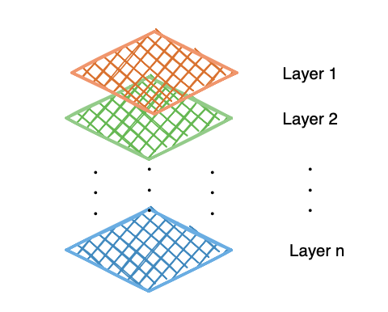
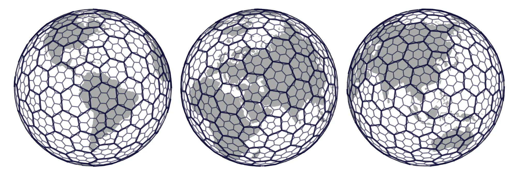
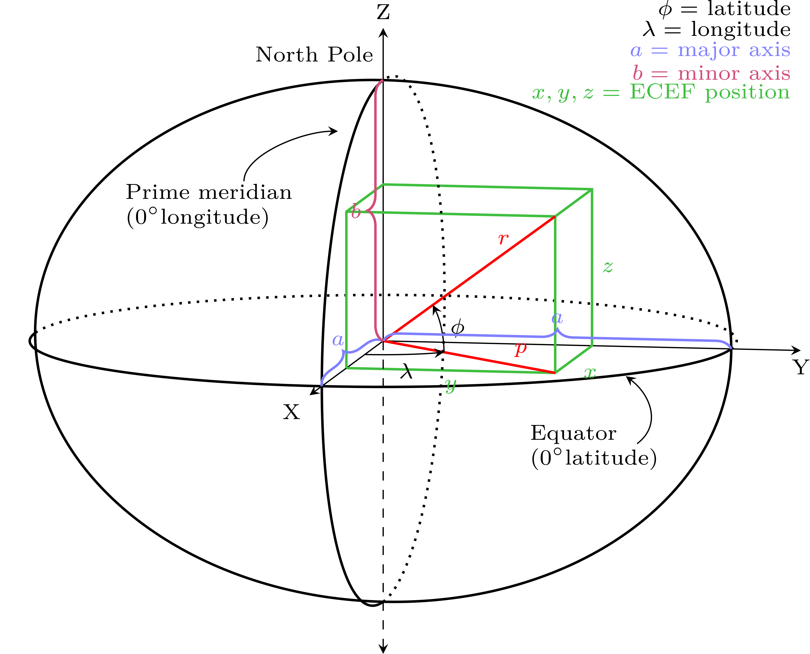
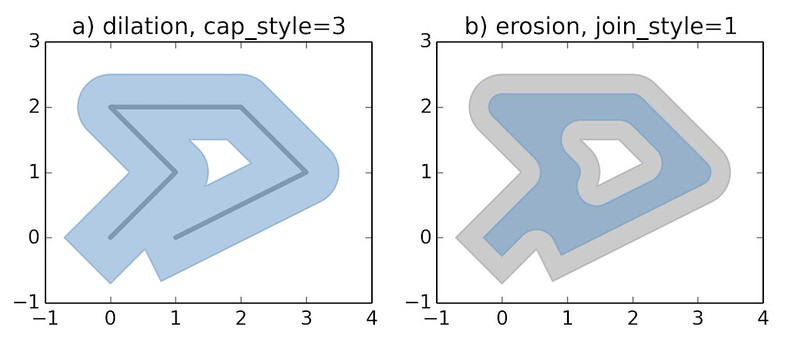
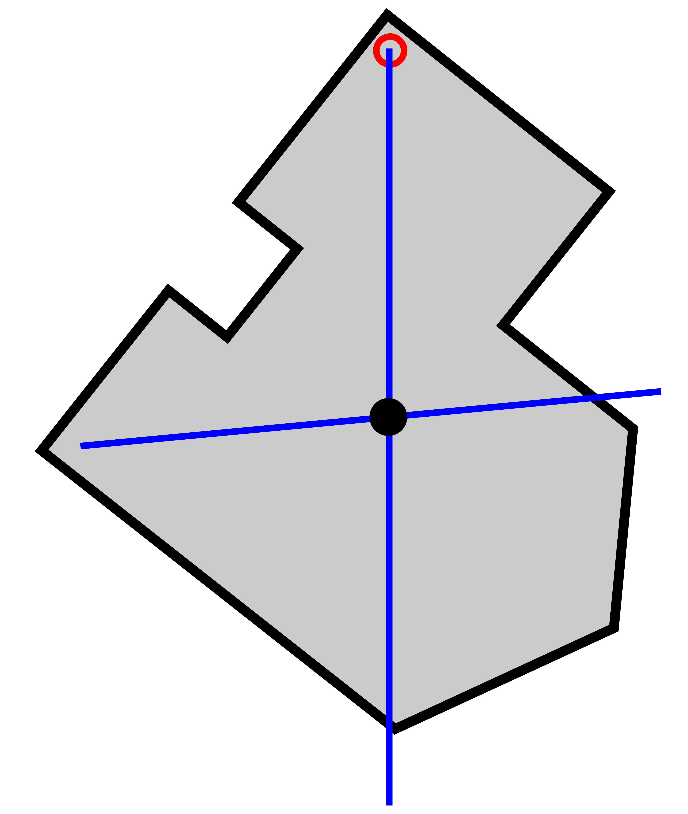

This appendix gathers, in a single place, the geospatial concepts, formats and operations actually used throughout this repository. It is not a general GIS reference, just a quick map back to the ideas and code paths this project depends on, for anyone who needs a refresher while reading the previous chapters.

## Geospatial Data Structures {#geospatial-data-structures}

### Vector data: points, lines and polygons

Vector data represents discrete geometric objects with exact coordinates: **Point**, **LineString** (and **MultiLineString**), and **Polygon** (and **MultiPolygon**). Most of what this repository handles is vector data:

- Crime incidents are **Points**, built from raw lat/lon columns with `gpd.points_from_xy`.
- Streets are **LineStrings** (`09e.shp`), later split corner to corner into shorter segments.
- Municipalities, AGEBs and the CDMX boundary are **Polygons** (`09m.shp`, `09a.shp`, `09ent.shp`).

### Raster data (pixel grid)

Raster data represents a phenomenon as a regular grid of cells (pixels), each with one or more band values, instead of discrete geometric objects. AlphaEarth embeddings are natively distributed in this form —a vector of 64 values per 10m pixel, as multiband GeoTIFFs. `src/etl/process_embeddings.py` is what converts that raster into the tabular rows (lon, lat, A00..A63) the rest of the pipeline works with.



### File formats used in this repository

- **Shapefile** (`.shp`, plus its companion files `.shx`/`.dbf`/`.prj`) — the classic multi-file vector format; used for each INEGI political division layer under `data/spatial/pd/`.
- **GeoParquet** — parquet files with a geometry column, read and written with `geopandas.read_parquet` / `to_parquet`; used for the training sets and the processed AlphaEarth pixel tables, since it keeps geometry, embeddings and attributes in a single columnar file, suitable for partitioning.
- **GeoJSON** — a text/JSON vector format; the output of the point-to-geometry aggregation step (`src/etl/assign_point_to_geometry.py`, `driver="GeoJSON"`).
- **Flat CSV/parquet with lat/lon columns** — not really a geometry format, just two floating-point columns promoted to Point geometries on demand with `gpd.points_from_xy` whenever a spatial operation is actually needed.

### H3: global discrete grid

H3 divides the globe into hexagonal cells at multiple resolutions, each with a unique cell id —a discrete alternative to a raw lat/lon grid. `h3_heatmap` from `src/eda/core.py` uses it (`h3.latlng_to_cell`, `h3.cell_to_latlng`) to group crime points into hexagonal cells for a density heatmap, which reads better than a raw point cloud once the number of points grows.



## Coordinate Reference Systems (CRS) {#crs}

**Def (CRS)**: a Coordinate Reference System defines how the numerical coordinates of a geometry map to real positions on Earth —its datum, its projection (if it has one) and its units.



- **Geographic CRS** (e.g. `EPSG:4326` / WGS84) — coordinates are (longitude, latitude) in degrees. Convenient for storage and for global data, but a degree is not a constant unit of distance (a degree of longitude shrinks toward the poles), so it is the wrong CRS for distance, area or buffer computations.
- **Projected CRS** (e.g. `EPSG:6372`, `EPSG:3857`) — coordinates are in a flat unit, usually meters, obtained by projecting the curved Earth onto a flat surface. Correct for distance-based work, at the cost of some distortion that grows with the area covered.

CRSs actually used in this repository:

- **`EPSG:4326`** — the native/storage CRS for the crime incident points, the AlphaEarth embeddings, and most of the raw shapefiles.
- **`EPSG:6372`** (Mexico ITRF2008 / LCC, meters) — used to reproject the crime points before DBSCAN clustering (`src/eda/core.py`), since DBSCAN's `eps` is a real distance and only makes sense in meters, not degrees.
- **`EPSG:3857`** (Web Mercator) — used to reproject the street network and the CDMX boundary before drawing a CartoDB basemap with `contextily` (`src/visuals/flash_highlight_showcase.py`), since web tiles are always served in this projection.

Reprojecting a GeoDataFrame is a single call:

```python
gdf_3857 = gdf.to_crs(3857)
```

A recurring source of bugs in this kind of project is combining two layers that are in *different* CRSs, or measuring distance/area in a geographic one —always check `gdf.crs` before joining, buffering or plotting a basemap under two layers.

## Fundamental Spatial Operations {#spatial-operations}

### Points from coordinates

```python
gpd.GeoDataFrame(df, geometry=gpd.points_from_xy(df["lon"], df["lat"]), crs="EPSG:4326")
```

Used everywhere a CSV or parquet only brings lat/lon columns instead of a real geometry column (`src/etl/assign_point_to_geometry.py`, `src/etl/get_training_sets.py`).

### Spatial join (`sjoin`) and nearest-neighbor join (`sjoin_nearest`)

**Def**: a spatial join attaches attributes from one layer to another based on a spatial predicate (intersects, contains, nearest, ...) instead of a shared key column.

- `sjoin(..., predicate="intersects")` — assigns the crime points to the AGEB polygon within which they fall (`agg_points_to_geometry`, POLYGON branch).
- `sjoin_nearest(...)` — assigns each crime point to its *nearest* street segment instead of requiring it to fall exactly on the line (`agg_points_to_geometry`, LINESTRING branch); it is also used to attach the AlphaEarth pixels and the MZA socio-demographic centroids to the street geometries.

### Buffering

`.buffer(distance)` expands a geometry outward by `distance` (in the units of the layer's own CRS), turning a line or a point into a polygon. It is used to convert a street LINESTRING into a corridor-like polygon, so that it can be treated as an area for pixel coverage aggregation (`src/etl/assign_point_to_geometry.py`).



### Centroid

`.centroid` returns the central point of a geometry. It is used to convert the MZA (block) polygons into unique representative points before joining them to the streets (`src/etl/get_socioecon_data.py`), and to place a single marker for a street segment in the animated demos (`src/visuals/flash_highlight_showcase.py`).



### Splitting geometries

- **At intersections** — `split_streets_at_intersections` from `src/utils/geom.py` walks each street line, uses a spatial index to find nearby candidate lines, computes their exact intersection points, and cuts the line at each of them with `shapely.ops.split`. This is how the raw street network becomes the corner-to-corner segments used as the spatial unit throughout the whole crime modeling pipeline.
- **By length** — `split_gdf_by_length` uses `shapely.ops.substring` to cut any line longer than a threshold into bounded pieces.

### Spatial index (`.sindex`)

An R-tree index over a layer's bounding boxes, so that "which geometries are near this one?" is resolved in approximately $O(\log n)$ instead of comparing against every other geometry one by one. This is what keeps `split_streets_at_intersections` and the nearest-street lookups tractable at CDMX scale (hundreds of thousands of segments).

### Bounding box filtering

A cheap prefilter before a more expensive operation: keep only the rows whose coordinates fall within a rectangle —either directly, `df["lat"].between(lat_lo, lat_hi) & df["lon"].between(lon_lo, lon_hi)` (`geo_split` from `src/eda/core.py`), or with geopandas' own `.cx[xmin:xmax, ymin:ymax]` indexer.

### Aggregation by geometry

Spatial join, then `groupby`, then merge the polygons back —the pattern behind every "crime count by district/street/year" table in this repository (`cvegeo_aggregate`, `street_aggregate` in `src/eda/core.py`).

## Raster to Vector Aggregation (Pixel Coverage) {#raster-to-vector}

This is the central geospatial technique of the whole project: converting a *raster* (the AlphaEarth pixel grid) into a single vector for a *vector* geometry (a street, a polygon).


The recipe is the same regardless of whether the target geometry is a polygon or a line (`src/etl/assign_point_to_geometry.py`, `src/etl/get_training_sets.py`):

1. Find every pixel (its center, treated as a point) that touches the target geometry.
2. Average the 64-dimensional embedding vectors of that coverage.
3. L2-normalize the averaged vector, so that the aggregate lands back on the unit sphere ($S^{63}$) on which AlphaEarth embeddings are natively defined —the average of unit vectors is not itself a unit vector.

```python
normalize(df[feat_cols], norm="l2", axis=1)
```

### Streaming large rasters

The raw AlphaEarth GeoTIFFs are too large to be loaded whole into memory. `tif_to_parquet_partition` from `src/etl/process_embeddings.py` reads them in fixed-size sliding windows (`rasterio.windows.Window`), masks the `nodata` pixels, recovers the true (lon, lat) of each pixel with `rasterio.transform.xy`, and appends each window as a chunk to a partitioned parquet dataset —converting an arbitrarily large raster to tabular form in bounded memory.

## Large-Scale Geospatial-Tabular Storage: Hive Partitioning

The processed embeddings (tens of millions of rows, at whole-city level) are stored as a Hive-style partitioned parquet dataset —one subfolder per `year=`/`CVE_MUN=` combination— so that the code can read, or sample, only the partitions it actually needs:

```python
dataset = pyarrow.dataset.dataset(path, format="parquet", partitioning="hive")
dataset.count_rows()                # metadata only, no data read
fragment.to_table(columns=[...])    # one partition at a time
```

`src/visuals/embedding_structure_showcase.py` uses exactly this to draw a random, representative sample of the whole city without ever keeping the full ~15.9M-row dataset in memory at once.

## Spatial Clustering and Density

### DBSCAN

**Def**: DBSCAN is a density-based clustering algorithm —a point with at least `min_samples` neighbors within a radius `eps` anchors a cluster; everything else is labeled as noise. Because `eps` is a real distance, DBSCAN has to run over a *projected* CRS (`EPSG:6372` here), never over raw lat/lon degrees (`gif_dbscan_by_year` from `src/eda/core.py`).

### Concave / convex hull

Used to outline the shape of a cluster once DBSCAN has assigned the labels: `shapely.concave_hull`, falling back to the plain `.convex_hull` for very small clusters or where `concave_hull` is not available.

### Kernel Density Estimation (KDE)

A smoothed density surface over the point coordinates (`seaborn.kdeplot`), used as a lighter alternative to clustering when the goal is just to see *where* incidents concentrate, not to assign each point a discrete label.

### Spherical K-means

Not a spatial operation in the strict coordinate sense —it groups embedding vectors, not (lat, lon) points— but it shares the unit-sphere logic of the pixel aggregation step: the features are L2-normalized first, so that the Euclidean distance between cluster centroids becomes a monotone function of the cosine similarity. See `src/unsupervised/clustering_kmeans.py`.

## Basemaps

For a static map that needs real-world visual context (streets, neighborhoods, labels) instead of just bare outlines, `contextily.add_basemap` fetches CartoDB/OpenStreetMap tiles and draws them behind the vector layers —but only once everything is in Web Mercator (`src/visuals/flash_highlight_showcase.py`):

```python
gdf_3857 = gdf.to_crs(3857)
gdf_3857.plot(ax=ax)
contextily.add_basemap(ax, source=contextily.providers.CartoDB.Positron, crs=gdf_3857.crs)
```

## Choropleth Maps

**Def**: a choropleth map fills each polygon or line with a color based on an attribute value, `gdf.plot(column="y_cnt", cmap=..., vmin=..., vmax=...)`, instead of plotting raw points. It is used throughout this repository for incident count maps, risk level maps and cluster maps —always paired with a fixed color scale (`vmin`/`vmax`, or a `BoundaryNorm` for discrete levels), so that the panels stay comparable across frames and years.

## Resources

[GeoPandas Documentation](https://geopandas.org/)

[Shapely Documentation](https://shapely.readthedocs.io/)

[PyProj / EPSG.io](https://epsg.io/)

[H3: Uber's Hexagonal Hierarchical Spatial Index](https://h3geo.org/)

[Rasterio Documentation](https://rasterio.readthedocs.io/)

[PyArrow Datasets](https://arrow.apache.org/docs/python/dataset.html)

[contextily Documentation](https://contextily.readthedocs.io/)

[Mexico INEGI's Marco Geoestadístico](https://www.inegi.org.mx/app/biblioteca/ficha.html?upc=794551163061)
