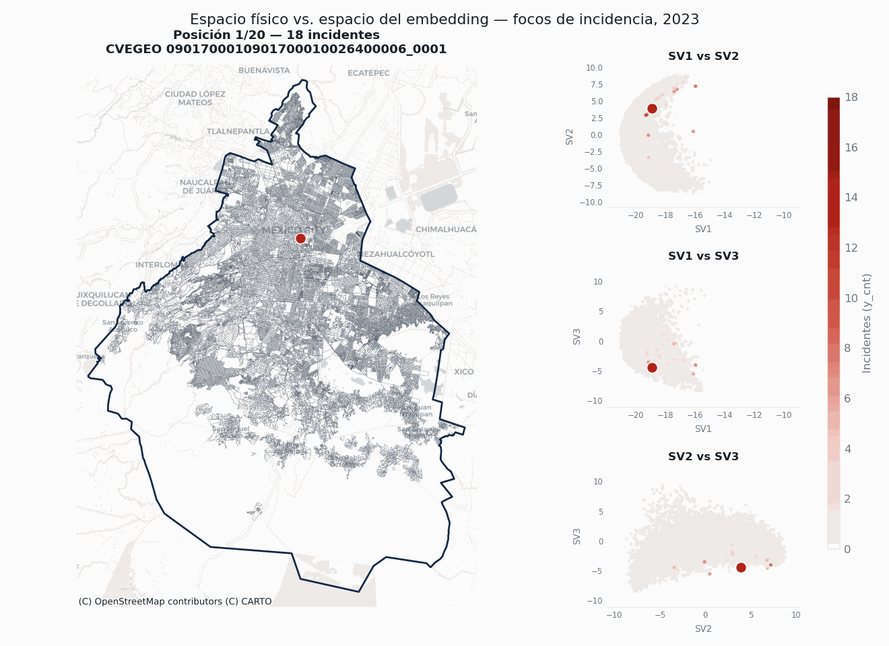

## Español

Serie de páginas sobre el uso de *Earth Embeddings* (bases vectoriales) para modelar la incidencia delictiva en la Ciudad de México.

[Comenzar →](00_introduction.qmd)

## English

A series of pages on the use of *Earth Embeddings* (vector bases) to model crime incidence in Mexico City.

[Start here →](00_introduction_eng.qmd)

